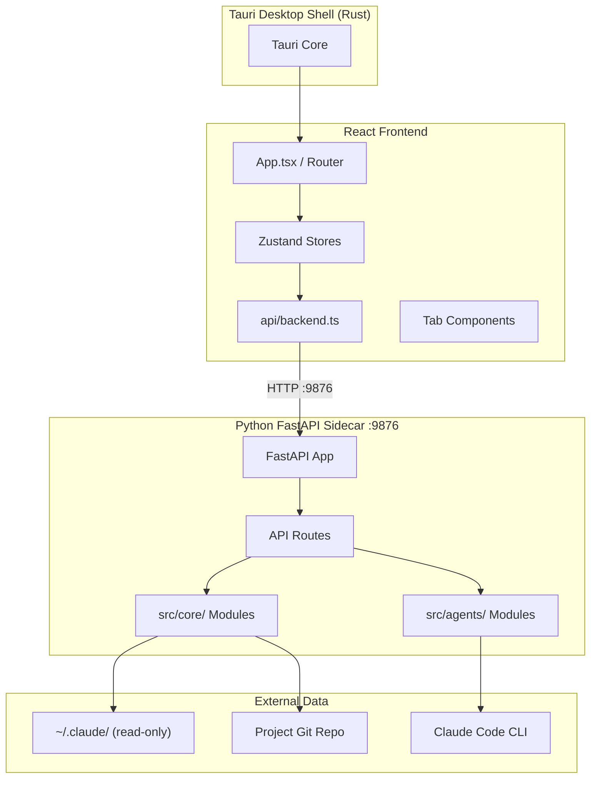
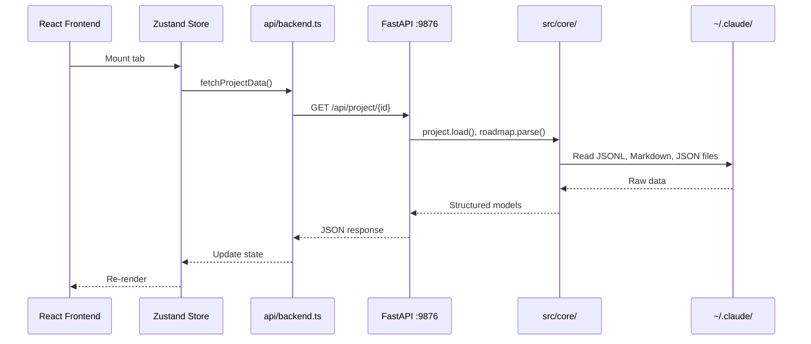
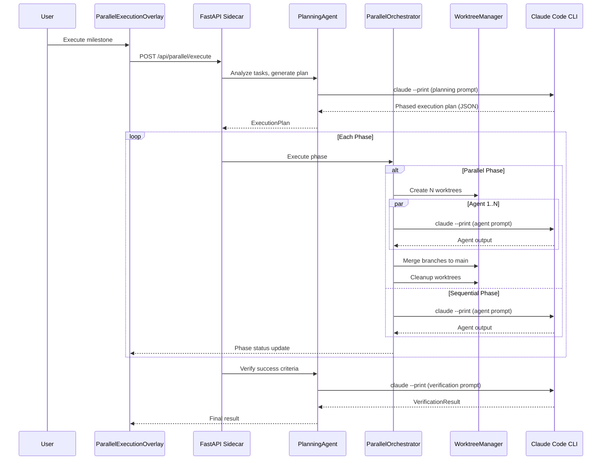

# Architecture

> Last updated: 2026-02-17

## Overview

Claudetini is a desktop dashboard for Claude Code projects that eliminates session amnesia and enforces development best practices. It reads Claude Code's existing data artifacts (`~/.claude/`) to give developers persistent project awareness — surfacing session history, roadmap progress, quality gates, and git state in a unified interface.

The system is a Tauri 2 desktop application composed of three layers: a React frontend for the UI, a Python FastAPI sidecar for all data processing and business logic, and a minimal Rust shell that provides the native desktop window.

**Key Goals:**
- Provide persistent project context across Claude Code sessions
- Enforce quality gates and development best practices before and after AI-assisted work
- Remain strictly read-only against Claude Code's data files — observe, never modify

## System Architecture



### Components

#### Tauri Shell (`app/src-tauri/`)
- **Purpose**: Provides the native desktop window and OS integration
- **Key Responsibilities**: Window management, app lifecycle, native menus
- **Dependencies**: Tauri 2 framework

#### React Frontend (`app/src/`)
- **Purpose**: User interface — tab-based dashboard with dark "Mission Control" theme
- **Location**: `app/src/`
- **Key Responsibilities**: Rendering tabs (Overview, Roadmap, Timeline, Gates, Git, Logs, Settings), managing UI state, polling the sidecar API
- **Dependencies**: React 19, Zustand 5, Tailwind CSS 3.4

#### Python Sidecar (`app/python-sidecar/`)
- **Purpose**: HTTP API server that wraps core business logic for the frontend
- **Location**: `app/python-sidecar/sidecar/`
- **Key Responsibilities**: Exposing REST endpoints, bridging frontend requests to core modules, streaming dispatch output
- **Dependencies**: FastAPI, Uvicorn, Pydantic

#### Core Business Logic (`src/core/`)
- **Purpose**: Shared Python modules containing all domain logic
- **Location**: `src/core/`
- **Key Responsibilities**: Roadmap parsing, session timeline building, project health checks, git operations, plan scanning, readiness scoring, secrets scanning, cost tracking
- **Dependencies**: GitPython, watchdog

#### Agents (`src/agents/`)
- **Purpose**: Claude Code CLI integration and orchestration
- **Location**: `src/agents/`
- **Key Responsibilities**: Dispatching tasks to Claude Code CLI, defining quality gates, executing gate checks, bootstrap engine for project scaffolding
- **Dependencies**: Claude Code CLI (external)

## Data Flow

### Example Flow: Loading Project Overview

1. User opens the app, frontend mounts `OverviewTab`
2. Zustand store triggers API call via `api/backend.ts`
3. HTTP GET to sidecar at `http://127.0.0.1:9876/api/project/...`
4. Sidecar route handler invokes `src/core/` modules (roadmap, health, sessions)
5. Core modules read from `~/.claude/projects/` and project git repo
6. Structured response returned to frontend
7. Zustand store updates, React re-renders



### Example Flow: Dispatching a Task to Claude Code

1. User triggers a dispatch (e.g., via quality gates or manual action)
2. Frontend POSTs to `/api/dispatch`
3. Sidecar invokes `src/agents/dispatcher.py` which shells out to `claude` CLI
4. Output is streamed back via SSE or polling
5. Post-task reconciliation syncs results with roadmap state

## Key Design Decisions

### Decision: Tauri + Python Sidecar (Hybrid Architecture)

**Context**: Need a desktop app with heavy file parsing and text processing logic.

**Options Considered**:
1. Electron + Node.js: Familiar but heavy memory footprint, weaker text processing
2. Tauri + Rust-only: Lightweight but complex for rapid prototyping of parsing logic
3. Tauri + Python sidecar: Lightweight shell with Python's ecosystem for parsing

**Decision**: Tauri + Python sidecar — the Rust shell stays minimal while Python handles all business logic where its ecosystem (GitPython, text parsing, JSONL processing) is strongest.

**Consequences**: Requires Python runtime on the host machine. Sidecar process management adds operational complexity.

### Decision: Read-Only Access to Claude Code Data

**Context**: Claudetini needs to surface Claude Code session data without interfering with active sessions.

**Decision**: Strictly read-only. The app never writes to `~/.claude/`. All mutations (roadmap updates, gate results) stay within the project repo or local app state.

**Consequences**: Safe to run alongside active Claude Code sessions. Cannot directly influence Claude Code behavior — only observe and report.

### Decision: Zustand for State Management

**Context**: Frontend needs global state for project data, settings, and polling results.

**Decision**: Zustand over Redux or Context API — minimal boilerplate, built-in devtools, simple async patterns.

**Consequences**: Lightweight and fast. Limited middleware ecosystem compared to Redux, but sufficient for this use case.

## Technology Stack

### Core Technologies
- **Desktop Shell**: Tauri 2 (Rust)
- **Frontend**: React 19 + TypeScript 5.8
- **Bundler**: Vite 7
- **Styling**: Tailwind CSS 3.4
- **State**: Zustand 5
- **Backend**: Python 3.11+ with FastAPI
- **ASGI Server**: Uvicorn

### Key Libraries
- **GitPython**: Git repository inspection and operations
- **watchdog**: File system event monitoring
- **Pydantic**: Data validation and serialization in sidecar
- **ruff**: Python linting
- **mypy**: Python type checking

### Infrastructure
- Local-only desktop application — no cloud services
- Python sidecar runs as a child process on port 9876
- No database — reads directly from filesystem artifacts

## Directory Structure

```
claudetini/
├── src/
│   ├── core/                   # 41 shared Python business logic modules
│   │   ├── roadmap.py          # Roadmap parsing, progress tracking
│   │   ├── timeline.py         # Session timeline builder
│   │   ├── health.py           # Project health checks
│   │   ├── readiness.py        # Readiness scorecard engine
│   │   ├── git_utils.py        # Git operations
│   │   ├── plan_scanner.py     # 7-tier plan detection
│   │   ├── secrets_scanner.py  # Security scanning
│   │   ├── sessions.py         # Claude Code session parsing
│   │   ├── cost_tracker.py     # Token/cost estimation
│   │   ├── preflight.py        # Pre-dispatch checks
│   │   └── ...
│   └── agents/                 # 15 Claude Code CLI integration modules
│       ├── dispatcher.py       # Claude Code CLI dispatch
│       ├── async_dispatcher.py # Async dispatch with background jobs
│       ├── codex_dispatcher.py # Codex CLI integration
│       ├── gemini_dispatcher.py# Gemini CLI integration
│       ├── gates.py            # Quality gate definitions
│       ├── executor.py         # Gate execution engine
│       ├── parallel_orchestrator.py # Multi-phase parallel execution
│       ├── planning_agent.py   # AI-driven execution planning
│       ├── reconciliation_agent.py  # AI-powered reconciliation
│       ├── bootstrap_engine.py # Project scaffolding engine
│       ├── parser.py           # Agent output parsing
│       ├── prompts.py          # Prompt templates and rendering
│       ├── claude_agents.py    # Sub-agent configuration
│       ├── hooks.py            # Git pre-push hook integration
│       └── bootstrap_cli.py    # CLI interface for bootstrap
├── tests/                      # Pytest test suite
│   └── fixtures/               # Test data
├── app/          # Tauri desktop application
│   ├── src/                    # React frontend
│   │   ├── App.tsx             # Root component
│   │   ├── api/backend.ts      # HTTP client to sidecar
│   │   ├── components/         # Tab-based UI components
│   │   │   ├── overview/       # Project overview dashboard
│   │   │   ├── roadmap/        # Roadmap viewer
│   │   │   ├── timeline/       # Session timeline
│   │   │   ├── gates/          # Quality gates
│   │   │   ├── git/            # Git status
│   │   │   ├── logs/           # Log viewer
│   │   │   ├── settings/       # App settings
│   │   │   ├── dispatch/       # Task dispatch UI
│   │   │   ├── scorecard/      # Readiness scorecard
│   │   │   ├── bootstrap/      # Bootstrap wizard
│   │   │   ├── roadmap/ParallelExecutionOverlay.tsx
│   │   │   └── ui/             # Shared primitives
│   │   ├── stores/             # Zustand state management
│   │   ├── managers/           # Polling and lifecycle managers
│   │   ├── hooks/              # React hooks
│   │   ├── styles/tokens.ts    # Design token definitions
│   │   └── types/index.ts      # TypeScript interfaces
│   ├── src-tauri/              # Rust Tauri shell
│   └── python-sidecar/         # FastAPI sidecar
│       └── sidecar/
│           ├── api/routes/     # REST endpoint handlers
│           ├── core/           # Sidecar-specific utilities
│           └── agents/         # Agent wrappers
├── .claude/planning/           # Roadmap and planning artifacts
└── docs/                       # Project documentation
```

## Deployment Architecture

### Development
- `npm run tauri:dev` starts all three layers: Vite dev server (HMR), Python sidecar (auto-reload), and Tauri window
- `npm run backend` starts the Python sidecar standalone for API development
- `npm run dev` starts the React dev server standalone for UI work

### Production
- Tauri builds a native desktop binary per-platform
- Python sidecar is bundled alongside the binary
- No external services or cloud dependencies required

## Security Considerations

- **Read-Only by Design**: Never writes to `~/.claude/` — eliminates risk of corrupting Claude Code data
- **Local-Only**: No network services exposed beyond localhost:9876 sidecar
- **Secrets Scanning**: `src/core/secrets_scanner.py` detects accidentally committed secrets in project files
- **No Stored Credentials**: App does not manage authentication tokens or API keys

## Performance Considerations

- **Polling Strategy**: Frontend polls sidecar endpoints with adaptive intervals — faster when sessions are active, slower when idle
- **File Parsing**: Core modules parse JSONL session logs lazily; large logs are streamed rather than loaded into memory
- **Caching**: `src/core/cache.py` provides in-memory caching for expensive operations like roadmap parsing and git status

## Parallel Execution Architecture

Claudetini supports parallel execution of roadmap milestones — dispatching multiple Claude Code agents simultaneously to complete independent tasks in isolation, then merging results back together.

### Components

- **Planning Agent** (`src/agents/planning_agent.py`): Given a milestone and its tasks, dispatches Claude Code to analyze the project and produce a phased execution plan. The plan groups tasks into themed agent assignments, determines which phases can run in parallel vs. sequentially, and defines success criteria for verification.
- **Parallel Orchestrator** (`src/agents/parallel_orchestrator.py`): Executes the plan phase by phase. For parallel phases, it creates isolated git worktrees (one per agent), runs agents concurrently, and merges branches back after each phase completes. Sequential phases run in the main worktree.
- **Worktree Manager** (`src/core/worktree_manager.py`): Handles git worktree lifecycle — creation, cleanup, and branch management. Each parallel agent works in its own worktree so file changes cannot conflict during execution.
- **ParallelExecutionOverlay** (`app/src/components/roadmap/ParallelExecutionOverlay.tsx`): Real-time UI overlay that displays execution progress — phase progression, per-agent status, merge results, and verification outcomes.

### Execution Flow



### Isolation Model

Each parallel agent operates in a dedicated git worktree with its own branch (`parallel/<batch-id>/<index>`). This provides full filesystem isolation — agents can create, modify, and delete files without interfering with each other. After all agents in a phase complete, branches are merged sequentially into the main branch. Merge conflicts are detected and reported in the batch status.

### Phased Execution

The planning agent organizes tasks into ordered phases with dependency awareness:

1. **Foundation phases** run first — creating shared types, utilities, and interfaces that later phases depend on.
2. **Implementation phases** run next — building features, tests, and integrations in parallel where possible.
3. **Validation phases** run last — integration tests and cross-cutting verification after all code is in place.

This phased approach ensures that parallel agents within a phase never depend on each other's outputs, while phases themselves run sequentially to respect inter-phase dependencies.

## Known Limitations

- Requires Python 3.11+ installed on the host machine
- Sidecar port (9876) is hardcoded — conflicts possible if port is in use
- Parallel execution requires sufficient disk space for multiple git worktrees
- Claude Code CLI must be installed and authenticated for agent dispatch features
