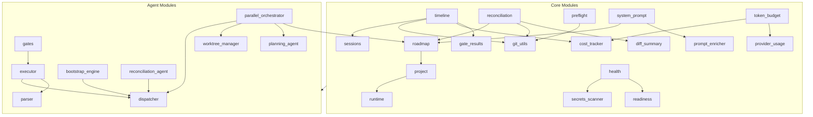

# Core Modules Reference

> Last updated: 2026-02-17

Reference documentation for all Python modules in `src/core/` (41 modules) and `src/agents/` (15 modules).

## Table of Contents

- [Core Modules (`src/core/`)](#core-modules-srccore)
  - [Project & Registry](#project--registry)
  - [Roadmap & Planning](#roadmap--planning)
  - [Sessions & Timeline](#sessions--timeline)
  - [Git Operations](#git-operations)
  - [Quality & Security](#quality--security)
  - [Cost & Budget](#cost--budget)
  - [Reconciliation](#reconciliation)
  - [Prompt & System](#prompt--system)
  - [Runtime & Caching](#runtime--caching)
  - [Utilities](#utilities)
- [Agent Modules (`src/agents/`)](#agent-modules-srcagents)
  - [Dispatchers](#dispatchers)
  - [Quality Gates](#quality-gates)
  - [Orchestration](#orchestration)
  - [Bootstrap](#bootstrap)
  - [Support](#support)

---

## Core Modules (`src/core/`)

### Project & Registry

#### `project.py`
Project model and registry management.

| Class | Description |
|-------|-------------|
| `Project` | Represents a Claude Code project with path, name, and computed hash |
| `ProjectRegistry` | Registry of known projects, persists to `~/.claudetini/projects.json` |

**Key Methods:**
- `Project.from_path(path)` — Create project from directory path
- `Project.has_roadmap()` — Check if `.claude/planning/ROADMAP.md` exists
- `Project.get_roadmap_path()` — Return roadmap file path
- `Project.has_claude_md()` — Check if CLAUDE.md exists
- `ProjectRegistry.register(path)` — Register a new project
- `ProjectRegistry.list_all()` — List all registered projects
- `_compute_claude_hash(path)` — Auto-detect Claude project hash from `~/.claude/projects/`

#### `runtime.py`
Runtime identity and storage helpers.

**Key Functions:**
- `project_id_for_path(path)` — Stable project ID from MD5 hash[:16]
- `project_id_for_project(project)` — Extract project ID from Project-like object
- `project_runtime_dir(project_id)` — Get or create canonical runtime directory
- `_migrate_legacy_runtime(project_id, target)` — Forward migration from old locations

**Constants:**
- `RUNTIME_HOME` — `~/.claudetini` (configurable via env var)
- `RUNTIME_ROOT` — `RUNTIME_HOME/projects`

---

### Roadmap & Planning

#### `roadmap.py`
Roadmap parsing, progress tracking, and modification.

| Class | Description |
|-------|-------------|
| `AgentGroup` | Agent group annotation with name and task indices |
| `RoadmapItem` | Single roadmap item with text, completion status, line number |
| `Milestone` | Milestone containing items with progress tracking |
| `Roadmap` | Full roadmap with milestones and title |
| `RoadmapParser` | Static helper for parsing roadmaps from project paths |

**Key Methods:**
- `Roadmap.parse(path)` — Parse from markdown file
- `Roadmap.toggle_item_by_text(text)` — Toggle completion
- `Roadmap.bulk_mark_complete(texts)` — Mark multiple items complete
- `Roadmap.extract_agent_groups(milestone)` — Extract agent group headings
- `Roadmap.find_next_incomplete()` — Find next incomplete item
- `Roadmap.save()` — Write changes back to file

#### `plan_scanner.py`
7-tier project plan detection and unification.

| Class | Description |
|-------|-------------|
| `ProjectPlanScanner` | Scans for planning artifacts across 7 tiers |

**Tiers:**
1. Explicit files (ROADMAP.md, TODO.md, PLAN.md, TASKS.md, BACKLOG.md)
2. Numbered files (phase*.md, sprint*.md, milestone*.md, epic*.md)
3. Planning directories (tasks/, plans/, .planning/, .claude/plans/, docs/roadmap/)
4a. Claude tasks (project todos JSON, session-scoped todo files)
4b. Claude global plans (~/.claude/plans/ with 3-layer correlation: session, content, timestamp)
5. Embedded sections (README.md, CLAUDE.md — keyword-gated header scanning)
6. Heuristic fallback (markdown files with 3+ checkboxes and planning keywords)

**Constants:** `PLAN_RELEVANCE_THRESHOLD = 0.25`

#### `plan_models.py`
Data models for unified plan representation.

| Class | Description |
|-------|-------------|
| `PlanItemStatus` | Enum: PENDING, IN_PROGRESS, DONE, BLOCKED |
| `PlanSource` | Enum: ROADMAP_FILE through HEURISTIC (7 tiers) |
| `ConflictResolution` | Enum: ROADMAP_WINS, TASKS_API_WINS, MOST_RECENT_WINS, MANUAL |
| `PlanItem` | Item with id, content, status, source, milestone, priority, tags |
| `PlanMilestone` | Milestone grouping items |
| `UnifiedProjectPlan` | Canonical plan view with progress and conflicts |

#### `plan_conflicts.py`
Conflict detection between plan sources.

**Key Functions:**
- `detect_conflicts(items)` — Find items with differing statuses across sources
- `merge_items(items, conflicts)` — Merge by ID, apply resolutions

#### `plan_consolidator.py`
Consolidate multiple plan sources into single ROADMAP.md.

| Class | Description |
|-------|-------------|
| `DetectedSource` | A detected planning source with path, type, item count |
| `ConsolidationResult` | Result with items consolidated, duplicates removed |
| `PlanConsolidator` | Merge, deduplicate, archive old planning files |

**Key Methods:**
- `detect_sources()` — Find all planning sources
- `needs_consolidation()` — Check if multiple sources exist
- `consolidate(archive, delete_after)` — Merge into ROADMAP.md

#### `task_dependency.py`
File overlap detection and task grouping for parallel execution.

| Class | Description |
|-------|-------------|
| `TaskFileProfile` | Predicted file/directory references for a task |
| `ParallelGroup` | Group of non-overlapping tasks |
| `DependencyAnalysis` | Analysis with task profiles, groups, max parallel |
| `TaskDependencyAnalyzer` | Heuristic analyzer using regex and graph coloring |

#### `scheduling.py`
Smart scheduling and dispatch queue management.

| Class | Description |
|-------|-------------|
| `SchedulingConfig` | Configuration for scheduling behavior |
| `QueuedDispatch` | Queued dispatch with prompt, reason, auto-dispatch flag |
| `DispatchScheduler` | Queue management and scheduling logic |

**Key Methods:**
- `should_queue()` — Return reason to queue (active editing, recent commit, DND)
- `enqueue()`, `pop_next()` — Queue operations

---

### Sessions & Timeline

#### `sessions.py`
Claude Code session log and memory parsing.

| Class | Description |
|-------|-------------|
| `SessionSummary` | Parsed session summary with accomplishments |
| `SessionLogEntry` | Single JSONL log entry |
| `Session` | Parsed session with timing and memory |
| `SessionParser` | Parser for session logs from `~/.claude/projects/` |

**Key Methods:**
- `find_sessions(project_hash)` — Find all sessions for a project
- `parse_log_entries(log_path, limit)` — Parse entries from JSONL
- `get_latest_session()` — Most recent session

#### `timeline.py`
Session timeline aggregation with commit correlation.

| Class | Description |
|-------|-------------|
| `CommitInfo` | Git commit with sha, message, timestamp |
| `TestResult` | Test summary with pass/fail |
| `TimelineEntry` | Rich session entry with duration, commits, tokens, gates, cost |
| `TimelineBuilder` | Build timeline from sessions, git, gates, costs |

**Key Methods:**
- `build(limit, use_cache)` — Build timeline entries (newest-first, cached)
- `_parse_session_metadata()` — Stream metadata from JSONL
- `_correlate_commits()` — Map commits to session time windows
- `_supplemental_provider_entries()` — Timeline entries from Codex/Gemini dispatches

#### `session_report.py`
Post-session report generation.

| Class | Description |
|-------|-------------|
| `SessionReport` | Report with commits, files, additions, deletions, cost |
| `SessionReportBuilder` | Generate reports from timeline entries |
| `SessionReportStore` | Persist reports with concurrent-safe file access (fcntl) |

#### `prompt_history.py`
Dispatch prompt versioning and history.

| Class | Description |
|-------|-------------|
| `PromptVersion` | Versioned prompt with outcome tracking |
| `PromptHistory` | History for a specific roadmap item |
| `PromptHistoryStore` | Persistent store with fcntl locking |

---

### Git Operations

#### `git_utils.py`
Comprehensive git operations.

| Class | Description |
|-------|-------------|
| `GitCommit` | Commit with sha, message, author, timestamp, files_changed |
| `GitStatus` | Branch, staged, modified, untracked, submodule issues |
| `GitRepo` | Low-level git operations |
| `GitUtils` | High-level UI-friendly git wrapper |

**Key Methods (GitUtils):**
- `get_status_detailed()` — Full status with staged, modified, untracked, stashes
- `stage_files()`, `unstage_files()`, `stage_all()`, `unstage_all()`
- `commit_staged()`, `commit_all()`, `push_to_remote()`
- `discard_file()`, `delete_untracked()`
- `stash_pop()`, `stash_drop()`, `list_stashes()`
- `get_diff_summary()` — Human-readable uncommitted changes
- `unpushed_commits()`, `recent_commits(limit)`

#### `branch_strategy.py`
Branch strategy detection.

| Class | Description |
|-------|-------------|
| `BranchStrategy` | Enum: TRUNK_BASED, GIT_FLOW, FEATURE_BRANCH, PR_BASED, UNKNOWN |
| `BranchStrategyResult` | Strategy with reasoning |
| `BranchStrategyDetector` | Infer strategy from branch topology |

#### `worktree_manager.py`
Git worktree lifecycle for parallel agent execution.

| Class | Description |
|-------|-------------|
| `WorktreeInfo` | Worktree path, branch, task index, status |
| `WorktreeManager` | Create, manage, and cleanup worktrees under `.cantina-worktrees/` |

**Key Methods:**
- `create_worktree(batch_id, task_index, base_ref)` — Create isolated worktree
- `merge_branch()` — Merge worktree branch back to main
- `cleanup_batch()`, `cleanup_orphans()` — Cleanup operations
- `is_working_tree_clean()`, `get_dirty_files()`

#### `diff_summary.py`
Human-readable diff summaries.

| Class | Description |
|-------|-------------|
| `FileChange` | File with additions, deletions, change type |
| `DiffSummary` | New, modified, deleted files with totals |
| `DiffSummaryBuilder` | Parse `git diff --numstat` |

---

### Quality & Security

#### `health.py`
Project health checks across 8 categories.

| Class | Description |
|-------|-------------|
| `HealthLevel` | Enum: GOOD, WARNING, BAD, UNKNOWN |
| `HealthCheck` | Single check result with category, level, message |
| `HealthStatus` | Overall status with score (0-100) |
| `HealthChecker` | Run all 8 health checks |
| `HealthScanner` | Simplified UI interface |

**Health Categories:** Security, Roadmap, README, CLAUDE.md, .gitignore, Tests, CI/CD, Quality Gates

#### `readiness.py`
Readiness scorecard engine with 12 checks.

| Class | Description |
|-------|-------------|
| `CheckSeverity` | Enum: CRITICAL, IMPORTANT, NICE_TO_HAVE |
| `ReadinessCheck` | Check with severity, weight, message, remediation, auto-generate flag |
| `ReadinessReport` | Score (0-100), checks, critical issues |
| `ReadinessScanner` | Run all 12 readiness checks |

**Readiness Checks:** Git, README, ROADMAP, CLAUDE.md, .gitignore, dependencies, license, architecture docs, tests, CI/CD, secrets, git clean

#### `secrets_scanner.py`
Security scanner for secrets and sensitive data.

| Class | Description |
|-------|-------------|
| `SecretMatch` | Found secret with file, line, type, severity |
| `ScanResult` | Scan results with findings and stats |
| `SecretsScanner` | Pattern-based secret detection |

**Secret Patterns (20+):** AWS keys, Google API keys, GitHub tokens, Stripe keys, Slack tokens/webhooks, SSH/RSA/PEM private keys, database URLs, JWT tokens, Anthropic/OpenAI API keys, NPM tokens, Heroku keys, generic API keys/passwords

**Constants:**
- `SECRET_PATTERNS` — 20+ regex patterns
- `DANGEROUS_FILES` — `.env`, `credentials.json`, `*.key`, `.pgpass`, etc.
- `SCANNABLE_EXTENSIONS` — `.py`, `.js`, `.ts`, `.json`, `.yaml`, `.sql`, etc.

#### `gate_results.py`
Quality gate result persistence.

| Class | Description |
|-------|-------------|
| `GateFinding` | Issue with source gate, severity, file, line, suggested fix |
| `StoredGateResult` | Structured result for one gate |
| `GateRunReport` | Full report for a gate execution cycle |
| `GateFailureTodo` | Todo generated from finding |
| `GateResultStore` | Persist and load gate results |

#### `gate_trends.py`
Gate history trend computation.

| Class | Description |
|-------|-------------|
| `GateHistoryPoint` | Date, status, metric |
| `GateTrend` | Gate name with result history |
| `GateTrendStore` | Compute and cache trends |

**Functions:** `render_sparkline(values)` — Unicode block rendering (▁▂▃▄▅▆▇█)

#### `dispatch_audit.py`
Append-only audit log for safety overrides.

| Class | Description |
|-------|-------------|
| `DispatchOverrideEvent` | Override event (gate, budget, prompt_secret) |
| `DispatchAuditStore` | Append-only JSONL log |

---

### Cost & Budget

#### `cost_tracker.py`
Token usage and cost tracking.

| Class | Description |
|-------|-------------|
| `TokenUsage` | Token counts (input, output) with model |
| `UsageTotals` | Aggregated usage totals |
| `CostTracker` | Persist and aggregate usage per project |

**Key Functions:**
- `estimate_cost(usage, model)` — Calculate USD from token counts
- `record_usage()` — Append event with fcntl locking
- `totals(now)` — Aggregate for all-time, month, week

**Pricing:** Claude 3.5 Sonnet/Haiku, Claude 3 Opus/Sonnet/Haiku, Claude 4 models

#### `token_budget.py`
Budget configuration and pre-dispatch cost enforcement.

| Class | Description |
|-------|-------------|
| `TokenBudget` | Budget limits (monthly, weekly, per-session, gate, blitz) |
| `BudgetDecision` | Decision with estimated cost, warnings, blocked flag |
| `TokenBudgetManager` | Budget evaluation and enforcement |

**Key Methods:**
- `estimate_dispatch_cost()` — Blend prompt heuristic with empirical history
- `remaining_budget_percent()` — Projected remaining
- `evaluate_dispatch()` — Budget decision with hard-cap enforcement

#### `provider_usage.py`
Provider-aware usage telemetry persistence.

| Class | Description |
|-------|-------------|
| `ProviderUsageTotals` | Per-provider tokens, effort units, cost, events |
| `ProviderUsageStore` | Persistent usage store with fcntl locking |

#### `provider_telemetry.py`
Provider telemetry adapters.

| Class | Description |
|-------|-------------|
| `ProviderUsageSnapshot` | Normalized usage snapshot |
| `ProviderTelemetryAdapter` | Base adapter with heuristic estimation |
| `ClaudeTelemetryAdapter` | Claude-specific (output_multiplier=3.0) |
| `CodexTelemetryAdapter` | Codex-specific (output_multiplier=2.6) |
| `GeminiTelemetryAdapter` | Gemini-specific (output_multiplier=2.8) |

---

### Reconciliation

#### `reconciliation.py`
State reconciliation engine — matches code changes to roadmap items.

| Class | Description |
|-------|-------------|
| `ProjectStateSnapshot` | Snapshot of project state at a point in time |
| `FileChange` | File-level change with path, type, LOC delta |
| `RoadmapSuggestion` | Suggested roadmap completion with confidence score |
| `ReconciliationReport` | Full report with suggestions, commits, files |
| `SnapshotStore` | Persist and load snapshots |
| `ReconciliationStore` | Store reconciliation reports |
| `ReconciliationEngine` | Orchestrate change detection and matching |

**ReconciliationEngine Methods:**
- `ReconciliationEngine(project_path: Path, project_id: str)` — Init with project path and ID (hashes absolute paths for safe storage)
- `create_snapshot(trigger: str = "manual") -> ProjectStateSnapshot` — Snapshot git, file tree, dependencies, and roadmap state
- `quick_check_for_changes() -> dict` — Fast change detection (<100ms); returns `{has_changes, commits_count, files_modified, uncommitted_count}`
- `detect_changes(old_snapshot, new_snapshot) -> tuple[list[FileChange], list[str]]` — Detect file changes and commit SHAs between two snapshots
- `generate_suggestions(roadmap, file_changes, commit_shas) -> list[RoadmapSuggestion]` — Keyword-based matching of changes to roadmap items (30% confidence threshold)
- `detect_external_completions(old_snapshot, new_snapshot) -> list[str]` — Find items marked complete outside the app
- `apply_suggestions(roadmap_path: Path, accepted_items: list[str]) -> int` — Mark accepted items complete in ROADMAP.md; returns count
- `verify_all_items(roadmap: Roadmap, min_confidence: float = 0.50) -> list[RoadmapSuggestion]` — Check ALL uncompleted items against codebase (file existence, git history)
- `verify_all_items_ai(roadmap: Roadmap, progress_callback=None) -> tuple[list[RoadmapSuggestion], dict]` — AI-powered verification via Claude Code with heuristic pre-filter

**SnapshotStore Methods:**
- `save_snapshot(snapshot)`, `load_snapshot(snapshot_id)`, `get_latest_snapshot()`, `list_snapshots()` — CRUD with auto-cleanup (max 10)

**ReconciliationStore Methods:**
- `save_report(report)`, `load_report(report_id)` — Report persistence
- `log_action(action, details)` — Append-only JSONL audit log
- `save_dismissals(dismissals)`, `load_dismissals()`, `add_dismissal(report_id, item_text)` — Dismissed suggestion tracking

---

### Prompt & System

#### `system_prompt.py`
System prompt generation for Claude Code dispatches.

| Class | Description |
|-------|-------------|
| `SystemPromptContext` | Context for rendering (roadmap, conventions, git diff, memory) |
| `SystemPromptBuilder` | Build and persist system prompt files |

#### `prompt_enricher.py`
Prompt enrichment with project context.

| Class | Description |
|-------|-------------|
| `EnrichedPrompt` | Enriched prompt with context summary |
| `PromptEnricher` | Add roadmap state, git diff, conventions to prompts |

#### `dispatch_intents.py`
Dispatch intent modeling.

| Class | Description |
|-------|-------------|
| `DispatchEnvelope` | Intent envelope with prompt, metadata |

#### `recommender.py`
Task recommendation engine.

| Class | Description |
|-------|-------------|
| `NextStep` | Recommended next action |
| `RecommendationContext` | Context for recommendations |
| `NextStepRecommender` | Suggest next tasks based on roadmap and project state |

#### `claude_md_manager.py`
CLAUDE.md file management.

| Class | Description |
|-------|-------------|
| `ClaudeMdStatus` | Status of CLAUDE.md (exists, has managed section) |
| `ClaudeMdManager` | Read/write managed section in CLAUDE.md |

#### `slash_commands.py`
Slash command generation for Claude Code.

| Class | Description |
|-------|-------------|
| `SlashCommandGenerator` | Generate `.claude/commands/` files |

#### `session_hooks.py`
Pre/post session hook management.

| Class | Description |
|-------|-------------|
| `HookSpec` | Hook specification (command, timeout) |
| `HookConfig` | Hook configuration (pre/post session, pre/post merge) |
| `HookResult` | Hook execution result |
| `SessionHookManager` | Execute hooks at lifecycle points |

---

### Runtime & Caching

#### `cache.py`
Simple JSON cache with fingerprint-based invalidation.

| Class | Description |
|-------|-------------|
| `CachePayload` | Cached data with fingerprint and timestamp |
| `JsonCache` | Load/save cache with metadata |

#### `preflight.py`
Pre-dispatch validation checks.

| Class | Description |
|-------|-------------|
| `PreflightCheck` | Single check result |
| `PreflightResult` | All checks collection |
| `PreflightChecker` | Run uncommitted changes, branch behind, stale deps, disk space checks |

#### `retry.py`
Retry logic utilities.

| Class | Description |
|-------|-------------|
| `RetryAttempt` | Single retry attempt |
| `RetryChain` | Chain of retry attempts |
| `RetryComposer` | Compose retry strategies |

---

### Utilities

#### `todos.py`
Claude Code todo file parsing.

**Type Aliases:**
- `TodoStatus` — `Literal["pending", "in_progress", "completed"]`
- `TodoPriority` — `Literal["high", "medium", "low"]`

| Class | Description |
|-------|-------------|
| `TodoItem` | Single todo item with content, status, priority, timestamps |
| `TodoList` | Collection of todo items from a session |
| `TodoParser` | Parser for Claude Code todo JSON files from `~/.claude/todos/` |

**TodoItem Fields:** `content`, `status`, `priority`, `session_id`, `created_at`, `completed_at`, `active_form`

**TodoItem Properties:**
- `is_completed` / `is_pending` / `is_in_progress` — Status checks

**TodoItem Methods:**
- `TodoItem.from_dict(data: dict, session_id: str | None) -> TodoItem` — Create from dict

**TodoList Properties:**
- `pending_items` / `in_progress_items` / `completed_items` — Filtered item lists
- `high_priority_pending` — Pending items with `priority == "high"`

**TodoParser Methods:**
- `TodoParser(claude_dir: Path | None)` — Init with optional Claude dir override
- `find_todo_files() -> list[Path]` — Find all todo JSON files
- `parse_todo_file(path: Path) -> TodoList | None` — Parse a single todo JSON file
- `get_all_todos() -> list[TodoList]` — Get all todo lists from all files
- `get_session_todos(session_id: str) -> TodoList | None` — Get todos for a specific session
- `get_pending_high_priority() -> list[TodoItem]` — All pending high-priority todos across sessions
- `get_incomplete_todos() -> list[TodoItem]` — All incomplete (pending or in_progress) todos

---

## Agent Modules (`src/agents/`)

### Dispatchers

#### `dispatcher.py`
Primary Claude Code CLI dispatch.

| Class | Description |
|-------|-------------|
| `DispatchResult` | Result with success, session_id, error_message, output_file, provider |

**Key Functions:**
- `dispatch_task(prompt, working_dir, system_prompt_file, timeout, agents_json)` — Run Claude CLI with full configuration
- `get_dispatch_output_path(working_dir, session_id)` — Generate session ID and output file path
- `_detect_token_limit_reached(output)` — Detect token limit errors in output

**CLI Flags Used:**
- `--print` — Non-interactive mode
- `--append-system-prompt-file` — Inject system prompt
- `--agents` — Configure agent behavior
- `--output-format stream-json` — Structured output
- `stdin=DEVNULL` — Prevent hanging in non-TTY

#### `async_dispatcher.py`
Async subprocess dispatcher for real-time Claude Code CLI streaming.

| Class | Description |
|-------|-------------|
| `AsyncDispatchResult` | Result with success, session_id, error_message, output, token_limit_reached, cancelled, exit_code |
| `AsyncDispatchJob` | Manages an async dispatch job with cancellation support and event queue |

**Standalone Functions:**
- `get_async_dispatch_output_path(working_dir: Path, session_id: str | None) -> tuple[str, Path]` — Generate session ID and output file path
- `async_dispatch_stream(prompt, working_dir, cli_path, timeout_seconds, output_file) -> AsyncGenerator[tuple[str, str], None]` — Stream CLI output as `(event_type, data)` tuples where event_type is `"output"`, `"status"`, `"error"`, or `"complete"`

**AsyncDispatchJob Methods:**
- `AsyncDispatchJob(job_id, prompt, working_dir, cli_path, timeout_seconds)` — Initialize job
- `start(output_file: Path | None)` — Start the dispatch as an asyncio task
- `cancel() -> bool` — Cancel the running job
- `get_result() -> AsyncDispatchResult | None` — Get final result if complete
- `events() -> AsyncGenerator[tuple[str, str, int], None]` — Yield `(event_type, data, sequence)` tuples

**AsyncDispatchJob Properties:**
- `is_running` / `is_cancelled` / `output_file`

**Constants:** `TOKEN_LIMIT_PHRASES` — Tuple of phrases indicating Claude usage limits

#### `codex_dispatcher.py`
Codex CLI integration.

**Key Functions:**
- `dispatch_codex(prompt, working_dir, cli_path, timeout)` — Run Codex CLI
- Maps Codex output format to standard DispatchResult

#### `gemini_dispatcher.py`
Gemini CLI integration.

**Key Functions:**
- `dispatch_gemini(prompt, working_dir, cli_path, timeout)` — Run Gemini CLI
- Maps Gemini output format to standard DispatchResult

---

### Quality Gates

#### `gates.py`
Quality gate runner and configuration.

| Class | Description |
|-------|-------------|
| `GateConfig` | Configuration for an individual gate (name, type, command, threshold) |
| `GateResult` | Runtime gate result with status, message, findings |
| `GateReport` | Aggregate report for a gate run |
| `QualityGateRunner` | Orchestrate command + agent + secrets gates |

**Gate Types:**
- `command` — Shell command execution (lint, test, etc.)
- `agent` — Dispatch to Claude Code for analysis
- `secrets` — Run secrets scanner

**Key Methods:**
- `QualityGateRunner.run_all()` — Execute all enabled gates
- `QualityGateRunner.load_config()` — Load from runtime storage with auto-detection fallbacks
- `QualityGateRunner.save_config()` — Persist configuration

#### `executor.py`
Gate execution engine.

| Class | Description |
|-------|-------------|
| `GateExecutor` | Execute command gates (parallel, max 4) and agent gates (sequential) |

**Key Methods:**
- `run_command_gates()` — Execute in parallel with ThreadPoolExecutor
- `run_agent_gates()` — Execute sequentially (each dispatches to Claude)
- `_run_command_gate()` — Single command (shell=True)
- `_run_agent_gate()` — Single agent gate (dispatch + parse)

#### `hooks.py`
Git pre-push hook integration.

| Class | Description |
|-------|-------------|
| `GitPrePushHookManager` | Install/manage git hooks that run gates before push |

---

### Orchestration

#### `parallel_orchestrator.py`
Multi-phase parallel execution engine.

| Class | Description |
|-------|-------------|
| `AgentSlot` | Agent execution slot with task, worktree, branch, status |
| `MergeResult` | Branch merge outcome with conflict details |
| `ParallelBatchStatus` | Full batch status with agents, merges, verification |
| `ParallelOrchestrator` | Coordinate phased execution across git worktrees |

**Key Methods:**
- `execute_plan(batch_id, tasks, plan, max_parallel)` — Run full phased execution
- Phases can be sequential (single worktree) or parallel (N worktrees)
- Handles worktree creation, branch merging, conflict resolution, verification
- Manages Vite HMR lock during execution

#### `planning_agent.py`
AI-driven execution planning.

| Class | Description |
|-------|-------------|
| `AgentAssignment` | Agent with theme, task indices, rationale |
| `ExecutionPhase` | Phase with agents and parallel flag |
| `ExecutionPlan` | Full plan with phases, success criteria, warnings |
| `CriterionResult` | Per-criterion verification result |
| `VerificationResult` | Overall verification outcome |
| `PlanningAgent` | Dispatch to Claude for plan generation |

#### `reconciliation_agent.py`
AI-powered reconciliation.

| Class | Description |
|-------|-------------|
| `AIAnalysisResult` | AI analysis result with matches |
| `ReconciliationAgent` | Dispatch to Claude for high-accuracy matching |

---

### Bootstrap

#### `bootstrap_engine.py`
Multi-step project scaffolding engine.

| Class | Description |
|-------|-------------|
| `BootstrapStepType` | Enum: ANALYZE, CLAUDE_MD, ROADMAP, GITIGNORE, ARCHITECTURE |
| `BootstrapStep` | Step definition with type and generator |
| `StepResult` | Step outcome |
| `BootstrapResult` | Full bootstrap result with artifacts |
| `BootstrapEngine` | Orchestrate multi-step bootstrap via Claude CLI |

**Generators:** `AnalyzeGenerator`, `ClaudeMdGenerator`, `RoadmapGenerator`, `GitignoreGenerator`, `ArchitectureGenerator`

#### `bootstrap_cli.py`
CLI interface for bootstrap.

| Class | Description |
|-------|-------------|
| `BootstrapCLI` | Command-line bootstrap runner |

---

### Support

#### `prompts.py`
Prompt templates and rendering.

| Class | Description |
|-------|-------------|
| `FailureContext` | Context for failure-related prompts |
| `PromptContext` | Full prompt context |
| `PromptBuilder` | Build prompts from templates |
| `CommonPrompts` | Common prompt snippets |
| `PromptTemplateLoader` | Load prompts from files |

#### `parser.py`
Agent output parsing.

| Class | Description |
|-------|-------------|
| `AgentIssue` | Parsed issue from agent output |
| `ParsedAgentOutput` | Structured parsed output |
| `AgentOutputParser` | Parse Claude CLI output for tokens, costs, errors, findings |

#### `claude_agents.py`
Claude agent definitions.

| Class | Description |
|-------|-------------|
| `ClaudeSubAgent` | Sub-agent configuration |
| `AgentRegistry` | Registry of available agents |

---

## Module Dependency Graph

