# Data Flows

> Last updated: 2026-02-17

Visual documentation of all major data flows in Claudetini using Mermaid diagrams.

## Table of Contents

1. [Application Startup](#1-application-startup)
2. [Project Loading](#2-project-loading)
3. [Task Dispatch (SSE + Polling)](#3-task-dispatch)
4. [Parallel Execution](#4-parallel-execution)
5. [Reconciliation Pipeline](#5-reconciliation-pipeline)
6. [Quality Gate Execution](#6-quality-gate-execution)
7. [Git Operations](#7-git-operations)
8. [Bootstrap Wizard](#8-bootstrap-wizard)
9. [Live Session Detection](#9-live-session-detection)
10. [Pre-Flight Checks](#10-pre-flight-checks)
11. [Provider Fallback](#11-provider-fallback)
12. [Error Recovery Flows](#12-error-recovery-flows)
13. [Parallel Execution Error Handling](#13-parallel-execution-error-handling)

---

## 1. Application Startup

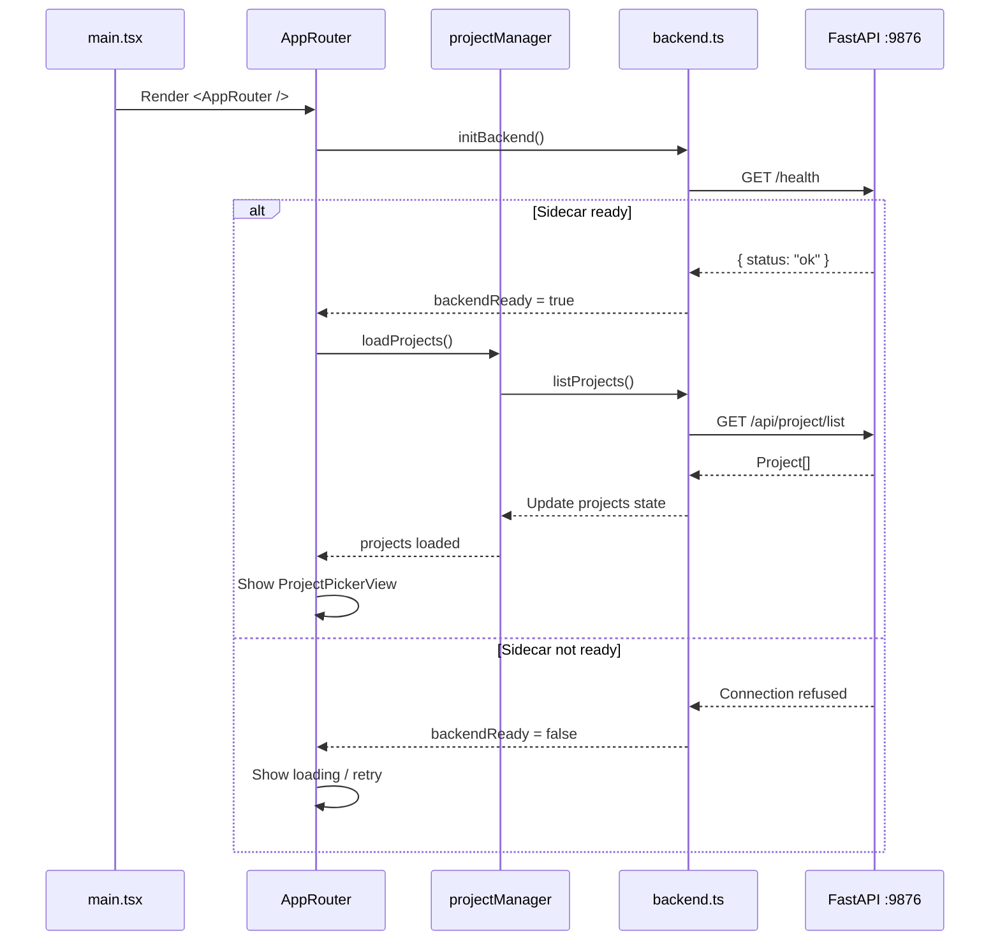
```mermaid
sequenceDiagram
    participant Main as main.tsx
    participant Router as AppRouter
    participant PM as projectManager
    participant API as backend.ts
    participant Sidecar as FastAPI :9876

    Main->>Router: Render <AppRouter />
    Router->>API: initBackend()
    API->>Sidecar: GET /health
    alt Sidecar ready
        Sidecar-->>API: { status: "ok" }
        API-->>Router: backendReady = true
        Router->>PM: loadProjects()
        PM->>API: listProjects()
        API->>Sidecar: GET /api/project/list
        Sidecar-->>API: Project[]
        API-->>PM: Update projects state
        PM-->>Router: projects loaded
        Router->>Router: Show ProjectPickerView
    else Sidecar not ready
        Sidecar-->>API: Connection refused
        API-->>Router: backendReady = false
        Router->>Router: Show loading / retry
    end
```

### Screen State Machine

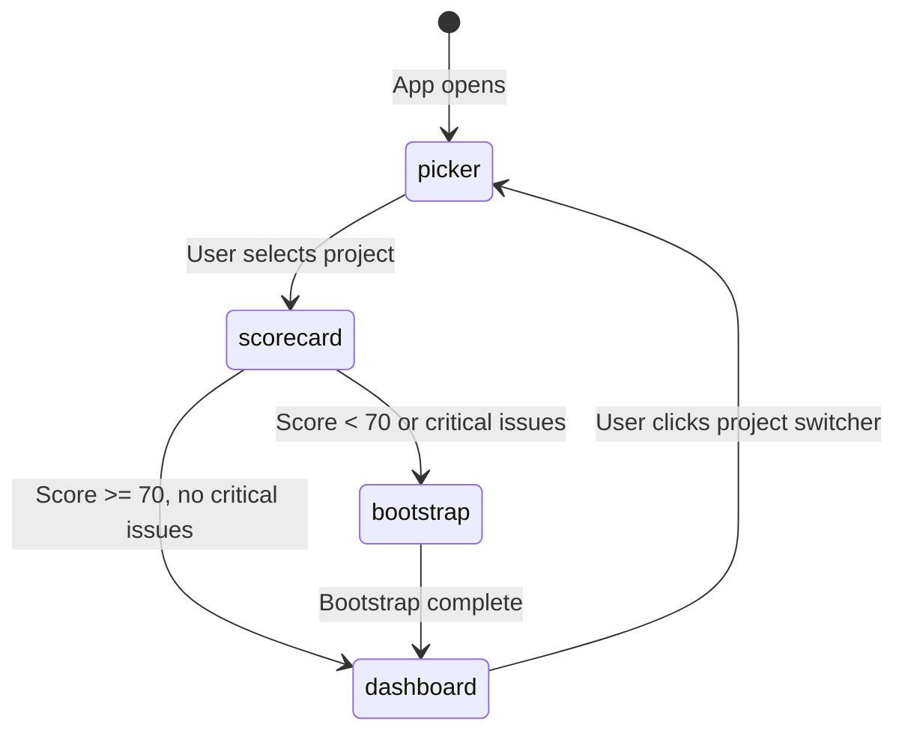
```mermaid
stateDiagram-v2
    [*] --> picker: App opens
    picker --> scorecard: User selects project
    scorecard --> bootstrap: Score < 70 or critical issues
    scorecard --> dashboard: Score >= 70, no critical issues
    bootstrap --> dashboard: Bootstrap complete
    dashboard --> picker: User clicks project switcher
```

---

## 2. Project Loading

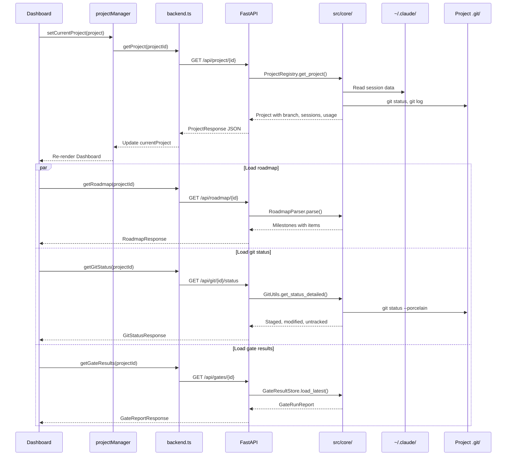
```mermaid
sequenceDiagram
    participant UI as Dashboard
    participant PM as projectManager
    participant API as backend.ts
    participant Sidecar as FastAPI
    participant Core as src/core/
    participant Claude as ~/.claude/
    participant Git as Project .git/

    UI->>PM: setCurrentProject(project)
    PM->>API: getProject(projectId)
    API->>Sidecar: GET /api/project/{id}
    Sidecar->>Core: ProjectRegistry.get_project()
    Core->>Claude: Read session data
    Core->>Git: git status, git log
    Core-->>Sidecar: Project with branch, sessions, usage
    Sidecar-->>API: ProjectResponse JSON
    API-->>PM: Update currentProject
    PM-->>UI: Re-render Dashboard

    par Load roadmap
        UI->>API: getRoadmap(projectId)
        API->>Sidecar: GET /api/roadmap/{id}
        Sidecar->>Core: RoadmapParser.parse()
        Core-->>Sidecar: Milestones with items
        Sidecar-->>UI: RoadmapResponse
    and Load git status
        UI->>API: getGitStatus(projectId)
        API->>Sidecar: GET /api/git/{id}/status
        Sidecar->>Core: GitUtils.get_status_detailed()
        Core->>Git: git status --porcelain
        Core-->>Sidecar: Staged, modified, untracked
        Sidecar-->>UI: GitStatusResponse
    and Load gate results
        UI->>API: getGateResults(projectId)
        API->>Sidecar: GET /api/gates/{id}
        Sidecar->>Core: GateResultStore.load_latest()
        Core-->>Sidecar: GateRunReport
        Sidecar-->>UI: GateReportResponse
    end
```

---

## 3. Task Dispatch

### Dispatch Phase State Machine

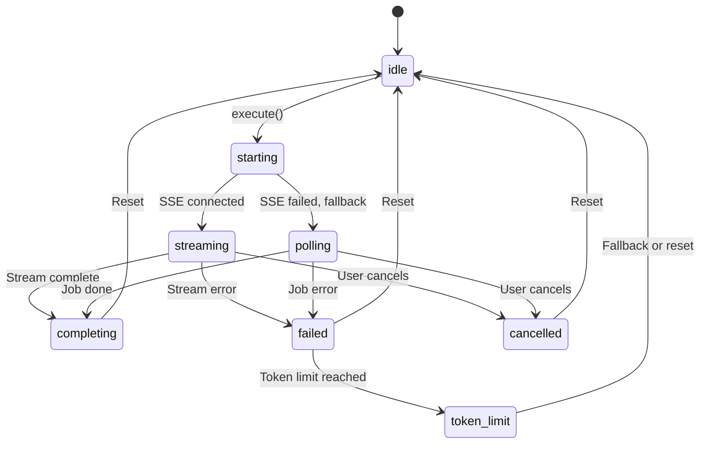
```mermaid
stateDiagram-v2
    [*] --> idle
    idle --> starting: execute()
    starting --> streaming: SSE connected
    starting --> polling: SSE failed, fallback
    streaming --> completing: Stream complete
    streaming --> failed: Stream error
    polling --> completing: Job done
    polling --> failed: Job error
    streaming --> cancelled: User cancels
    polling --> cancelled: User cancels
    completing --> idle: Reset
    failed --> idle: Reset
    failed --> token_limit: Token limit reached
    token_limit --> idle: Fallback or reset
    cancelled --> idle: Reset
```

### SSE-First with Polling Fallback

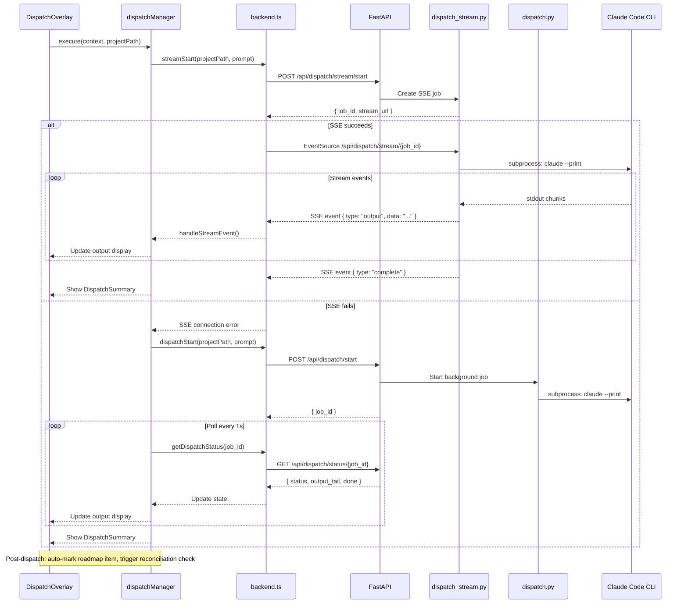
```mermaid
sequenceDiagram
    participant UI as DispatchOverlay
    participant DM as dispatchManager
    participant API as backend.ts
    participant Sidecar as FastAPI
    participant Stream as dispatch_stream.py
    participant Dispatch as dispatch.py
    participant CLI as Claude Code CLI

    UI->>DM: execute(context, projectPath)
    DM->>API: streamStart(projectPath, prompt)
    API->>Sidecar: POST /api/dispatch/stream/start
    Sidecar->>Stream: Create SSE job
    Stream-->>API: { job_id, stream_url }

    alt SSE succeeds
        API->>Stream: EventSource /api/dispatch/stream/{job_id}
        Stream->>CLI: subprocess: claude --print
        loop Stream events
            CLI-->>Stream: stdout chunks
            Stream-->>API: SSE event { type: "output", data: "..." }
            API-->>DM: handleStreamEvent()
            DM-->>UI: Update output display
        end
        Stream-->>API: SSE event { type: "complete" }
        DM-->>UI: Show DispatchSummary
    else SSE fails
        API-->>DM: SSE connection error
        DM->>API: dispatchStart(projectPath, prompt)
        API->>Sidecar: POST /api/dispatch/start
        Sidecar->>Dispatch: Start background job
        Dispatch->>CLI: subprocess: claude --print
        Sidecar-->>API: { job_id }
        loop Poll every 1s
            DM->>API: getDispatchStatus(job_id)
            API->>Sidecar: GET /api/dispatch/status/{job_id}
            Sidecar-->>API: { status, output_tail, done }
            API-->>DM: Update state
            DM-->>UI: Update output display
        end
        DM-->>UI: Show DispatchSummary
    end

    Note over DM,UI: Post-dispatch: auto-mark roadmap item, trigger reconciliation check
```

---

## 4. Parallel Execution

### Parallel Execution Phase Machine

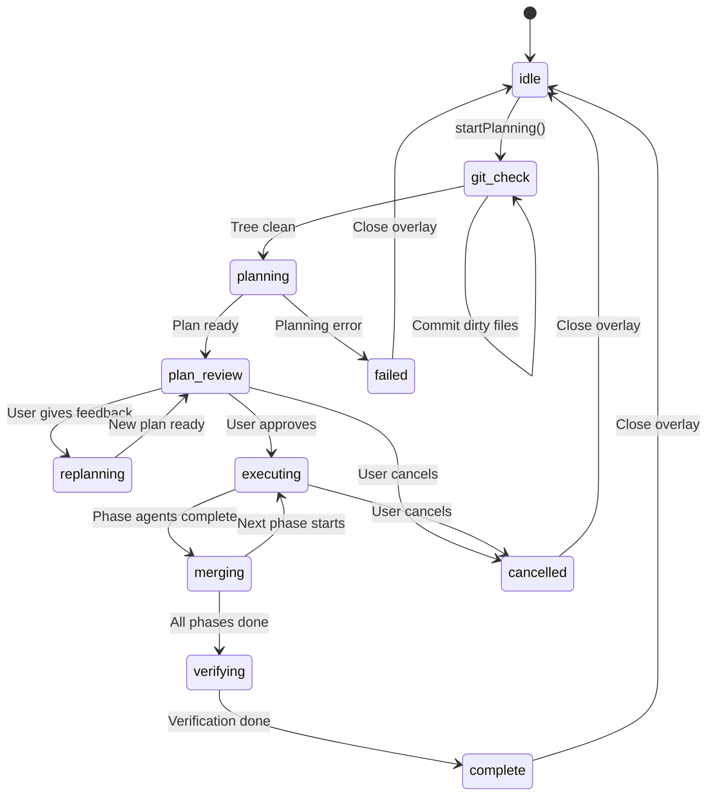
```mermaid
stateDiagram-v2
    [*] --> idle
    idle --> git_check: startPlanning()
    git_check --> planning: Tree clean
    git_check --> git_check: Commit dirty files
    planning --> plan_review: Plan ready
    planning --> failed: Planning error
    plan_review --> replanning: User gives feedback
    replanning --> plan_review: New plan ready
    plan_review --> executing: User approves
    executing --> merging: Phase agents complete
    merging --> executing: Next phase starts
    merging --> verifying: All phases done
    verifying --> complete: Verification done
    complete --> idle: Close overlay
    failed --> idle: Close overlay
    plan_review --> cancelled: User cancels
    executing --> cancelled: User cancels
    cancelled --> idle: Close overlay
```

### Full Execution Flow

```mermaid
sequenceDiagram
    participant UI as ParallelExecutionOverlay
    participant PAR as parallelManager
    participant API as backend.ts
    participant Sidecar as FastAPI
    participant Orch as ParallelOrchestrator
    participant WT as WorktreeManager
    participant CLI as Claude Code CLI

    UI->>PAR: startPlanning(milestone, projectPath)
    PAR->>API: parallelGitCheck(projectPath)
    API->>Sidecar: POST /api/parallel/git-check
    Sidecar-->>API: { clean: true }
    PAR->>API: parallelPlan(projectPath, tasks, title)
    API->>Sidecar: POST /api/parallel/plan
    Sidecar->>CLI: PlanningAgent dispatches to Claude
    loop Poll planning status
        PAR->>API: parallelPlanStatus(planJobId)
        API->>Sidecar: GET /api/parallel/plan/status/{id}
    end
    Sidecar-->>API: Plan with phases and agents
    PAR-->>UI: Show plan for review

    UI->>PAR: approvePlan(projectPath)
    PAR->>API: parallelExecute(projectPath, tasks, plan, maxParallel)
    API->>Sidecar: POST /api/parallel/execute
    Sidecar->>Orch: execute_plan()

    loop For each phase
        Orch->>WT: create_worktree() per agent
        par Parallel agents
            Orch->>CLI: dispatch_task() in worktree A
            Orch->>CLI: dispatch_task() in worktree B
        end
        Orch->>WT: merge_branch() per agent
        Orch->>WT: cleanup_batch()
    end

    Orch->>CLI: Verify success criteria
    Orch-->>Sidecar: BatchStatus (complete)

    loop Poll execution status
        PAR->>API: parallelExecuteStatus(batchId)
        API->>Sidecar: GET /api/parallel/execute/status/{id}
        Sidecar-->>API: Agent statuses, merge results, verification
        API-->>PAR: Update state
        PAR-->>UI: Render agent cards, progress
    end
```

---

## 5. Reconciliation Pipeline

### Reconciliation Footer State Machine

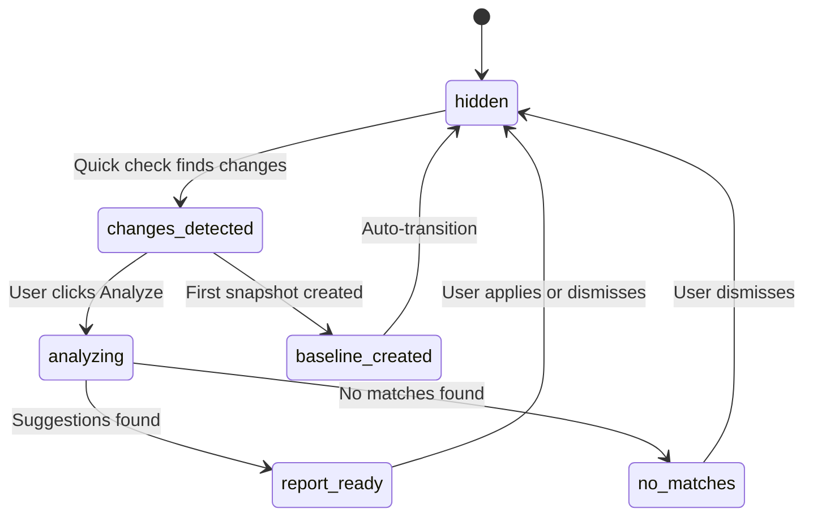
```mermaid
stateDiagram-v2
    [*] --> hidden
    hidden --> changes_detected: Quick check finds changes
    changes_detected --> analyzing: User clicks Analyze
    analyzing --> report_ready: Suggestions found
    analyzing --> no_matches: No matches found
    report_ready --> hidden: User applies or dismisses
    no_matches --> hidden: User dismisses
    changes_detected --> baseline_created: First snapshot created
    baseline_created --> hidden: Auto-transition
```

### Full Reconciliation Flow

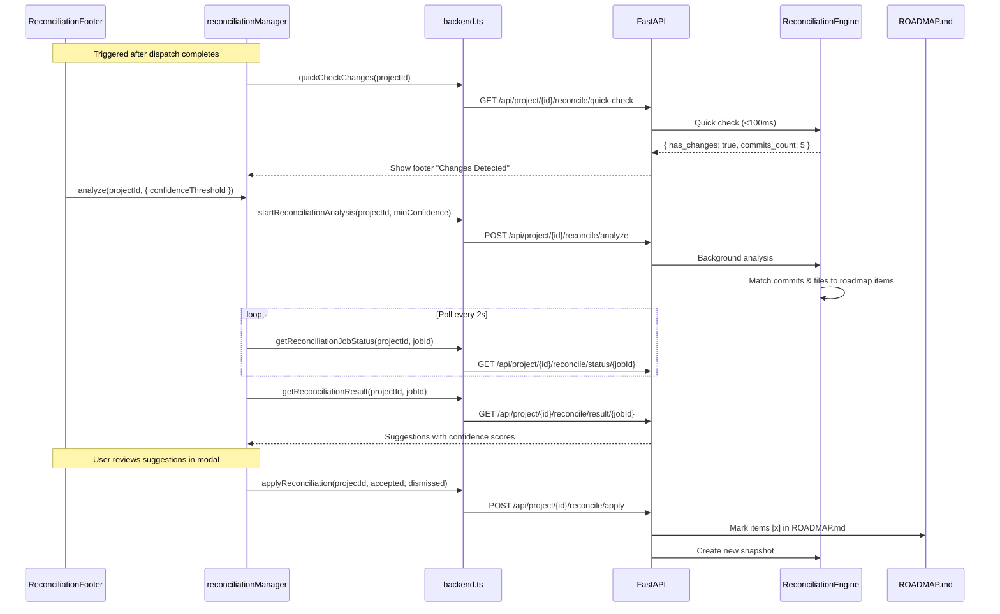
```mermaid
sequenceDiagram
    participant Footer as ReconciliationFooter
    participant RM as reconciliationManager
    participant API as backend.ts
    participant Sidecar as FastAPI
    participant Engine as ReconciliationEngine
    participant Roadmap as ROADMAP.md

    Note over Footer,RM: Triggered after dispatch completes
    RM->>API: quickCheckChanges(projectId)
    API->>Sidecar: GET /api/project/{id}/reconcile/quick-check
    Sidecar->>Engine: Quick check (<100ms)
    Engine-->>Sidecar: { has_changes: true, commits_count: 5 }
    Sidecar-->>RM: Show footer "Changes Detected"

    Footer->>RM: analyze(projectId, { confidenceThreshold })
    RM->>API: startReconciliationAnalysis(projectId, minConfidence)
    API->>Sidecar: POST /api/project/{id}/reconcile/analyze
    Sidecar->>Engine: Background analysis
    Engine->>Engine: Match commits & files to roadmap items

    loop Poll every 2s
        RM->>API: getReconciliationJobStatus(projectId, jobId)
        API->>Sidecar: GET /api/project/{id}/reconcile/status/{jobId}
    end

    RM->>API: getReconciliationResult(projectId, jobId)
    API->>Sidecar: GET /api/project/{id}/reconcile/result/{jobId}
    Sidecar-->>RM: Suggestions with confidence scores

    Note over Footer,RM: User reviews suggestions in modal
    RM->>API: applyReconciliation(projectId, accepted, dismissed)
    API->>Sidecar: POST /api/project/{id}/reconcile/apply
    Sidecar->>Roadmap: Mark items [x] in ROADMAP.md
    Sidecar->>Engine: Create new snapshot
```

---

## 6. Quality Gate Execution

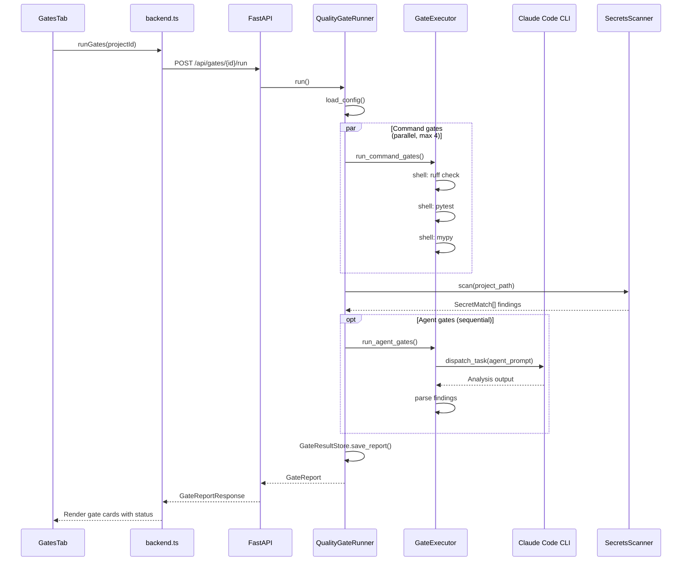
```mermaid
sequenceDiagram
    participant UI as GatesTab
    participant API as backend.ts
    participant Sidecar as FastAPI
    participant Runner as QualityGateRunner
    participant Executor as GateExecutor
    participant CLI as Claude Code CLI
    participant Scanner as SecretsScanner

    UI->>API: runGates(projectId)
    API->>Sidecar: POST /api/gates/{id}/run
    Sidecar->>Runner: run()
    Runner->>Runner: load_config()

    par Command gates (parallel, max 4)
        Runner->>Executor: run_command_gates()
        Executor->>Executor: shell: ruff check
        Executor->>Executor: shell: pytest
        Executor->>Executor: shell: mypy
    end

    Runner->>Scanner: scan(project_path)
    Scanner-->>Runner: SecretMatch[] findings

    opt Agent gates (sequential)
        Runner->>Executor: run_agent_gates()
        Executor->>CLI: dispatch_task(agent_prompt)
        CLI-->>Executor: Analysis output
        Executor->>Executor: parse findings
    end

    Runner->>Runner: GateResultStore.save_report()
    Runner-->>Sidecar: GateReport
    Sidecar-->>API: GateReportResponse
    API-->>UI: Render gate cards with status
```

---

## 7. Git Operations

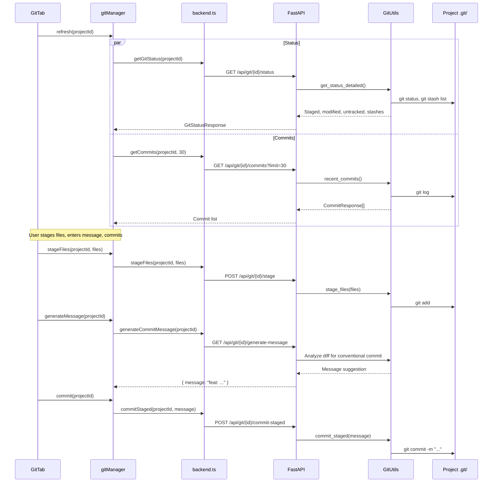
```mermaid
sequenceDiagram
    participant UI as GitTab
    participant GM as gitManager
    participant API as backend.ts
    participant Sidecar as FastAPI
    participant Git as GitUtils
    participant Repo as Project .git/

    UI->>GM: refresh(projectId)
    par Status
        GM->>API: getGitStatus(projectId)
        API->>Sidecar: GET /api/git/{id}/status
        Sidecar->>Git: get_status_detailed()
        Git->>Repo: git status, git stash list
        Git-->>Sidecar: Staged, modified, untracked, stashes
        Sidecar-->>GM: GitStatusResponse
    and Commits
        GM->>API: getCommits(projectId, 30)
        API->>Sidecar: GET /api/git/{id}/commits?limit=30
        Sidecar->>Git: recent_commits()
        Git->>Repo: git log
        Git-->>Sidecar: CommitResponse[]
        Sidecar-->>GM: Commit list
    end

    Note over UI,GM: User stages files, enters message, commits
    UI->>GM: stageFiles(projectId, files)
    GM->>API: stageFiles(projectId, files)
    API->>Sidecar: POST /api/git/{id}/stage
    Sidecar->>Git: stage_files(files)
    Git->>Repo: git add

    UI->>GM: generateMessage(projectId)
    GM->>API: generateCommitMessage(projectId)
    API->>Sidecar: GET /api/git/{id}/generate-message
    Sidecar->>Git: Analyze diff for conventional commit
    Git-->>Sidecar: Message suggestion
    Sidecar-->>GM: { message: "feat: ..." }

    UI->>GM: commit(projectId)
    GM->>API: commitStaged(projectId, message)
    API->>Sidecar: POST /api/git/{id}/commit-staged
    Sidecar->>Git: commit_staged(message)
    Git->>Repo: git commit -m "..."
```

---

## 8. Bootstrap Wizard

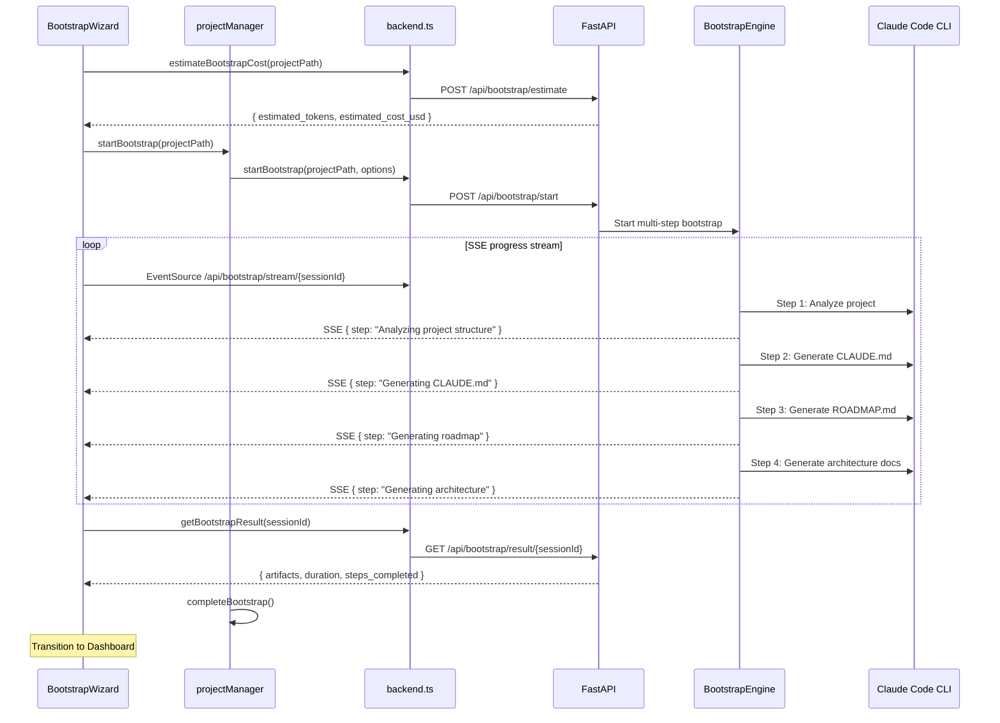
```mermaid
sequenceDiagram
    participant UI as BootstrapWizard
    participant PM as projectManager
    participant API as backend.ts
    participant Sidecar as FastAPI
    participant Engine as BootstrapEngine
    participant CLI as Claude Code CLI

    UI->>API: estimateBootstrapCost(projectPath)
    API->>Sidecar: POST /api/bootstrap/estimate
    Sidecar-->>UI: { estimated_tokens, estimated_cost_usd }

    UI->>PM: startBootstrap(projectPath)
    PM->>API: startBootstrap(projectPath, options)
    API->>Sidecar: POST /api/bootstrap/start
    Sidecar->>Engine: Start multi-step bootstrap

    loop SSE progress stream
        UI->>API: EventSource /api/bootstrap/stream/{sessionId}
        Engine->>CLI: Step 1: Analyze project
        Engine-->>UI: SSE { step: "Analyzing project structure" }
        Engine->>CLI: Step 2: Generate CLAUDE.md
        Engine-->>UI: SSE { step: "Generating CLAUDE.md" }
        Engine->>CLI: Step 3: Generate ROADMAP.md
        Engine-->>UI: SSE { step: "Generating roadmap" }
        Engine->>CLI: Step 4: Generate architecture docs
        Engine-->>UI: SSE { step: "Generating architecture" }
    end

    UI->>API: getBootstrapResult(sessionId)
    API->>Sidecar: GET /api/bootstrap/result/{sessionId}
    Sidecar-->>UI: { artifacts, duration, steps_completed }
    PM->>PM: completeBootstrap()
    Note over UI: Transition to Dashboard
```

---

## 9. Live Session Detection

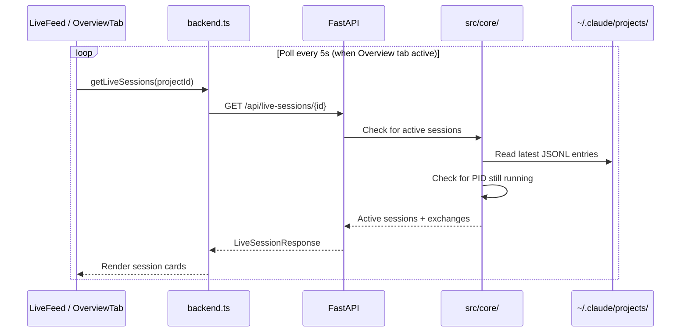
```mermaid
sequenceDiagram
    participant UI as LiveFeed / OverviewTab
    participant API as backend.ts
    participant Sidecar as FastAPI
    participant Core as src/core/
    participant Claude as ~/.claude/projects/

    loop Poll every 5s (when Overview tab active)
        UI->>API: getLiveSessions(projectId)
        API->>Sidecar: GET /api/live-sessions/{id}
        Sidecar->>Core: Check for active sessions
        Core->>Claude: Read latest JSONL entries
        Core->>Core: Check for PID still running
        Core-->>Sidecar: Active sessions + exchanges
        Sidecar-->>API: LiveSessionResponse
        API-->>UI: Render session cards
    end
```

---

## 10. Pre-Flight Checks

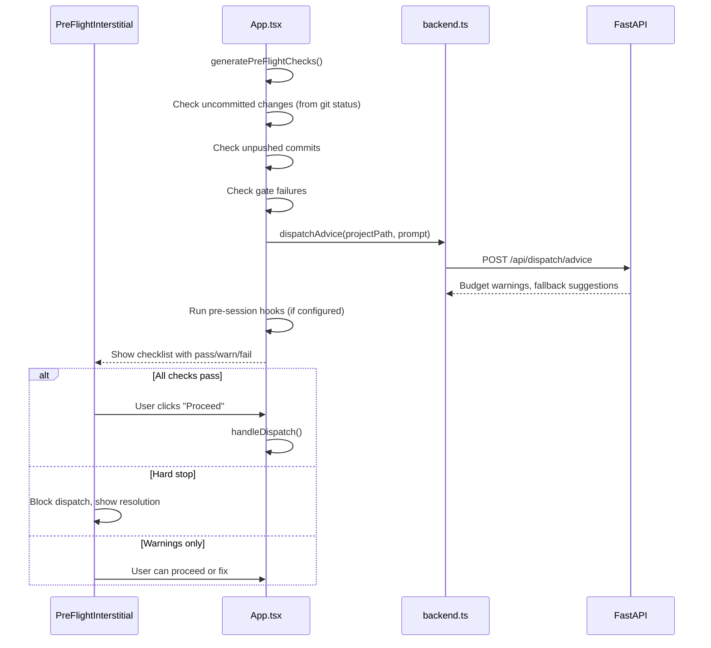
```mermaid
sequenceDiagram
    participant UI as PreFlightInterstitial
    participant App as App.tsx
    participant API as backend.ts
    participant Sidecar as FastAPI

    App->>App: generatePreFlightChecks()
    App->>App: Check uncommitted changes (from git status)
    App->>App: Check unpushed commits
    App->>App: Check gate failures
    App->>API: dispatchAdvice(projectPath, prompt)
    API->>Sidecar: POST /api/dispatch/advice
    Sidecar-->>API: Budget warnings, fallback suggestions
    App->>App: Run pre-session hooks (if configured)
    App-->>UI: Show checklist with pass/warn/fail

    alt All checks pass
        UI->>App: User clicks "Proceed"
        App->>App: handleDispatch()
    else Hard stop
        UI->>UI: Block dispatch, show resolution
    else Warnings only
        UI->>App: User can proceed or fix
    end
```

---

## 11. Provider Fallback

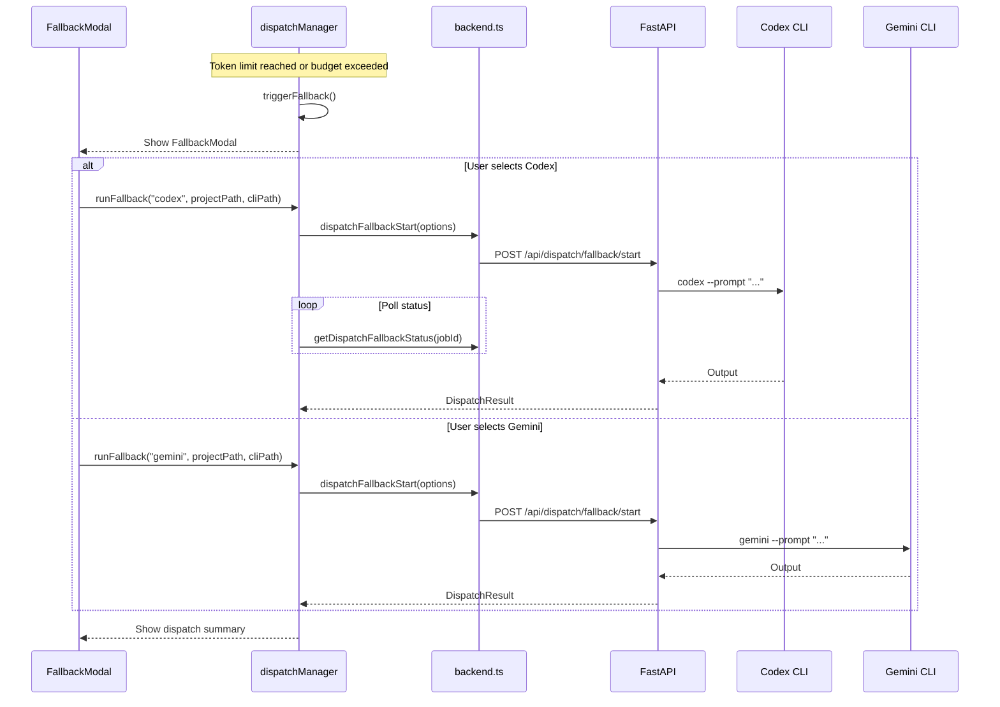
```mermaid
sequenceDiagram
    participant UI as FallbackModal
    participant DM as dispatchManager
    participant API as backend.ts
    participant Sidecar as FastAPI
    participant Codex as Codex CLI
    participant Gemini as Gemini CLI

    Note over DM: Token limit reached or budget exceeded
    DM->>DM: triggerFallback()
    DM-->>UI: Show FallbackModal

    alt User selects Codex
        UI->>DM: runFallback("codex", projectPath, cliPath)
        DM->>API: dispatchFallbackStart(options)
        API->>Sidecar: POST /api/dispatch/fallback/start
        Sidecar->>Codex: codex --prompt "..."
        loop Poll status
            DM->>API: getDispatchFallbackStatus(jobId)
        end
        Codex-->>Sidecar: Output
        Sidecar-->>DM: DispatchResult
    else User selects Gemini
        UI->>DM: runFallback("gemini", projectPath, cliPath)
        DM->>API: dispatchFallbackStart(options)
        API->>Sidecar: POST /api/dispatch/fallback/start
        Sidecar->>Gemini: gemini --prompt "..."
        Gemini-->>Sidecar: Output
        Sidecar-->>DM: DispatchResult
    end

    DM-->>UI: Show dispatch summary
```

---

## 12. Error Recovery Flows

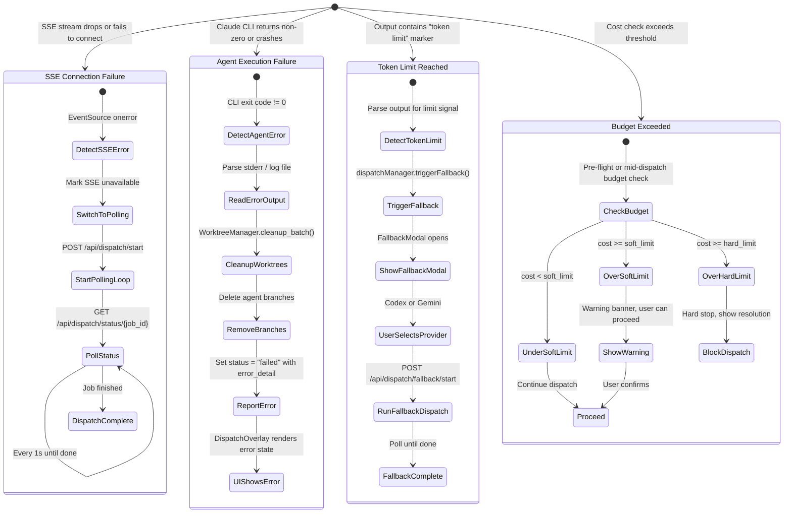
```mermaid
stateDiagram-v2
    state "SSE Connection Failure" as sse_fail
    state "Agent Execution Failure" as agent_fail
    state "Token Limit Reached" as token_limit
    state "Budget Exceeded" as budget_exceeded

    [*] --> sse_fail: SSE stream drops or fails to connect

    state sse_fail {
        [*] --> DetectSSEError: EventSource onerror
        DetectSSEError --> SwitchToPolling: Mark SSE unavailable
        SwitchToPolling --> StartPollingLoop: POST /api/dispatch/start
        StartPollingLoop --> PollStatus: GET /api/dispatch/status/{job_id}
        PollStatus --> PollStatus: Every 1s until done
        PollStatus --> DispatchComplete: Job finished
    }

    [*] --> agent_fail: Claude CLI returns non-zero or crashes

    state agent_fail {
        [*] --> DetectAgentError: CLI exit code != 0
        DetectAgentError --> ReadErrorOutput: Parse stderr / log file
        ReadErrorOutput --> CleanupWorktrees: WorktreeManager.cleanup_batch()
        CleanupWorktrees --> RemoveBranches: Delete agent branches
        RemoveBranches --> ReportError: Set status = "failed" with error_detail
        ReportError --> UIShowsError: DispatchOverlay renders error state
    }

    [*] --> token_limit: Output contains "token limit" marker

    state token_limit {
        [*] --> DetectTokenLimit: Parse output for limit signal
        DetectTokenLimit --> TriggerFallback: dispatchManager.triggerFallback()
        TriggerFallback --> ShowFallbackModal: FallbackModal opens
        ShowFallbackModal --> UserSelectsProvider: Codex or Gemini
        UserSelectsProvider --> RunFallbackDispatch: POST /api/dispatch/fallback/start
        RunFallbackDispatch --> FallbackComplete: Poll until done
    }

    [*] --> budget_exceeded: Cost check exceeds threshold

    state budget_exceeded {
        [*] --> CheckBudget: Pre-flight or mid-dispatch budget check
        CheckBudget --> UnderSoftLimit: cost < soft_limit
        CheckBudget --> OverSoftLimit: cost >= soft_limit
        CheckBudget --> OverHardLimit: cost >= hard_limit
        UnderSoftLimit --> Proceed: Continue dispatch
        OverSoftLimit --> ShowWarning: Warning banner, user can proceed
        ShowWarning --> Proceed: User confirms
        OverHardLimit --> BlockDispatch: Hard stop, show resolution
    }
```

---

## 13. Parallel Execution Error Handling

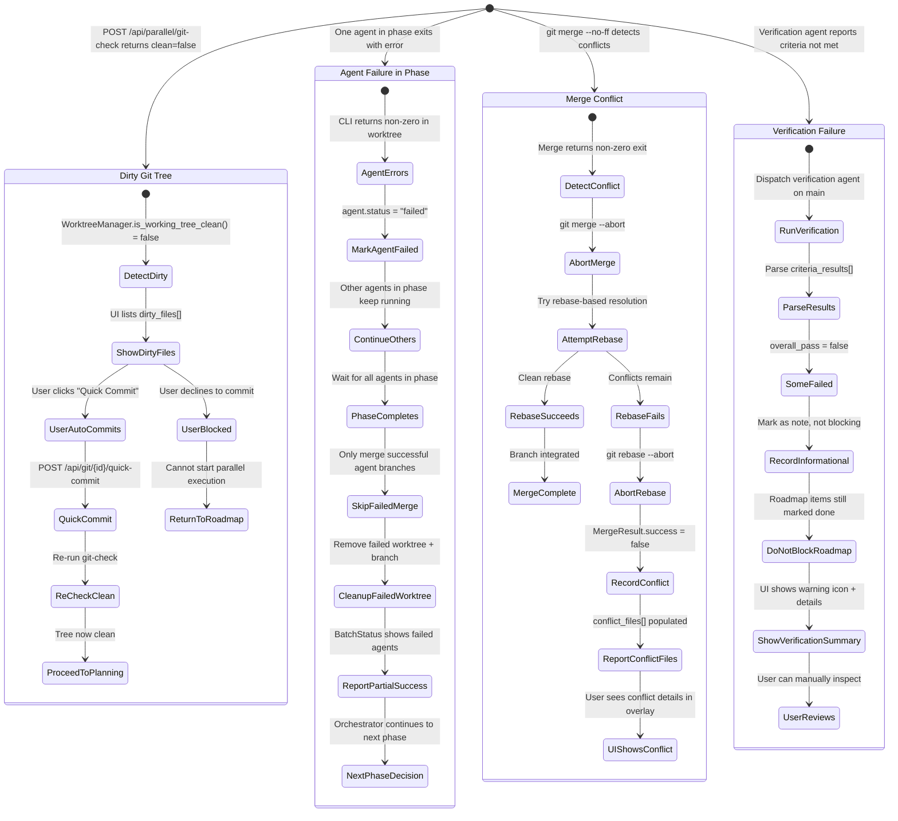
```mermaid
stateDiagram-v2
    state "Dirty Git Tree" as dirty_tree
    state "Agent Failure in Phase" as phase_fail
    state "Merge Conflict" as merge_conflict
    state "Verification Failure" as verify_fail

    [*] --> dirty_tree: POST /api/parallel/git-check returns clean=false

    state dirty_tree {
        [*] --> DetectDirty: WorktreeManager.is_working_tree_clean() = false
        DetectDirty --> ShowDirtyFiles: UI lists dirty_files[]
        ShowDirtyFiles --> UserAutoCommits: User clicks "Quick Commit"
        ShowDirtyFiles --> UserBlocked: User declines to commit
        UserAutoCommits --> QuickCommit: POST /api/git/{id}/quick-commit
        QuickCommit --> ReCheckClean: Re-run git-check
        ReCheckClean --> ProceedToPlanning: Tree now clean
        UserBlocked --> ReturnToRoadmap: Cannot start parallel execution
    }

    [*] --> phase_fail: One agent in phase exits with error

    state phase_fail {
        [*] --> AgentErrors: CLI returns non-zero in worktree
        AgentErrors --> MarkAgentFailed: agent.status = "failed"
        MarkAgentFailed --> ContinueOthers: Other agents in phase keep running
        ContinueOthers --> PhaseCompletes: Wait for all agents in phase
        PhaseCompletes --> SkipFailedMerge: Only merge successful agent branches
        SkipFailedMerge --> CleanupFailedWorktree: Remove failed worktree + branch
        CleanupFailedWorktree --> ReportPartialSuccess: BatchStatus shows failed agents
        ReportPartialSuccess --> NextPhaseDecision: Orchestrator continues to next phase
    }

    [*] --> merge_conflict: git merge --no-ff detects conflicts

    state merge_conflict {
        [*] --> DetectConflict: Merge returns non-zero exit
        DetectConflict --> AbortMerge: git merge --abort
        AbortMerge --> AttemptRebase: Try rebase-based resolution
        AttemptRebase --> RebaseSucceeds: Clean rebase
        AttemptRebase --> RebaseFails: Conflicts remain
        RebaseSucceeds --> MergeComplete: Branch integrated
        RebaseFails --> AbortRebase: git rebase --abort
        AbortRebase --> RecordConflict: MergeResult.success = false
        RecordConflict --> ReportConflictFiles: conflict_files[] populated
        ReportConflictFiles --> UIShowsConflict: User sees conflict details in overlay
    }

    [*] --> verify_fail: Verification agent reports criteria not met

    state verify_fail {
        [*] --> RunVerification: Dispatch verification agent on main
        RunVerification --> ParseResults: Parse criteria_results[]
        ParseResults --> SomeFailed: overall_pass = false
        SomeFailed --> RecordInformational: Mark as note, not blocking
        RecordInformational --> DoNotBlockRoadmap: Roadmap items still marked done
        DoNotBlockRoadmap --> ShowVerificationSummary: UI shows warning icon + details
        ShowVerificationSummary --> UserReviews: User can manually inspect
    }
```

---

## Cross-Cutting: Data Storage

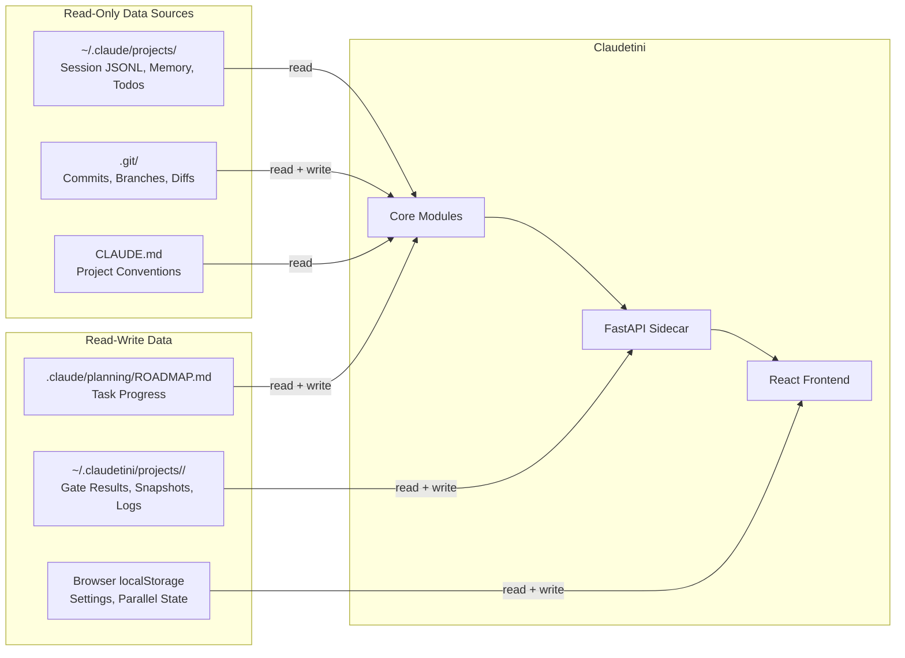
```mermaid
graph LR
    subgraph ReadOnly["Read-Only Data Sources"]
        Claude["~/.claude/projects/<br/>Session JSONL, Memory, Todos"]
        GitData[".git/<br/>Commits, Branches, Diffs"]
        ClaudeMD["CLAUDE.md<br/>Project Conventions"]
    end

    subgraph ReadWrite["Read-Write Data"]
        Roadmap[".claude/planning/ROADMAP.md<br/>Task Progress"]
        Runtime["~/.claudetini/projects/<hash>/<br/>Gate Results, Snapshots, Logs"]
        LocalStorage["Browser localStorage<br/>Settings, Parallel State"]
    end

    subgraph App["Claudetini"]
        Core["Core Modules"]
        Sidecar["FastAPI Sidecar"]
        Frontend["React Frontend"]
    end

    Claude -->|read| Core
    GitData -->|read + write| Core
    ClaudeMD -->|read| Core
    Roadmap -->|read + write| Core
    Runtime -->|read + write| Sidecar
    LocalStorage -->|read + write| Frontend
    Core --> Sidecar
    Sidecar --> Frontend
```
