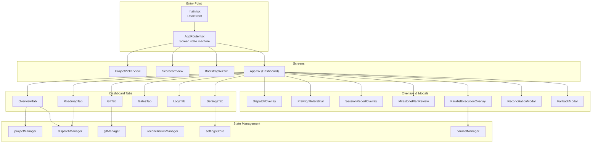

# Frontend Architecture

> Last updated: 2026-02-17

> **See also:** [Design System](DESIGN-SYSTEM.md) for the full color token reference, typography, spacing, and UI primitive specs. [State Management](STATE-MANAGEMENT.md) for detailed Zustand store documentation, domain manager patterns, and persistence strategies. Per-view documentation is available in [docs/views/](views/) for detailed coverage of each tab, overlay, and screen.

## Overview

The Claudetini frontend is a React 19 single-page application bundled with Vite 7 and styled with Tailwind CSS 3.4. It runs inside a Tauri 2 desktop shell and communicates with a Python FastAPI sidecar via HTTP REST and Server-Sent Events (SSE).

**Stack:** React 19 + TypeScript 5.8 + Zustand 5 + Tailwind CSS 3.4 + Vite 7

## Application Structure



## Screen Router

`AppRouter.tsx` implements a screen state machine that determines which top-level view to render.

| Screen | Component | Condition |
|--------|-----------|-----------|
| `picker` | `ProjectPickerView` | Initial screen, no project selected |
| `scorecard` | `ScorecardView` | Project selected, checking readiness |
| `bootstrap` | `BootstrapWizard` | Score < 70 or critical issues found |
| `dashboard` | `App.tsx` | Project ready, main application |

**Transitions:** `picker` -> `scorecard` -> `bootstrap` (if needed) -> `dashboard`

## Dashboard Tabs

Defined in `App.tsx`:
```typescript
const TABS = ["Overview", "Roadmap", "Git", "Quality Gates", "Logs", "Settings"];
```

Each tab is rendered as a child of the main `Dashboard` layout component with a `TabBar` for navigation.

---

## Component Catalog

### Layout (`components/layout/`)

| Component | File | Description |
|-----------|------|-------------|
| `Dashboard` | `layout/Dashboard.tsx` | Main layout shell with header and content area |
| `TabBar` | `layout/TabBar.tsx` | Horizontal tab navigation bar |

### Overview Tab (`components/overview/`)

| Component | File | Description |
|-----------|------|-------------|
| `OverviewTab` | `overview/OverviewTab.tsx` | Main overview dashboard |
| `ProjectHero` | `overview/ProjectHero.tsx` | Project name, branch, health score banner |
| `MilestoneCard` | `overview/MilestoneCard.tsx` | Active milestone with item checkboxes |
| `LiveFeed` | `overview/LiveFeed.tsx` | Real-time session activity feed |
| `RecentSessions` | `overview/RecentSessions.tsx` | Past session history cards |
| `QualityIssues` | `overview/QualityIssues.tsx` | Quality gate warnings panel |
| `GitStatusBar` | `overview/GitStatusBar.tsx` | Compact git status display |
| `AskInput` | `overview/AskInput.tsx` | Free-text dispatch prompt input |
| `ValidationList` | `overview/ValidationList.tsx` | Validation checks list |

### Roadmap Tab (`components/roadmap/`)

| Component | File | Description |
|-----------|------|-------------|
| `RoadmapTab` | `roadmap/RoadmapTab.tsx` | Milestone list with item actions |
| `SuggestionCard` | `roadmap/SuggestionCard.tsx` | AI task suggestion card |
| `ReconciliationModal` | `roadmap/ReconciliationModal.tsx` | Reconciliation suggestion review modal |
| `ParallelExecutionOverlay` | `roadmap/ParallelExecutionOverlay.tsx` | Full-screen parallel execution UI |

### Tab Views

| Component | File | Description |
|-----------|------|-------------|
| `TimelineTab` | `timeline/TimelineTab.tsx` | Session timeline with commit correlation (exists but not in active TABS — available for future use) |
| `LogsTab` | `logs/LogsTab.tsx` | Log entry viewer with filtering |
| `SettingsTab` | `settings/SettingsTab.tsx` | Full settings panel |
| `ProjectPickerView` | `project/ProjectPickerView.tsx` | Project list and registration |
| `GitTab` | `git/GitTab.tsx` | Git status, staging, commit, push |
| `GatesTab` | `gates/GatesTab.tsx` | Quality gate results and execution |

### Dispatch (`components/dispatch/`)

| Component | File | Description |
|-----------|------|-------------|
| `DispatchOverlay` | `dispatch/DispatchOverlay.tsx` | Full-screen dispatch progress with streaming output |
| `DispatchMinimized` | `dispatch/DispatchMinimized.tsx` | Minimized dispatch indicator |
| `DispatchSummary` | `dispatch/DispatchSummary.tsx` | Post-dispatch file changes and actions |
| `StreamingOutput` | `dispatch/StreamingOutput.tsx` | Real-time CLI output renderer |
| `FallbackModal` | `dispatch/FallbackModal.tsx` | Codex/Gemini fallback provider modal |

### Scorecard & Bootstrap

| Component | File | Description |
|-----------|------|-------------|
| `ScorecardView` | `scorecard/ScorecardView.tsx` | Readiness scorecard with scoring rings |
| `ReadinessRing` | `scorecard/ReadinessRing.tsx` | Circular progress indicator |
| `BootstrapWizard` | `bootstrap/BootstrapWizard.tsx` | Multi-step project setup wizard |
| `BootstrapProgressView` | `bootstrap/BootstrapProgressView.tsx` | Bootstrap step-by-step progress |

### Overlays (`components/overlays/`)

| Component | File | Description |
|-----------|------|-------------|
| `PreFlightInterstitial` | `overlays/PreFlightInterstitial.tsx` | Pre-dispatch check modal |
| `SessionReportOverlay` | `overlays/SessionReportOverlay.tsx` | Detailed session report |
| `MilestonePlanReview` | `overlays/MilestonePlanReview.tsx` | Milestone plan review before execution |

### Footer

| Component | File | Description |
|-----------|------|-------------|
| `ReconciliationFooter` | `footer/ReconciliationFooter.tsx` | Persistent reconciliation status bar |

### UI Primitives (`components/ui/`)

| Component | File | Description |
|-----------|------|-------------|
| `Button` | `ui/Button.tsx` | Button with variants (primary, secondary, ghost) |
| `Tag` | `ui/Tag.tsx` | Chip/badge component |
| `SeverityTag` | `ui/SeverityTag.tsx` | Color-coded severity indicator |
| `StatusDot` | `ui/StatusDot.tsx` | Small status dot (pass/warn/fail) |
| `Section` | `ui/Section.tsx` | Card/section container |
| `Toggle` | `ui/Toggle.tsx` | Checkbox/switch toggle |
| `Select` | `ui/Select.tsx` | Dropdown selector |
| `Toast` | `ui/Toast.tsx` | Toast notification system |
| `ConfirmDialog` | `ui/ConfirmDialog.tsx` | Confirmation modal dialog |
| `SkeletonLoader` | `ui/SkeletonLoader.tsx` | Loading skeleton placeholder |
| `Icons` | `ui/Icons.tsx` | SVG icon library |
| `Sparkline` | `ui/Sparkline.tsx` | Tiny line chart for trend data |
| `InlineMarkdown` | `ui/InlineMarkdown.tsx` | Lightweight inline markdown renderer |
| `DiffBlock` | `ui/DiffBlock.tsx` | Syntax-highlighted diff viewer |

---

## State Management

Claudetini uses Zustand 5 for state management with a "Domain Manager" pattern. Each major feature area has its own store with state, actions, and internal polling logic.

### `projectManager` — Project & Screen State

| Field | Type | Description |
|-------|------|-------------|
| `currentScreen` | `AppScreen` | Active screen (picker/scorecard/bootstrap/dashboard) |
| `currentProject` | `Project \| null` | Selected project |
| `projects` | `Project[]` | All registered projects |
| `readinessScore` | `number \| null` | Current readiness score |
| `readinessReport` | `ReadinessReport \| null` | Full readiness report |
| `bootstrapSessionId` | `string \| null` | Active bootstrap session |
| `bootstrapInProgress` | `boolean` | Bootstrap running flag |

**Actions:** `loadProjects()`, `scanReadiness()`, `startBootstrap()`, `completeBootstrap()`, `setScreen()`

### `dispatchManager` — Dispatch Lifecycle

| Field | Type | Description |
|-------|------|-------------|
| `phase` | `DispatchPhase` | Current phase (idle/starting/streaming/polling/completing/failed/token_limit/cancelled) |
| `jobId` | `string \| null` | Active dispatch job ID |
| `elapsedSeconds` | `number` | Elapsed time counter |
| `progressPct` | `number` | Estimated progress (0-100) |
| `statusText` | `string` | Human-readable status |
| `outputTail` | `string \| null` | Latest CLI output |
| `streamOutputLines` | `string[]` | Full streaming output lines |
| `errorDetail` | `string \| null` | Error message if failed |
| `fallbackPhase` | `string` | Fallback dispatch phase |
| `milestonePlanPhase` | `string` | Milestone planning phase |

**Actions:** `execute()`, `retry()`, `cancel()`, `runFallback()`, `startMilestonePlan()`, `executeMilestone()`, `cleanup()`

**Execution Flow:** SSE streaming attempted first → automatic fallback to HTTP polling if SSE fails

### `gitManager` — Git Operations

| Field | Type | Description |
|-------|------|-------------|
| `status` | `GitStatus \| null` | Current git status |
| `commits` | `Commit[]` | Recent commit history |
| `commitMessage` | `string` | Draft commit message |
| `isCommitting` | `boolean` | Commit in progress |
| `isGeneratingMessage` | `boolean` | Message generation in progress |

**Actions:** `refresh()`, `stageFiles()`, `stageAll()`, `unstageFiles()`, `unstageAll()`, `generateMessage()`, `generateMessageAI()`, `commit()`, `push()`, `discardFile()`, `deleteUntracked()`, `stashPop()`, `stashDrop()`

### `reconciliationManager` — Reconciliation Workflow

| Field | Type | Description |
|-------|------|-------------|
| `footerState` | `ReconciliationFooterState` | UI state (hidden/changes_detected/analyzing/report_ready/no_matches/baseline_created) |
| `report` | `ReconciliationReport \| null` | Analysis report |
| `jobId` | `string \| null` | Background job ID |
| `showModal` | `boolean` | Modal visibility |
| `checkedItems` | `Set<string>` | Selected suggestions |

**Actions:** `check()`, `analyze()`, `verifyProgress()`, `verifyProgressAI()`, `apply()`, `undo()`, `dismiss()`, `toggleCheckedItem()`, `toggleAllHighConfidence()`

### `parallelManager` — Parallel Execution

| Field | Type | Description |
|-------|------|-------------|
| `phase` | `ParallelPhase` | Current phase (idle/git_check/planning/plan_review/replanning/executing/merging/verifying/finalizing/complete/failed/cancelled) |
| `plan` | `ExecutionPlan \| null` | Approved execution plan |
| `batchId` | `string \| null` | Active execution batch |
| `agents` | `AgentSlotStatus[]` | Per-agent status cards |
| `mergeResults` | `MergeResultStatus[]` | Branch merge outcomes |
| `verification` | `VerificationResult \| null` | Success criteria results |
| `totalCost` | `number` | Cumulative cost estimate |

**Actions:** `startPlanning()`, `approvePlan()`, `replan()`, `cancel()`, `closeOverlay()`, `commitAndProceed()`, `generateCommitMessage()`

**Persistence:** State persisted to localStorage for Vite HMR survival.

### `settingsStore` — User Settings

| Field | Type | Description |
|-------|------|-------------|
| `preferredFallback` | `"codex" \| "gemini"` | Preferred fallback provider |
| `usageMode` | `"subscription" \| "api"` | Usage mode |
| `claudeRemainingPct` | `number` | Claude remaining usage % |
| `fallbackThresholdPct` | `number` | Fallback suggestion threshold |
| `reconciliationEnabled` | `boolean` | Auto-reconciliation on/off |
| `maxParallelAgents` | `number` | Max parallel agents (1-8) |
| `lightModel` | `string` | Model for lightweight tasks |
| `preSessionHooks` | `HookCommand[]` | Pre-session shell commands |
| `postSessionHooks` | `HookCommand[]` | Post-session shell commands |
| `preMergeHooks` | `HookCommand[]` | Pre-merge shell commands |
| `postMergeHooks` | `HookCommand[]` | Post-merge shell commands |

**Persistence:** Zustand with localStorage — settings survive page reloads and HMR.

---

## API Client (`api/backend.ts`)

The API client provides type-safe methods for all sidecar endpoints with built-in infrastructure features.

### Features

- **GET Deduplication** — Concurrent identical GET requests are collapsed into a single network call
- **Timing Instrumentation** — All API calls timed and logged to DevTools console with tier classification (instant <50ms, fast <200ms, medium <1s, slow >1s)
- **Timeout Handling** — Default 2-minute timeout on all requests
- **Error Handling** — HTTP status codes mapped to descriptive errors

### Endpoint Count by Domain

| Domain | Method Count |
|--------|-------------|
| Projects | 4 |
| Roadmap | 3 |
| Timeline | 1 |
| Git | 17 |
| Quality Gates | 2 |
| Dispatch | 14 |
| Streaming | 3 |
| Live Sessions | 1 |
| Reconciliation | 9 |
| Readiness | 2 |
| Bootstrap | 3 |
| Parallel | 8 |
| Logs | 1 |

---

## Hooks

### `useLazyLoad`

Intersection Observer-based lazy loading. Returns `{ isVisible, elementRef }`. Triggers once when element scrolls into view.

### `useDataCache`

Module-level caching utility (not a React hook) with TTL tiers:

| Cache Key | TTL |
|-----------|-----|
| Sessions | 5 min (immutable data) |
| Timeline | 2 min |
| Advice | 5 min |
| Commits | 30 sec |
| Git status | 15 sec |
| Default | 1 min |

**Functions:** `getCached<T>(key)`, `setCache<T>(key, data)`, `invalidateCache(keyPrefix)`

---

## Design System

### Theme

"Mission Control" — dark theme inspired by Bloomberg Terminal, Linear, and Raycast.

### Color Tokens (`styles/tokens.ts`)

| Token | Value | Usage |
|-------|-------|-------|
| `mc-bg-0` | `#0c0c0f` | Deepest background |
| `mc-bg-1` | `#111116` | Primary surface |
| `mc-bg-2` | `#18181f` | Elevated surface |
| `mc-bg-3` | `#1f1f28` | Card background |
| `mc-bg-4` | `#262630` | Hover state |
| `mc-border-0` | 4% white | Subtle divider |
| `mc-border-1` | 7% white | Default border |
| `mc-border-2` | 12% white | Emphasized border |
| `mc-text-0` | `#f0f0f5` | Primary text |
| `mc-text-1` | | Secondary text |
| `mc-text-2` | | Tertiary text |
| `mc-text-3` | `#5c5c6e` | Muted text |
| `mc-accent` | `#8b7cf6` | Purple accent |
| `mc-green` | `#34d399` | Success/pass |
| `mc-red` | `#f87171` | Error/fail |
| `mc-amber` | `#fbbf24` | Warning |
| `mc-cyan` | `#22d3ee` | Info/active |

### Typography

- **Sans:** Satoshi, DM Sans, system sans-serif
- **Mono:** IBM Plex Mono, JetBrains Mono, monospace

### Styling Rules

- All custom colors use the `mc-` prefix in Tailwind classes
- Consistent border radius: `rounded-lg` for cards, `rounded-md` for inputs
- Spacing: 4px grid (Tailwind default)
- No inline styles — all styling via Tailwind utility classes

---

## TypeScript Interfaces

All shared types are defined in `types/index.ts`, organized by domain:

| Domain | Key Interfaces |
|--------|---------------|
| **Project** | `Project`, `HealthReport`, `HealthItem` |
| **Roadmap** | `Roadmap`, `Milestone`, `MilestoneItem` |
| **Timeline** | `TimelineResponse`, `TimelineEntry`, `CommitInfo`, `TokenUsageSnapshot`, `SessionTestResult` |
| **Git** | `GitStatus`, `UncommittedFile`, `UntrackedFile`, `Stash`, `Commit` |
| **Gates** | `GateReport`, `Gate`, `GateFinding` |
| **Dispatch** | `DispatchResult`, `DispatchStartResult`, `DispatchJobStatus`, `DispatchAdvice`, `DispatchUsageSummary` |
| **Streaming** | `StreamEvent`, `StreamStartResult`, `StreamJobStatus` |
| **Parallel** | `ExecutionPlan`, `ExecutionPhase`, `AgentAssignment`, `ParallelBatchStatus`, `VerificationResult`, `CriterionResult` |
| **Reconciliation** | `ReconciliationReport`, `RoadmapSuggestion`, `FileChange`, `ReconciliationFooterState` |
| **Readiness** | `ReadinessReport`, `ReadinessCheck` |
| **Settings** | `HookCommand` (settings are in settingsStore, not typed separately) |
