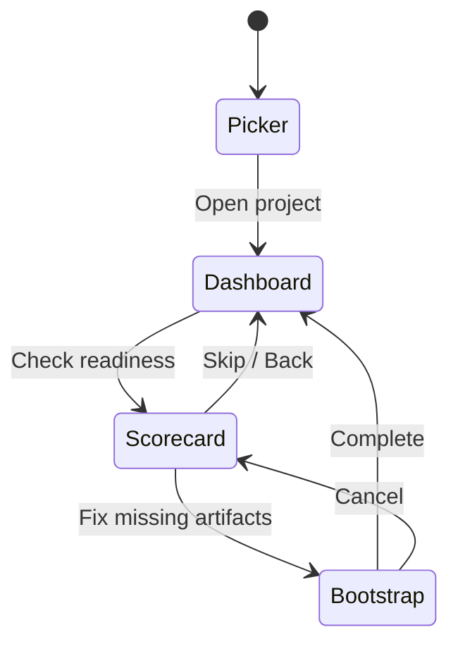

# View Documentation

> Last updated: 2026-02-17

Claudetini uses a view-based architecture managed by `AppRouter.tsx`. The application is a state machine that transitions between standalone screens (project picker, scorecard, bootstrap wizard) and a tabbed dashboard. Overlays and modals layer on top of any active screen. Each view is documented in its own file linked below.

## Screen Flow

`AppRouter` (`src/AppRouter.tsx`) owns the `currentScreen` state via `useProjectManager`. The four screens are `picker`, `scorecard`, `bootstrap`, and `dashboard`. The dashboard screen renders `App.tsx`, which manages the tab bar and all overlay state.

## Dashboard Tabs

The `TABS` array in `App.tsx` defines the six active tabs. Each tab is always mounted but hidden when inactive to preserve fetch state across switches.

| Index | Tab | Component | Doc |
|-------|-----|-----------|-----|
| 0 | Overview | `OverviewTab` | [overview.md](overview.md) |
| 1 | Roadmap | `RoadmapTab` | [roadmap.md](roadmap.md) |
| 2 | Git | `GitTab` | [git.md](git.md) |
| 3 | Quality Gates | `GatesTab` | [gates.md](gates.md) |
| 4 | Logs | `LogsTab` | [logs.md](logs.md) |
| 5 | Settings | `SettingsTab` | [settings.md](settings.md) |
| -- | Timeline | `TimelineTab` | [timeline.md](timeline.md) |

> **Note:** Timeline (`TimelineTab`) exists as a component in `components/timeline/` but is not included in the active `TABS` array and is not rendered in the current dashboard layout.

## Overlays and Modals

Overlays render on top of the dashboard and are controlled by state flags in `App.tsx`.

| Overlay | Component(s) | Trigger | Doc |
|---------|-------------|---------|-----|
| Dispatch | `DispatchOverlay`, `DispatchMinimized`, `DispatchSummary`, `FallbackModal` | Task execution via pre-flight | [dispatch.md](dispatch.md) |
| Parallel Execution | `ParallelExecutionOverlay` | "Run Parallel" on a milestone | [parallel-execution.md](parallel-execution.md) |
| Pre-flight | `PreFlightInterstitial` | Any dispatch action | [overlays.md](overlays.md) |
| Session Report | `SessionReportOverlay` | View report from Overview or Git | [overlays.md](overlays.md) |
| Milestone Plan | `MilestonePlanReview` | "Start Milestone" on Roadmap tab | [overlays.md](overlays.md) |
| Reconciliation | `ReconciliationModal`, `ReconciliationFooter` | Auto-detected completed items | [reconciliation.md](reconciliation.md) |

## Standalone Screens

These screens are rendered by `AppRouter` instead of the dashboard.

| Screen | Component | Entry point | Doc |
|--------|-----------|-------------|-----|
| Project Picker | `ProjectPickerView` | App launch (default screen) | [project-picker.md](project-picker.md) |
| Scorecard | `ScorecardView` | Dashboard action to check readiness | [scorecard.md](scorecard.md) |
| Bootstrap | `BootstrapWizard`, `BootstrapProgressView` | Scorecard "Fix" action | [bootstrap.md](bootstrap.md) |

## Component Count Summary

| Directory | Count | Purpose |
|-----------|-------|---------|
| `components/overview/` | 9 | Overview tab and its sub-components |
| `components/roadmap/` | 4 | Roadmap tab, reconciliation modal, parallel overlay |
| `components/dispatch/` | 5 | Dispatch overlay, minimized bar, summary, fallback |
| `components/overlays/` | 3 | Pre-flight, session report, milestone plan |
| `components/ui/` | 14 | Reusable primitives (Button, Tag, Toast, etc.) |
| `components/layout/` | 2 | Dashboard shell and TabBar |
| `components/scorecard/` | 2 | Scorecard view and readiness ring |
| `components/bootstrap/` | 2 | Bootstrap wizard and progress view |
| `components/git/` | 1 | Git tab |
| `components/gates/` | 1 | Quality gates tab |
| `components/logs/` | 1 | Logs tab |
| `components/settings/` | 1 | Settings tab |
| `components/timeline/` | 1 | Timeline tab (inactive) |
| `components/project/` | 1 | Project picker |
| `components/footer/` | 1 | Reconciliation footer |
| **Total** | **48** | |

All component paths are relative to `app/src/`.

## Demo Projects

| Document | Description |
|----------|-------------|
| [Recipe CLI Demo](recipe-cli-demo.md) | Beginner demo (recipe-cli) |
| [Devlog Demo](devlog-demo.md) | Intermediate demo (devlog) |
