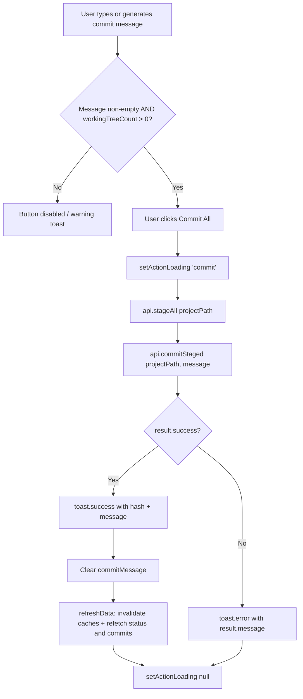
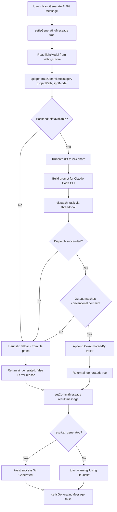
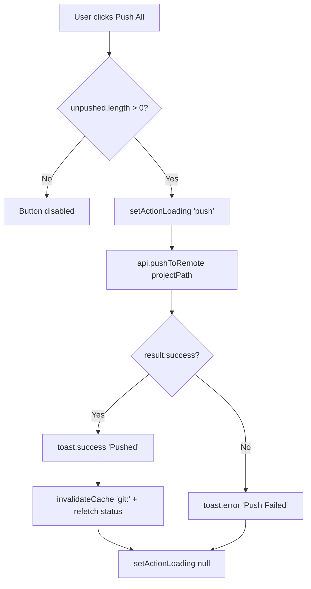
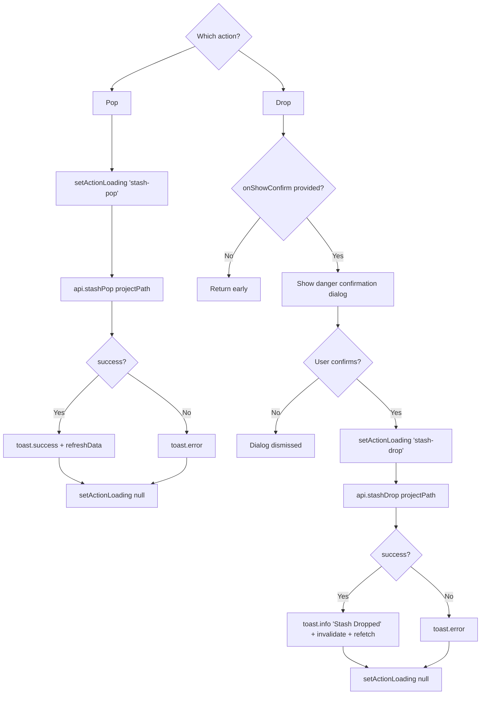
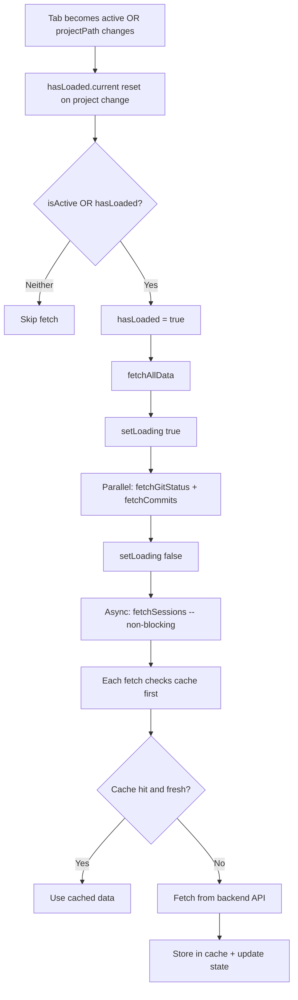

# Git Tab

Last updated: 2026-02-17

## 1. Purpose and Role

The Git tab (`GitTab.tsx`) is Claudetini's integrated source-control panel. It provides a real-time view of the repository state for the currently selected project, combining working-tree inspection, commit history, session correlation, and one-click git actions (commit, push, stash) -- all without leaving the dashboard.

The tab is the primary place where developers:

- See what has changed since the last commit (staged, uncommitted, untracked files).
- Review unpushed commits and push them to the remote.
- Write or AI-generate commit messages and commit all changes.
- Manage stashes (pop, drop).
- Correlate commits with Claude Code sessions to understand *which session produced which commits*.

**Source file:** `app/src/components/git/GitTab.tsx`

---

## 2. UI Structure

The tab renders as a vertical stack of two main regions: a **top strip** (three-column grid) and a **bottom grid** (two-column session/commit correlation).

### 2.1 Top Strip -- Three-Column Grid

```
+---------------------+---------------------+---------------------+
|  Unpushed Commits   |   Working Tree      |       Stash         |
|  (push action)      |   (commit form)     |   (pop / drop)      |
+---------------------+---------------------+---------------------+
```

#### Column 1 -- Unpushed Commits

- Header: `Unpushed . {count}`
- Lists up to 6 unpushed commits showing short hash (cyan, monospace), message (truncated), and relative time.
- Overflow indicator: "+N more" when more than 6 exist.
- **Push All** button at the bottom (disabled when count is 0 or push is in-flight).
- Empty state: italic "All commits pushed".

#### Column 2 -- Working Tree

- Header: `Working Tree . {count}` where count = `uncommitted.length + untracked.length`.
- Merges uncommitted files (tracked, status `M`/`A`/`D`) and untracked files (status `?`) into a single list, showing up to 8 entries.
- Each file row shows:
  - A colored status badge: **M** (amber), **A** (green), **D** (red), **U** (cyan for untracked).
  - The file path in monospace.
  - Optional `+N/-N` line-change annotation.
- Overflow indicator: "+N more" when more than 8 files.
- **Commit form** below the file list:
  - A resizable `<textarea>` for the commit message (auto-expands for multi-line messages).
  - **Generate AI Git Message** button -- calls the AI message generation endpoint.
  - **Commit All** button (primary style) -- stages everything and commits.

#### Column 3 -- Stash

- Header: `Stash . {count}`
- Lists all stash entries showing the stash message and timestamp.
- **Pop** button -- applies the most recent stash (`stash pop`).
- **Drop** button -- permanently deletes the most recent stash (shows a danger confirmation dialog via `onShowConfirm`).
- Empty state: italic "No stashes".

### 2.2 Bottom Grid -- Session-Commit Correlation

```
+-------------------------------+-------------------------------+
|          Sessions             |           Commits             |
|   (clickable list)            |   (highlighted by session)    |
+-------------------------------+-------------------------------+
```

#### Left Column -- Sessions

- Lists up to 15 most recent sessions derived from the timeline API.
- Each session row displays:
  - Session number (`#1`, `#2`, ...).
  - Date and branch (with color-coded `Tag`).
  - Dispatch mode badge if not `standard` (Review, Pipeline, Milestone).
  - Duration in the top-right corner.
  - 2-line summary.
  - Stats: commit count, lines added/removed, cost, token usage, test results.
  - "View full report" link for the selected session (uses `onReport` callback).
- Clicking a session sets it as `selectedSession`, highlighting it with an accent left-border and background.

#### Right Column -- Commits

- Shows up to 20 recent commits from `api.getCommits`.
- Each commit row displays:
  - A branch-colored dot (with glow when linked to the selected session).
  - Short hash colored by branch.
  - Commit message (merge commits are italic and dimmed at 50% opacity).
  - Relative date.
- **Correlation highlighting:** When a session is selected, any commit whose short SHA appears in that session's timeline entry lights up with `bg-mc-accent-muted` background and a glowing branch dot.

---

## 3. State Management

The Git tab uses **local component state** exclusively (no Zustand store slice). All state lives inside `GitTab` via `useState` and `useRef` hooks. The only external store read is `useSettingsStore` to obtain the `lightModel` for AI message generation.

### 3.1 Local State Fields

| Field | Type | Purpose |
|---|---|---|
| `gitStatus` | `GitStatus` | Full status: branch, unpushed, staged, uncommitted, untracked, stashed, submodule_issues |
| `commits` | `Commit[]` | Recent commit history (up to 30) |
| `loading` | `boolean` | True during initial data fetch |
| `hasLoaded` | `Ref<boolean>` | Prevents refetch until tab becomes active for the first time |
| `commitMessage` | `string` | The current commit message textarea value |
| `isGeneratingMessage` | `boolean` | True while AI message generation is in-flight |
| `actionLoading` | `string \| null` | Tracks which action is in-flight: `"push"`, `"commit"`, `"stash-pop"`, `"stash-drop"`, or `null` |
| `sessions` | `ExtendedSession[]` | Timeline sessions mapped to display format |
| `selectedSession` | `string \| null` | The session ID currently highlighted for commit correlation |
| `timelineEntries` | `TimelineEntry[]` | Raw timeline entries from the API (used for commit-session mapping) |

### 3.2 Derived Data

| Name | Derivation |
|---|---|
| `commitSessionMap` | `useMemo` -- maps 7-char commit SHAs to session IDs by iterating `timelineEntries` |
| `workingTreeCount` | `uncommitted.length + untracked.length` |
| `allWorkingFiles` | Merged array of uncommitted (tracked) and untracked files |

### 3.3 Caching

Data fetches use the in-memory cache from `useDataCache.ts`:

| Cache key pattern | TTL | Description |
|---|---|---|
| `git:status:{projectPath}` | 15 seconds | Git status (working tree, stash, unpushed) |
| `commits:{projectPath}` | 30 seconds | Commit history |
| `sessions:{projectPath}` | 5 minutes | Session/timeline data (immutable past sessions) |

After mutations (commit, push, stash operations), the `refreshData` callback explicitly invalidates `git:` and `commits:` prefixes so the next fetch hits the backend.

---

## 4. API Calls

All calls go through `api/backend.ts` which communicates with the Python FastAPI sidecar on port 9876.

### 4.1 Read Endpoints (GET)

| Frontend method | Backend route | Purpose |
|---|---|---|
| `api.getGitStatus(projectId)` | `GET /api/git/{id}/status` | Fetch branch, unpushed, staged, uncommitted, untracked, stashed, submodule issues |
| `api.getCommits(projectId, 30)` | `GET /api/git/{id}/commits?limit=30` | Fetch recent commit history |
| `api.getStashes(projectId)` | `GET /api/git/{id}/stashes` | Fetch stash list (also included in status) |
| `api.getTimeline(projectPath)` | `GET /api/timeline/{id}` | Fetch session timeline for commit correlation |
| `api.generateCommitMessage(projectId)` | `GET /api/git/{id}/generate-message` | Heuristic commit message (no LLM) |
| `api.generateCommitMessageAI(projectId, model?)` | `GET /api/git/{id}/generate-message-ai` | AI-powered commit message via Claude Code CLI |

### 4.2 Write Endpoints (POST/DELETE)

| Frontend method | Backend route | Purpose |
|---|---|---|
| `api.stageAll(projectId)` | `POST /api/git/{id}/stage-all` | Stage all working-tree changes |
| `api.stageFiles(projectId, files)` | `POST /api/git/{id}/stage` | Stage specific files |
| `api.unstageFiles(projectId, files)` | `POST /api/git/{id}/unstage` | Unstage specific files |
| `api.unstageAll(projectId)` | `POST /api/git/{id}/unstage-all` | Unstage all staged files |
| `api.commitStaged(projectId, message)` | `POST /api/git/{id}/commit-staged` | Commit only staged changes |
| `api.commitAll(projectId, message)` | `POST /api/git/{id}/commit` | Stage all + commit |
| `api.pushToRemote(projectId)` | `POST /api/git/{id}/push` | Push current branch to origin |
| `api.stashPop(projectId)` | `POST /api/git/{id}/stash/pop` | Pop the most recent stash |
| `api.stashDrop(projectId, stashId?)` | `POST /api/git/{id}/stash/drop` | Drop a stash entry (defaults to most recent) |
| `api.quickCommit(projectId)` | `POST /api/git/{id}/quick-commit` | Stage all + heuristic message + commit in one call |
| `api.discardFile(projectId, file)` | `POST /api/git/{id}/discard` | Restore a file to its last-committed state |
| `api.deleteUntracked(projectId, file)` | `DELETE /api/git/{id}/untracked` | Delete an untracked file from disk |

---

## 5. User Interactions

### 5.1 Staging Files

The current UI uses a "commit all" workflow: the **Commit All** button calls `api.stageAll()` before `api.commitStaged()`. The backend also exposes `stageFiles`, `unstageFiles`, `unstageAll`, and `stageAll` for future granular staging UI.

### 5.2 Generating Commit Messages

Two approaches are available (see Section 7 for details):

1. **AI generation** -- Click the "Generate AI Git Message" button. Calls the AI endpoint which dispatches the diff to Claude Code CLI.
2. **Heuristic fallback** -- If AI fails or no diff is available, the backend automatically falls back to path-based heuristics.

### 5.3 Committing

- Type or generate a commit message in the textarea.
- Click **Commit All**. The handler calls `api.stageAll()` then `api.commitStaged()`.
- On success: toast shows the short hash + truncated message, the textarea clears, and data refreshes.
- On failure: toast shows the error message.

### 5.4 Pushing

- Click **Push All** in the Unpushed section.
- Calls `api.pushToRemote()`.
- On success/failure: toast notification. Status refreshes automatically.

### 5.5 Stash Operations

- **Pop:** Click the Pop button. Applies the top stash entry and refreshes data.
- **Drop:** Click the Drop button. A confirmation dialog appears ("Permanently delete the stashed changes? This cannot be undone.") via the `onShowConfirm` prop. On confirm, calls `api.stashDrop()`.

### 5.6 Session-Commit Correlation

- Click any session in the Sessions list. The selected session's commits highlight in the Commits column via `commitSessionMap` lookups.
- Click "View full report" to navigate to a full session report (via `onReport` callback).

---

## 6. Quick Commit Flow

The quick commit endpoint (`api.quickCommit`) provides a single-call shortcut:

1. **Check for changes** -- If no uncommitted files exist, return immediately with `success: false`.
2. **Generate message** -- Use the heuristic `_generate_commit_message` to build a conventional commit message from file paths.
3. **Stage and commit** -- Call `git.commit_all(message)` which stages everything then commits.
4. **Return** -- The response includes the generated message, commit hash, and file count.

This is exposed as a backend endpoint but is not currently wired to a dedicated UI button in the Git tab. The tab's "Commit All" button uses the two-step stage-then-commit approach instead.

---

## 7. Commit Message Generation

### 7.1 Heuristic Approach (No LLM)

**Endpoint:** `GET /api/git/{id}/generate-message`

The backend analyzes changed file paths to produce a conventional commit message:

1. **Categorize files** into added, modified, and deleted lists.
2. **Infer commit type** from path keywords:
   - `test`, `spec` -> `test`
   - `readme`, `docs/`, `.md` -> `docs`
   - `fix`, `bug`, `patch` -> `fix`
   - Only additions -> `feat`
   - Only modifications -> `refactor`
   - Default -> `chore`
3. **Derive scope** from the most common top-level directory of changed files (skips `src`/`lib`/`app` to go one level deeper).
4. **Choose verb** -- `add` (only additions), `remove` (only deletions), or `update` (mixed).
5. **Build description** from file names: single file name, comma-separated list for 2-3 files, or "N .ext files" / "a, b, c and N more" for larger sets.
6. **Assemble** as `type(scope): verb description`.

**Example output:** `feat(components): add GitTab.tsx, CommitForm.tsx`

### 7.2 AI Approach (Claude Code CLI)

**Endpoint:** `GET /api/git/{id}/generate-message-ai?model=...`

1. **Get the full diff** via `git.get_diff()`. Truncate to 24,000 characters if larger.
2. **Build a prompt** instructing Claude to write one conventional commit message with a body.
3. **Dispatch** to Claude Code CLI via `dispatch_task()` (run in a threadpool), using the model specified in the query parameter (defaults to `claude-haiku-4-5-20251001` to save tokens).
4. **Extract message** from Claude's output using `_extract_commit_message()` -- finds the conventional-commit subject line, then captures subsequent body lines.
5. **Append trailer** -- adds `Co-Authored-By: {Model Name} & Claudetini <noreply@anthropic.com>`.
6. **Fallback** -- If AI dispatch fails, the output does not match conventional format, or no diff is available, the endpoint automatically falls back to the heuristic approach and sets `ai_generated: false` with an `error` field explaining what happened.

The frontend reads `useSettingsStore.lightModel` to pass the preferred model to the AI endpoint. The default is `claude-haiku-4-5-20251001`.

---

## 8. Edge Cases

### 8.1 Nothing Staged / Nothing to Commit

- The **Commit All** button is disabled when `commitMessage` is empty or `workingTreeCount === 0`.
- If `handleCommit` is somehow invoked with no changes, it shows a warning toast: "No changes to commit".
- Working Tree section shows italic "Working tree clean" when empty.

### 8.2 Nothing to Push

- The Unpushed section shows italic "All commits pushed".
- The **Push All** button is disabled when `unpushed.length === 0`.

### 8.3 Merge Commits in History

- Merge commits render at 50% opacity with italic message text.
- They are visually de-emphasized but still present in the commit list.

### 8.4 Stash Operations

- **Pop on conflict:** If stash pop encounters merge conflicts, the backend returns `success: false` with an error message. The UI shows an error toast.
- **Drop confirmation:** Dropping a stash requires explicit confirmation through a danger dialog. The `onShowConfirm` callback must be provided by the parent component; if absent, the drop button handler returns early without action.
- **Empty stash:** When no stashes exist, the section shows "No stashes" and no action buttons.

### 8.5 No Project Selected

- If `projectPath` is null/undefined, the entire tab renders a centered message: "Select a project to view git data."

### 8.6 Backend Disconnected

- If `isBackendConnected()` returns false, all fetch functions set their state to empty defaults and return immediately.
- The loading indicator shows a pulsing accent bar with "Fetching git data..." text during loads.

### 8.7 AI Message Generation Failure

- Network errors, timeouts, or Claude output that does not match conventional commit format all trigger automatic fallback to the heuristic approach.
- The toast distinguishes between AI success ("AI Generated") and heuristic fallback ("Using Heuristic").

---

## 9. Flow Diagrams

### 9.1 Commit Flow



### 9.2 Commit Message Generation Flow



### 9.3 Push Flow



### 9.4 Stash Pop / Drop Flow



### 9.5 Data Loading Lifecycle


