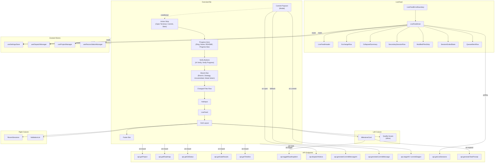

# Overview Tab

> Last updated: 2026-02-17

The Overview tab is the primary landing screen of Claudetini. It provides a unified dashboard summarizing project progress, active development sessions, quality status, and dispatch controls -- everything a developer needs to understand the current state of their project at a glance.

---

## Table of Contents

1. [Purpose and Role](#1-purpose-and-role)
2. [Component Hierarchy](#2-component-hierarchy)
3. [Child Component Reference](#3-child-component-reference)
4. [Layout Structure](#4-layout-structure)
5. [Data Flow](#5-data-flow)
6. [State Dependencies](#6-state-dependencies)
7. [User Interactions](#7-user-interactions)
8. [Edge Cases](#8-edge-cases)
9. [Component Diagram](#9-component-diagram)

---

## 1. Purpose and Role

The Overview tab serves as the command center for a selected project. It answers the core questions a developer has when resuming work:

- **Where am I?** -- Project name, branch, progress percentage, README summary.
- **What should I do next?** -- Active milestone with the next task highlighted, dispatch advice with token/cost estimates.
- **What is happening right now?** -- Live session feed showing real-time Claude Code activity, dispatch queue.
- **How healthy is the project?** -- Quality issues derived from readiness checks, validation list combining health checks and quality gates.
- **What happened recently?** -- Recent session history with duration, cost, and diff stats.

The tab is the default view when a project is selected and acts as the primary dispatch surface: users can start Claude Code sessions directly from task items, from the Ask Input prompt bar, or via the Open Terminal button.

**Source file:** `app/src/components/overview/OverviewTab.tsx`

---

## 2. Component Hierarchy

```
OverviewTab
|-- (inline) Action Strip
|     |-- Button "Open Terminal"
|     |-- Button "Commit"
|     |-- Diff stats, session count, cost/week, "Last report" link
|
|-- (inline) Progress Hero
|     |-- SVG progress ring (48px)
|     |-- Project name, item counts, README summary
|     |-- Linear progress bar
|     |-- "AI Verify Progress" / "Verify Progress" buttons
|
|-- (inline) Branch Bar
|     |-- Branch name, strategy tag, uncommitted tag
|     |-- Select (dispatch mode)
|     |-- Button "Agents" -> settings
|     |-- Changed files row (or "Clean" row)
|
|-- AskInput
|
|-- LiveFeed
|     |-- LiveFeedErrorBoundary
|     |-- LiveFeedInner
|           |-- LiveFeedHeader
|           |-- ExchangeRow (repeated)  OR  CollapsedSummary
|           |-- SecondarySessionRow (repeated, if multiple)
|           |-- ModifiedFilesStrip
|           |-- QueuedItemRow (repeated, if queue non-empty)
|           |-- SessionEndedState (when session finishes)
|
|-- (grid layout: left + right columns)
|     |-- Left column
|     |     |-- Section > MilestoneCard
|     |     |-- Section "Quality Issues" (conditional, inline rendering)
|     |
|     |-- Right column
|           |-- Section > RecentSessions
|           |-- Section "Validation" > ValidationList
|
|-- (inline) Footer Bar
|
|-- (inline) Commit Popover (modal overlay, conditional)
```

**Note:** `ProjectHero`, `QualityIssues`, and `GitStatusBar` exist as standalone components in the `overview/` directory but are **not currently imported** by `OverviewTab`. Their functionality has been inlined into the parent component. They remain available as reusable components if needed elsewhere.

---

## 3. Child Component Reference

### 3.1 AskInput

**File:** `app/src/components/overview/AskInput.tsx`

**Purpose:** A persistent prompt bar that allows users to type a free-form task description and dispatch it to Claude Code.

**Props:**

| Prop | Type | Description |
|------|------|-------------|
| `askPrompt` | `string` | Current prompt text (controlled) |
| `onAskPromptChange` | `(value: string) => void` | Callback when text changes |
| `dispatchMode` | `string` | Current dispatch mode for badge display |
| `onDispatch` | `() => void` | Callback when user submits (Enter or click) |

**Internal state:**
- `inputRef` -- ref to the `<input>` element (not currently used for focus management externally).

**API calls:** None (dispatch is handled by the parent).

**User interactions:**
- Type text into the input field.
- Press Enter or click the "Dispatch" button to trigger `onDispatch`.
- The Dispatch button is disabled when the prompt is empty.
- A mode badge (e.g., "std", "--agents", "pipeline", "blitz") appears to the right of the input.

**Edge cases:**
- Empty/whitespace-only prompt: Dispatch button renders at 40% opacity and is inert.
- Border color transitions to accent when text is present.

---

### 3.2 LiveFeed

**File:** `app/src/components/overview/LiveFeed.tsx`

**Purpose:** Displays real-time Claude Code session activity. Shows active sessions with an exchange log, handles session completion detection, manages a dispatch queue, and supports auto-dispatch.

**Props:**

| Prop | Type | Description |
|------|------|-------------|
| `projectPath` | `string` | Project identifier for polling |
| `onReport` | `(sessionId?: string) => void` | Navigate to session report |
| `onDispatchFromQueue` | `(item: QueuedDispatch) => void` | Dispatch a queued item |

**Internal state (LiveFeedInner):**
- `liveSessions: LiveSession[]` -- Currently active sessions from backend polling.
- `exchanges: Exchange[]` -- User/assistant exchange log for the primary session.
- `feedExpanded: boolean` -- Whether the exchange log is expanded or collapsed.
- `sessionEnded: boolean` -- True when an active session transitions to inactive.
- `dismissed: boolean` -- True when user dismisses the ended-session banner.
- `lastEndedSession: LiveSession | null` -- Snapshot of the session that just ended.
- `prevSessionIds: Ref<Set<string>>` -- Tracks session IDs to detect new sessions.
- `pollInFlight: Ref<boolean>` -- Prevents concurrent poll requests.

**Zustand stores consumed:**
- `useDispatchManager` -- reads `queue`, `isDispatching`, `removeFromQueue`, and `dispatchNext`.
- `useSettingsStore` -- reads `autoDispatchEnabled` (for auto-dispatch on session end).

**API calls:**
- `api.getLiveSessions(projectPath)` -- Polled on interval.

**Polling pattern:**
- **Active sessions present:** Poll every 2 seconds.
- **No active sessions (idle):** Poll every 15 seconds.
- **Dismissed and queue empty:** Polling stops entirely.
- Guard prevents concurrent in-flight polls.

**Sub-components:**
- `LiveFeedHeader` -- Pulsing green dot, session count label, provider tag, PID, elapsed time, cost, lines changed, collapse/expand toggle.
- `ExchangeRow` -- Single user or assistant exchange with timestamp, directional indicator, summary text, file pills, and line stats.
- `CollapsedSummary` -- Single-line view of the latest exchange when the feed is collapsed.
- `SecondarySessionRow` -- Compact row for additional concurrent sessions beyond the primary.
- `ModifiedFilesStrip` -- Horizontal strip of file name buttons for files modified in the session.
- `SessionEndedState` -- Banner shown when a session completes, with "View Report" and "Dismiss" buttons.
- `QueuedItemRow` -- Single queued dispatch item with position number, prompt text, relative time, Dispatch button, and remove button.
- `LiveFeedErrorBoundary` -- React class-based error boundary that catches rendering errors and shows a retry UI.

**Edge cases:**
- Returns `null` when dismissed and queue is empty, or when no sessions exist and no queue.
- When a session ends and `autoDispatchEnabled` is true, auto-dispatches the next queued item after a 2-second delay.
- New sessions appearing resets `dismissed` and `sessionEnded` flags.
- Error boundary prevents LiveFeed crashes from unmounting the entire Overview tab.
- Timeout errors on the live-sessions endpoint are silently ignored.

---

### 3.3 MilestoneCard

**File:** `app/src/components/overview/MilestoneCard.tsx`

**Purpose:** Displays the currently active milestone from the project roadmap, listing remaining tasks with dispatch controls, prompt editing, retry chains, and AI-generated prompt support.

**Props:**

| Prop | Type | Description |
|------|------|-------------|
| `milestone` | `Milestone` | The active milestone object |
| `expandedItem` | `string \| null` | Text of the currently expanded task item |
| `onExpandItem` | `(text: string \| null) => void` | Toggle item expansion |
| `projectPath` | `string \| null` | Project path for API calls |
| `usageMode` | `"subscription" \| "api"` | Controls cost vs. unit display |
| `taskAdvice` | `Record<string, DispatchAdvice>` | Pre-fetched dispatch estimates per task |
| `onStartSession` | `(item: MilestoneItem) => void` | Start a Claude Code session for a task |
| `onToggleDone` | `(item: MilestoneItem) => void` | Mark/unmark a task as complete |
| `onRetryWithContext` | `(item, retryPrompt) => void` | Retry a failed task with error context |
| `onEditPrompt` | `(item, newPrompt) => void` | Save an edited prompt |

**Internal state:**
- `promptVersion: Record<string, number>` -- Selected prompt version per task (for prompt history navigation).
- `editingItem: string | null` -- Text key of the task currently being edited.
- `editText: string` -- Current contents of the prompt editor textarea.
- `aiPrompts: Record<string, string>` -- AI-generated prompts keyed by task text.
- `generatingPrompt: string | null` -- Task text currently awaiting AI prompt generation.
- `generatedKeys: Ref<Set<string>>` -- Prevents duplicate AI prompt generation requests.

**API calls:**
- `api.generateTaskPrompt(projectPath, itemText)` -- Called once per task when first expanded, generates an AI-tailored prompt.

**User interactions:**
- **Click a task row** to expand it and reveal the Claude Prompt panel. First expansion triggers AI prompt generation.
- **Click the checkbox** to toggle task completion (calls `onToggleDone`).
- **Click "Start" / "Run"** to dispatch the task to Claude Code.
- **Click "Edit"** to enter prompt editing mode with a textarea.
- **Click "Save" / "Cancel"** in edit mode.
- **Click "Retry with Context"** on tasks that have a retry chain (previous failed attempts).
- **Select a prompt version** from the dropdown when prompt history exists.

**Visual indicators:**
- The first remaining task is highlighted as "Up next" with an accent-colored left border and background.
- Tasks display dispatch advice (estimated tokens, cost/effort units, remaining usage percentage).
- Fallback provider suggestions shown when usage is low.
- Retry chain section shows numbered failed attempts with error messages.
- AI-generated prompts display a purple "AI Generated" tag.
- Prompt generation shows a spinner with progress bar.

---

### 3.4 RecentSessions

**File:** `app/src/components/overview/RecentSessions.tsx`

**Purpose:** Displays the 5 most recent Claude Code sessions in a compact list, supporting keyboard navigation and click-to-view-report.

**Props:**

| Prop | Type | Description |
|------|------|-------------|
| `sessions` | `Session[]` | Array of recent session objects |
| `onSessionClick` | `(sessionId: string) => void` | Navigate to session report |

**Internal state:**
- `focusedIndex: number` -- Index of the keyboard-focused session item (-1 = none).
- `itemRefs: Ref<HTMLDivElement[]>` -- Refs to each session row for focus management.

**API calls:** None (data is provided via props from the parent).

**User interactions:**
- Click a session row to navigate to its report (`onSessionClick`).
- Arrow Up/Down to navigate sessions via keyboard.
- Enter to select the focused session.

**Displayed data per session:**
- Status dot (green = tests passed, red = tests failed).
- Summary text (truncated to one line).
- Session ID suffix (last 4 chars), duration, cost, lines added/removed.
- Relative date (e.g., "2h ago", "Feb 15").

**Edge cases:**
- Empty sessions array: renders "No recent sessions" centered text.
- Only shows the first 5 sessions (`visible = sessions.slice(0, 5)`).
- Uses ARIA `role="listbox"` / `role="option"` for accessibility.

---

### 3.5 ValidationList

**File:** `app/src/components/overview/ValidationList.tsx`

**Purpose:** Combines health check results and quality gate results into a single unified validation checklist with pass/warn/fail status indicators.

**Props:**

| Prop | Type | Description |
|------|------|-------------|
| `health` | `HealthData[]` | Health check results |
| `gates` | `GateData[]` | Quality gate results |

**Internal state:** None.

**API calls:** None (data provided via props).

**Rendering logic:**
- Merges `health` and `gates` arrays into a single `allItems` list (gates are suffixed with " Gate").
- Computes aggregate counts: pass, warn, fail.
- Displays a header row with the counts.
- Each item row shows a status icon (checkmark/warning/cross), name, and optional detail text.
- Failed items get a red muted background.

**Edge cases:**
- Empty `allItems`: renders "No validation data available".
- Detail text is truncated to 160px max width.

---

### 3.6 ProjectHero (standalone, not currently used by OverviewTab)

**File:** `app/src/components/overview/ProjectHero.tsx`

**Purpose:** A standalone progress hero component displaying project name, progress ring, item counts, last session, and weekly cost. This functionality is currently inlined in `OverviewTab` directly, but `ProjectHero` remains available as a reusable extracted component.

**Props:** `name`, `progress`, `completedItems`, `totalItems`, `milestoneCount`, `lastSession`, `costWeek`.

---

### 3.7 QualityIssues (standalone, not currently used by OverviewTab)

**File:** `app/src/components/overview/QualityIssues.tsx`

**Purpose:** A standalone quality issues display with severity tags and "Fix Now" buttons. This functionality is currently rendered inline in `OverviewTab` with additional features (dispatch integration, markdown rendering). The standalone component remains available for other contexts.

**Props:** `issues: QualityIssue[]`.

---

### 3.8 GitStatusBar (standalone, not currently used by OverviewTab)

**File:** `app/src/components/overview/GitStatusBar.tsx`

**Purpose:** A compact bar showing branch name and uncommitted change count. This information is rendered inline in the Branch Bar section of `OverviewTab`.

**Props:** `branch: string`, `uncommitted: number`.

---

## 4. Layout Structure

The Overview tab uses a single-column vertical flow with one two-column grid section:

```
+---------------------------------------------------------------+
| ACTION STRIP (no card bg)                                      |
| [Open Terminal] | [Commit]        +123 -45 | 12 sessions | $X |
+---------------------------------------------------------------+

+---------------------------------------------------------------+
| PROGRESS HERO (rounded card)                                   |
| [Ring 48px]  ProjectName  12/45 items - 8 milestones           |
|              README summary (2-line clamp)                     |
|              [=========-------] progress bar                   |
|              [AI Verify Progress] [Verify Progress]            |
+---------------------------------------------------------------+

+---------------------------------------------------------------+
| BRANCH BAR (rounded card, 2 rows)                              |
| Row 1: [branch icon] main | trunk-based | 3 uncommitted | ... |
|         [Select: dispatch mode] [Agents]                       |
| Row 2: [3 changes] file1.ts, file2.py +1 more  [Go to Git ->] |
+---------------------------------------------------------------+

+---------------------------------------------------------------+
| ASK INPUT (rounded prompt bar)                                 |
| -> Describe a task to dispatch to terminal...    std [Dispatch]|
+---------------------------------------------------------------+

+---------------------------------------------------------------+
| LIVE FEED (conditional, green border when active)              |
| [pulsing dot] LIVE SESSION  claude  PID 1234     3m12s  $0.45 |
| [exchange log or collapsed summary]                            |
| MODIFIED: [file1] [file2] [file3]                              |
| NEXT UP (1): [queued prompt]              [Dispatch] [x]       |
+---------------------------------------------------------------+

+---------------------------------+-----------------------------+
| LEFT COLUMN (flex-1)            | RIGHT COLUMN (340px fixed)  |
|                                 |                             |
| MILESTONE CARD (Section)        | RECENT SESSIONS (Section)   |
| [13] Milestone Title    45%     | [dot] Session summary       |
| [*] Up next task      [Start]   |  #a1b2  3m  $0.12  +10 -5  |
| [ ] Other task          [Run]   | [dot] Session summary       |
| [ ] Another task        [Run]   |  ...                        |
| 8 completed                     |                             |
|                                 |-----------------------------|
| QUALITY ISSUES (conditional)    | VALIDATION (Section)        |
| [!] warn: Missing tests         | Validation   3 pass - 1 warn|
|   Add unit tests for core...    | [check] ROADMAP exists       |
|                      [Fix]      | [warn]  Test coverage        |
|                                 | [check] Lint Gate            |
+---------------------------------+-----------------------------+

+---------------------------------------------------------------+
| FOOTER BAR (rounded, monospace)                                |
| [branch] main | 3 modified | Provider: Claude | 12 sessions   |
+---------------------------------------------------------------+
```

The grid uses `grid-cols-[1fr_340px]` with `gap-3.5` (14px). The right sidebar is fixed at 340px; the left column fills remaining space. All gaps between vertical sections are `3.5` (14px). The overall container adds bottom padding (`pb-12`) when the reconciliation footer is visible.

---

## 5. Data Flow

### 5.1 Initial Load Sequence

When `OverviewTab` mounts (or `projectPath` / `refreshKey` changes):

1. **Guard checks:** If no `projectPath`, reset all state to empty. If backend is not connected, set `loading = false` and return.

2. **Cache check:** Look up `getCached(cacheKey)` where `cacheKey = "${projectPath}-${refreshKey}"`. If cached data exists and this is initial load (`refreshKey === 0`), hydrate all state from cache immediately and skip fetching.

3. **Seed from projectManager:** If the selected project data is already in `useProjectManager.getState().currentProject` (from the project picker), seed `project` state immediately to avoid a full-page skeleton. This sets `projectLoaded = true` and `loading = false` before any API call completes.

4. **Fetch project data:** `api.getProject(projectPath)` -- returns name, branch, uncommitted count, README summary, etc. On success, sets `project` and `projectLoaded = true`.

5. **Parallel fetch (Promise.allSettled):**
   - `api.getRoadmap(projectPath)` -- milestones and items.
   - `api.getGitStatus(projectPath)` -- uncommitted and untracked files.
   - `api.getGateResults(projectPath)` -- quality gate pass/warn/fail results.
   - `api.getTimeline(projectPath, 10)` -- recent session history (10 entries).

6. **Readiness report mapping:** Instead of calling a separate health endpoint, the tab reads `readinessReport` from `useProjectManager` and derives both `health` items and `qualityIssues` from its checks.

7. **Cache results:** All fetched data is stored via `setCache(cacheKey, ...)` for future use.

### 5.2 Dispatch Advice Fetching

A separate `useEffect` fetches cost/token estimates for the active milestone's pending tasks:

1. Identifies the active milestone (first milestone with incomplete items).
2. Takes up to 6 pending items as candidates.
3. Builds a deduplication key from `projectPath`, settings, and task texts.
4. Checks the module-level cache (`getCached("advice:${key}")`).
5. If not cached, calls `api.dispatchAdvice(...)` for each candidate in parallel.
6. Results are stored in `taskAdvice` state and cached.

Dependencies: `activeMilestone`, `preferredFallback`, `projectPath`, `usageMode`, `claudeRemainingPct`, `fallbackThresholdPct`.

### 5.3 Refresh Triggers

| Trigger | Mechanism |
|---------|-----------|
| **Dispatch completes** | `isDispatching` transitions from `true` to `false`. A 600ms debounced timer increments `refreshKey`, which invalidates the cache and re-runs the main fetch effect. |
| **Project path changes** | The main `useEffect` dependency on `projectPath` triggers a full reload. |
| **Manual cache invalidation** | When `refreshKey > 0`, `invalidateCache(projectPath)` is called. |

### 5.4 LiveFeed Polling (independent)

The `LiveFeed` component runs its own polling loop independent of the parent's data flow. See [Section 3.2](#32-livefeed) for poll intervals.

---

## 6. State Dependencies

### 6.1 Zustand Stores Consumed by OverviewTab

| Store | Selector | Purpose |
|-------|----------|---------|
| `useSettingsStore` | `preferredFallback` | Fallback provider preference (codex/gemini) for dispatch advice |
| `useSettingsStore` | `usageMode` | "subscription" or "api" -- controls cost display format |
| `useSettingsStore` | `claudeRemainingPct` | Current Claude usage remaining percentage |
| `useSettingsStore` | `fallbackThresholdPct` | Threshold below which fallback is suggested |
| `useSettingsStore` | `reconciliationConfidenceThreshold` | Confidence threshold for progress verification |
| `useSettingsStore` | `lightModel` | Model ID for AI commit message generation |
| `useSettingsStore` | `autoDispatchEnabled` | Whether to auto-dispatch queued items (used in LiveFeed) |
| `useDispatchManager` | `setContext` | Set dispatch context before launching pre-flight |
| `useDispatchManager` | `isDispatching` | Track whether a dispatch is in progress |
| `useDispatchManager` | `queue` | Queued dispatch items (used in LiveFeed) |
| `useDispatchManager` | `removeFromQueue` | Remove item from queue (used in LiveFeed) |
| `useDispatchManager` | `dispatchNext` | Auto-dispatch next queued item (used in LiveFeed) |
| `useProjectManager` | `readinessReport` | Readiness checks used for health/quality issues |
| `useProjectManager` | `currentProject` | Seed data to avoid skeleton on initial render |
| `useProjectManager` | `setScreen` | Navigate to scorecard screen from Validation header |
| `useReconciliationManager` | `verifyProgress` | Trigger heuristic progress verification |
| `useReconciliationManager` | `verifyProgressAI` | Trigger AI-based progress verification |
| `useReconciliationManager` | `footerState` | Controls bottom padding and button disabled state |

### 6.2 Local State in OverviewTab

| State variable | Type | Purpose |
|----------------|------|---------|
| `refreshKey` | `number` | Incremented on dispatch completion to trigger re-fetch |
| `expandedItem` | `string \| null` | Currently expanded milestone task |
| `project` | `ProjectData \| null` | Core project metadata |
| `milestones` | `OverviewMilestoneData[]` | Roadmap milestones |
| `health` | `HealthData[]` | Health check results |
| `qualityIssues` | `QualityIssue[]` | Failed/warning readiness checks |
| `gates` | `GateData[]` | Quality gate results |
| `loading` | `boolean` | True during initial fetch |
| `error` | `string \| null` | Error message from failed fetch |
| `dispatchMode` | `string` | Selected dispatch mode (standard/with-review/full-pipeline/blitz) |
| `changedFiles` | `string[]` | List of uncommitted/untracked file paths |
| `taskAdvice` | `Record<string, DispatchAdvice>` | Dispatch cost estimates per task |
| `projectLoaded` | `boolean` | Progressive loading flag for project data |
| `milestonesLoaded` | `boolean` | Progressive loading flag for milestones |
| `healthLoaded` | `boolean` | Progressive loading flag for health/quality |
| `sessionsLoaded` | `boolean` | Progressive loading flag for session history |
| `showCommitPopover` | `boolean` | Whether commit modal is visible |
| `commitMessage` | `string` | Current commit message text |
| `isCommitting` | `boolean` | True while commit is in progress |
| `isGeneratingAI` | `boolean` | True while regenerating AI commit message |
| `askPrompt` | `string` | Text in the Ask Input field |
| `sessions` | `RecentSession[]` | Recent session data for sidebar |
| `totalAdded` | `number` | Aggregate lines added across recent sessions |
| `totalRemoved` | `number` | Aggregate lines removed across recent sessions |

### 6.3 Data Cache Layer

The tab uses a module-level cache via `getCached` / `setCache` / `invalidateCache` from `useDataCache`. This cache survives component unmounts (tab switches) so returning to the Overview tab displays data instantly without re-fetching. Cache is invalidated when `refreshKey > 0` (i.e., after a dispatch completes).

---

## 7. User Interactions

| Interaction | Location | Effect |
|-------------|----------|--------|
| Click "Open Terminal" | Action Strip | Opens pre-flight flow with empty prompt (interactive terminal mode) |
| Click "Commit" | Action Strip | Generates AI commit message, opens commit popover modal |
| Click "Last report" link | Action Strip | Navigates to session report for the most recent session |
| Click "AI Verify Progress" | Progress Hero | Triggers AI-based roadmap reconciliation via `verifyProgressAI` |
| Click "Verify Progress" | Progress Hero | Triggers heuristic roadmap reconciliation via `verifyProgress` |
| Change dispatch mode | Branch Bar Select | Updates `dispatchMode` local state; affects all subsequent dispatches |
| Click "Agents" | Branch Bar | Navigates to Settings tab (`onNavigateToSettings`) |
| Click "Go to Git" | Changed Files row | Navigates to Git tab (`onNavigateToGit`) |
| Type in Ask Input | Ask Input | Updates `askPrompt` state |
| Press Enter / click Dispatch | Ask Input | Dispatches typed prompt through pre-flight flow |
| Click task row | MilestoneCard | Expands/collapses the task's Claude Prompt panel; triggers AI prompt generation on first expand |
| Click task checkbox | MilestoneCard | Toggles task completion (optimistic update + backend persist via `api.toggleRoadmapItem`) |
| Click "Start" / "Run" | MilestoneCard | Dispatches the task to Claude Code via pre-flight |
| Click "Edit" | MilestoneCard (expanded) | Enters prompt editing mode |
| Click "Retry with Context" | MilestoneCard (expanded) | Dispatches task with error context from previous failed attempts |
| Click a session row | RecentSessions | Navigates to session report (`onReport(sessionId)`) |
| Click "Scan Readiness" | Validation Section header | Navigates to the Scorecard screen |
| Click "Fix" on quality issue | Quality Issues section | Dispatches a fix prompt through pre-flight |
| Expand/Collapse LiveFeed | LiveFeed header | Toggles between full exchange log and collapsed summary |
| Click "View Report" | LiveFeed (session ended) | Navigates to report for the ended session |
| Click "Dismiss" | LiveFeed (session ended) | Hides the session-ended banner |
| Click "Dispatch" on queued item | LiveFeed queue | Removes item from queue and dispatches it |
| Click remove on queued item | LiveFeed queue | Removes item from queue without dispatching |
| Edit commit message | Commit Popover | Updates `commitMessage` state |
| Click "Regenerate with AI" | Commit Popover | Re-generates commit message using AI |
| Click "Commit" | Commit Popover | Stages all changes and commits; refreshes git status on success |
| Click "Cancel" | Commit Popover | Closes the commit popover |
| Click backdrop | Commit Popover | Closes the commit popover |

---

## 8. Edge Cases

### 8.1 Loading States

The Overview tab implements **progressive loading** to minimize perceived load time:

| Phase | Condition | Rendered output |
|-------|-----------|-----------------|
| Full skeleton | `loading && !projectLoaded` | `SkeletonCard` (x2) + `SkeletonMilestone` + `SkeletonSession` in a grid |
| Project loaded, rest loading | `projectLoaded && !milestonesLoaded` | Progress Hero and Branch Bar render immediately; milestone area shows `SkeletonMilestone` |
| Sessions loading | `!sessionsLoaded` | Right sidebar shows `SkeletonSession` placeholder |
| Health loading | `!healthLoaded` | Quality Issues area shows `SkeletonText` (3 lines) |

Seeding from `useProjectManager.currentProject` eliminates the full-page skeleton in the common case where the user navigated from the project picker.

### 8.2 Empty States

| Condition | Rendered output |
|-----------|-----------------|
| No `projectPath` | Centered text: "Select a project to view overview data." |
| No `project` data (after load) | Centered text: "No project data available." |
| No milestones | Centered text: "No roadmap milestones available." |
| No quality issues | Quality Issues section is not rendered at all (conditional) |
| No recent sessions | RecentSessions renders: "No recent sessions" |
| No validation data | ValidationList renders: "No validation data available" |
| No live sessions, no queue | LiveFeed returns `null` (not rendered) |
| Clean working tree | Changed files row shows "Clean" tag + "Working tree clean" |
| Commit with no changes | Toast notification: "No Changes -- Working tree is clean, nothing to commit." |

### 8.3 Error Handling

| Error source | Handling |
|-------------|----------|
| Main data fetch failure | Sets `error` state; renders centered red error message |
| Individual parallel fetch failure | `Promise.allSettled` ensures partial failures don't block other data. Failed sections show empty state. Warnings logged to console. |
| Roadmap item toggle failure | Optimistic update is reverted on API error |
| Commit failure | Toast error notification with message |
| AI commit message failure | Falls back to heuristic `api.generateCommitMessage`; if that also fails, opens popover with empty message |
| AI task prompt generation failure | Spinner disappears; task shows default prompt text |
| LiveFeed render crash | Error boundary catches it; shows "Live session feed unavailable" with Retry button |
| LiveFeed poll timeout | Silently ignored (no error toast or console warning) |
| Backend not connected | Sets `loading = false` and returns early; no error message displayed |

### 8.4 Reconciliation Footer Padding

When `reconciliationFooterState !== "hidden"`, the container adds `pb-12` to prevent the reconciliation footer overlay from obscuring content.

---

## 9. Component Diagram


