# Parallel Execution System

> Multi-agent parallel execution of milestone tasks with AI-driven planning, phased worktree isolation, and automated verification.

**Last updated: 2026-02-17**

---

## Table of Contents

1. [Purpose](#1-purpose)
2. [Phase State Machine](#2-phase-state-machine)
3. [ParallelExecutionOverlay Component](#3-parallelexecutionoverlay-component)
4. [AI Planning Agent](#4-ai-planning-agent)
5. [Plan Review UI](#5-plan-review-ui)
6. [Execution Phase](#6-execution-phase)
7. [Branch Merging](#7-branch-merging)
8. [Verification](#8-verification)
9. [Finalization](#9-finalization)
10. [HMR Resilience](#10-hmr-resilience)
11. [State Management (parallelManager)](#11-state-management-parallelmanager)
12. [Backend Orchestration (parallel_orchestrator.py)](#12-backend-orchestration-parallel_orchestratorpy)
13. [Edge Cases](#13-edge-cases)

---

## 1. Purpose

The Parallel Execution system allows Claudetini to execute an entire milestone's worth of tasks simultaneously using multiple Claude Code agent instances. Instead of running tasks one-by-one in a single session, the system:

- **Decomposes** a milestone's uncompleted tasks into themed execution phases via an AI Planning Agent.
- **Presents** the plan for human review and optional refinement before execution begins.
- **Dispatches** multiple Claude Code CLI agents in parallel, each working in its own git worktree to prevent file conflicts.
- **Merges** all agent branches back into the main branch after each phase.
- **Verifies** the result against AI-generated success criteria.
- **Finalizes** by marking roadmap items complete, committing all changes, and cleaning up worktrees.

The full lifecycle is managed through a modal overlay (`ParallelExecutionOverlay`) that guides the user through every phase, from git cleanliness checks through to a final summary with cost tracking.

### Key Design Decisions

- **Git worktree isolation**: Each parallel agent works in its own git worktree (under `.cantina-worktrees/`), so agents cannot overwrite each other's files. Sequential agents within the same phase share a single worktree.
- **Human-in-the-loop**: The plan is always presented for approval. Users can reject, provide feedback, and trigger re-planning before any agents are dispatched.
- **Verification is informational**: Verification results (lint failures, test failures) are displayed but do not block task completion. If an agent's code was committed and merged successfully, the task is marked done in the roadmap regardless of verification outcome. This prevents false negatives from blocking legitimate work.
- **HMR resilience**: The execution state is persisted to `localStorage` so that Vite hot module replacement or a full page refresh does not lose progress. Polling resumes automatically on reload.

---

## 2. Phase State Machine

The parallel execution system progresses through a well-defined sequence of phases. The `ParallelPhase` type defines all possible states:

```typescript
type ParallelPhase =
  | "idle"
  | "git_check"
  | "planning"
  | "plan_review"
  | "replanning"
  | "executing"
  | "merging"
  | "verifying"
  | "finalizing"
  | "complete"
  | "failed"
  | "cancelled";
```

### Mermaid State Diagram

```mermaid
stateDiagram-v2
    [*] --> idle

    idle --> git_check : startPlanning()

    git_check --> planning : tree is clean
    git_check --> git_check : commitAndProceed() — re-check
    git_check --> cancelled : cancel()

    planning --> plan_review : plan parsed successfully
    planning --> failed : planning agent error

    plan_review --> replanning : replan() with feedback
    plan_review --> executing : approvePlan()
    plan_review --> cancelled : cancel()

    replanning --> plan_review : revised plan ready
    replanning --> failed : re-planning error

    executing --> merging : phase agents complete (per-phase)
    executing --> failed : unrecoverable error
    executing --> cancelled : cancel()

    merging --> executing : merge done, next phase begins
    merging --> verifying : all phases merged

    verifying --> finalizing : verification complete (pass or fail)
    verifying --> finalizing : verification error (logged, not blocking)

    finalizing --> complete : roadmap marked, changes committed

    complete --> idle : closeOverlay()
    failed --> idle : closeOverlay()
    cancelled --> idle : closeOverlay()
```



### Phase-by-Phase Summary

| Phase | Description | User Interaction |
|-------|-------------|------------------|
| `idle` | No execution in progress. | User clicks "Parallel Execute" on a milestone. |
| `git_check` | Checks for uncommitted tracked changes. | If dirty: commit UI shown. User writes/generates a commit message, then "Commit & Continue". |
| `planning` | AI Planning Agent dispatched via Claude Code CLI. | Read-only: live output tail shown. |
| `plan_review` | AI-generated plan displayed for human review. | Approve, reject (cancel), or provide feedback + re-plan. |
| `replanning` | Planning Agent re-dispatched with user feedback + previous plan. | Read-only: live output tail shown. |
| `executing` | Agents dispatched in worktrees, running phase by phase. | Read-only: real-time status cards with per-agent progress. |
| `merging` | After each parallel phase, agent branches merged into main. | Read-only: brief transition state (shown as part of "executing" in the stepper). |
| `verifying` | Verification agent checks success criteria against codebase. | Read-only: live verification output shown. |
| `finalizing` | Roadmap items marked complete, changes staged and committed, worktrees cleaned up. | Read-only: step-by-step progress indicators. |
| `complete` | Terminal state. All results displayed. | User reviews results, clicks "Done" to close. |
| `failed` | Terminal state. Error message displayed. | User reviews error, clicks "Done" to close. |
| `cancelled` | Terminal state. User-initiated cancellation. | User clicks "Done" to close. |

### Terminal States

Three phases are terminal: `complete`, `failed`, and `cancelled`. When a terminal phase is reached:
1. Polling stops.
2. `localStorage` persistence is cleared.
3. The overlay shows a "Done"/"Close" button that resets all state back to `idle`.

---

## 3. ParallelExecutionOverlay Component

**File:** `app/src/components/roadmap/ParallelExecutionOverlay.tsx`

The `ParallelExecutionOverlay` is a fixed-position, full-screen modal overlay that renders on top of the entire application. It is the sole UI surface for the parallel execution workflow.

### Structure

```
+----------------------------------------------------+
| Header: Title, agent/task count, phase label        |
| Phase Stepper: Plan > Review > Execute > Verify > F |
+----------------------------------------------------+
| Content Area (scrollable, phase-dependent)          |
|                                                     |
|   [Phase-specific content rendered here]            |
|                                                     |
+----------------------------------------------------+
| Footer: Phase status label + action buttons         |
+----------------------------------------------------+
```

### Component Props

```typescript
interface ParallelExecutionOverlayProps {
  projectPath: string;
}
```

The component reads all other data from the `useParallelManager` Zustand store. It subscribes to individual store fields using separate selector calls to minimize re-renders.

### Phase Stepper

A 5-step horizontal progress bar is displayed in the header (hidden during `git_check` since that is a pre-step). The steps are:

| Step Key | Label | Active During Phases |
|----------|-------|---------------------|
| `planning` | Plan | `planning`, `replanning` |
| `plan_review` | Review | `plan_review` |
| `executing` | Execute | `executing`, `merging` |
| `verifying` | Verify | `verifying` |
| `finalizing` | Finalize | `finalizing`, `complete` |

Each step renders as a colored bar: green if completed, accent (purple) if active, dark gray if pending.

### What Each Phase Renders

**`git_check` (dirty tree)**
- Warning icon and "Uncommitted Changes" heading.
- Scrollable list of dirty file paths (monospace).
- A textarea for the commit message.
- Two buttons: "AI Message" (generates a commit message via the light model) and "Commit & Continue" (stages all, commits, re-checks, then proceeds to planning).
- Error banner if commit fails.

**`git_check` (clean/loading)**
- Spinner with "Checking git status..." text. This is a brief flash state that typically resolves in under a second.

**`planning` / `replanning`**
- Section heading ("Planning Agent" or "Re-planning...").
- Spinner with "Analyzing N tasks..." text.
- A `<pre>` block showing the live tail of the planning agent's CLI output, updated via polling every 2 seconds.

**`plan_review`**
- Plan summary paragraph rendered with inline Markdown.
- For each `ExecutionPhase` in the plan:
  - Color-coded card (cycles through accent/green/cyan/amber borders).
  - Tag showing "Parallel" or "Sequential".
  - Phase name and description.
  - Agent cards within the phase, arranged in a 2-column grid for parallel phases or stacked for sequential.
  - Each agent card shows: Agent ID, theme, and truncated task titles.
- Collapsible "Success Criteria" section showing the plan's verifiable criteria.
- Collapsible "Warnings" section showing any risks identified by the planning agent.
- "Refine Plan" textarea for user feedback.
- Footer buttons: "Cancel", "Re-plan" (visible only if feedback text is non-empty), "Approve & Run".

**`executing` / `merging`**
- Phase-grouped execution view (when plan data is available):
  - Each phase rendered as a collapsible card with color-coded border.
  - Phase header shows: collapse toggle, Parallel/Sequential tag, phase name, progress counter.
  - Per-phase progress bar (gradient green-to-accent while active, solid green when done).
  - Active phases default to expanded; completed phases default to collapsed; pending phases are collapsed and dimmed (40% opacity).
  - Within expanded phases: agent cards grouped by `group_id`, each showing per-task status icons.
- Flat agent list fallback when plan is null (e.g., if resumed from localStorage without plan data).
- Running cost display.
- Live terminal output from the currently running agent (the first agent with `status === "running"` that has `output_tail`).

**Status Icons** used during execution:

| Status | Icon |
|--------|------|
| `running` | Animated spinner (purple border, 0.8s rotation) |
| `succeeded` | Green checkmark |
| `failed` | Red X |
| `cancelled` | Gray em-dash |
| `pending` | Small gray circle |

**`verifying`**
- Spinner with "Running verification agent -- checking N criteria".
- Descriptive text: "Running tests, linting, and checking file integrity..."
- Live `<pre>` block of verification agent output (or "Waiting for output..." placeholder).

**`finalizing`**
- Spinner with "Finalizing..." heading.
- Three-step checklist:
  1. "Marking tasks complete in roadmap..." (spinning)
  2. "Staging and committing changes..." (pending dot)
  3. "Cleaning up worktrees..." (pending dot)

**`complete`**
- Green checkmark with "All N tasks executed" heading.
- **Verification Results** section: per-criterion pass/fail with green checkmark or red X, evidence text for failures.
- **Merge Results** section: per-branch cards showing success (green) or failure (red) with branch name and message.
- **Finalize result**: monospace message (e.g., "Marked 5 item(s) complete, committed as a1b2c3d4").
- **Total cost** in monospace.

**`failed` / `cancelled`**
- Error banner (for `failed`) or cancellation message (for `cancelled`).
- "Done" button in footer.

### Footer Actions by Phase

| Phase | Left Status Text | Right Buttons |
|-------|-----------------|---------------|
| `git_check` | "Commit required" | Cancel |
| `planning` / `replanning` | "Planning..." | Cancel |
| `plan_review` | "Review the plan" | Cancel, Re-plan (conditional), Approve & Run |
| `executing` / `merging` | "Phase N: Name" or "Running..." | Cancel |
| `verifying` | "Verifying..." | Cancel |
| `finalizing` | "Finalizing..." | Cancel |
| `complete` | "All done" | Done |
| `failed` | "Execution failed" | Done |
| `cancelled` | "Cancelled" | Done |

---

## 4. AI Planning Agent

**File:** `src/agents/planning_agent.py`

The `PlanningAgent` class is responsible for decomposing a milestone's tasks into a phased execution plan. It dispatches Claude Code CLI with a richly constructed prompt that includes full project context.

### Data Models

```python
@dataclass
class AgentAssignment:
    agent_id: int           # Unique ID within the phase
    theme: str              # Descriptive name (e.g., "Backend Core", "Frontend UI")
    task_indices: list[int] # 0-based indices into the task list
    rationale: str          # Why these tasks belong together
    agent_prompt: str       # Detailed implementation prompt for the agent

@dataclass
class ExecutionPhase:
    phase_id: int           # Sequential phase number (0-based)
    name: str               # Human-readable phase name
    description: str        # Why this phase exists
    parallel: bool          # Can agents in this phase run simultaneously?
    agents: list[AgentAssignment]

@dataclass
class ExecutionPlan:
    summary: str                    # Brief strategy description
    phases: list[ExecutionPhase]    # Ordered list of execution phases
    success_criteria: list[str]     # Concrete, verifiable checks
    estimated_total_agents: int     # Total agent count across all phases
    warnings: list[str]            # Dependency risks or concerns
    raw_output: str                # Full planning agent CLI output
```

### Planning Process

1. **Context gathering** (`_get_project_context`):
   - Reads `CLAUDE.md` for project conventions (up to 12,000 chars).
   - Reads `ROADMAP.md` for current status (up to 2,000 chars).
   - Runs `git ls-files` for the project file tree (up to 8,000 chars).
   - Runs `git log --name-only -5 --oneline` for recent changes (up to 2,000 chars).

2. **Agent group detection** (`_get_agent_groups`):
   - Checks if the ROADMAP.md has pre-defined agent groupings (using `###` headings within the milestone).
   - If found, these are injected as a hard constraint: "Use the pre-defined agent groups above -- do NOT re-group or split tasks differently."
   - If not found, the default rule is: "Target 2-5 agents total, never one agent per task."

3. **Prompt construction** (`_build_planning_prompt`):
   - Instructs the AI to first write a brief analysis (themes, dependencies, grouping rationale, potential conflicts).
   - Then output a JSON execution plan.
   - Key rules enforced in the prompt:
     - Group by theme and semantic dependency.
     - `agent_prompt` must be detailed enough for independent execution.
     - Success criteria must be concrete (runnable commands, file existence).
     - Tasks with dependencies must be in sequential phases.
     - Cross-file dependency rules: each agent must complete full integration for its files (e.g., new route file must also add the router import in `server.py`).

4. **Dispatch and parsing**:
   - Dispatches via `dispatch_task()` with a 600-second timeout.
   - Extracts JSON from the output using brace-counting (handles markdown code fences and mixed text).
   - Parses into `ExecutionPlan` dataclass.
   - On failure: returns an `ExecutionPlan` with empty phases and the error in `summary`/`warnings`.

### Re-planning

When the user provides feedback and clicks "Re-plan", `create_plan` is called with `previous_plan` and `user_feedback` parameters. The prompt changes to:

- Show the previous plan as JSON.
- Show the user's feedback.
- Ask the AI to describe what changes it is making and then output a revised JSON plan.
- Reduced context (6,000 chars conventions, 4,000 chars file tree) since the AI has already seen the project.

### Verification

The `verify_completion` method dispatches a separate verification agent that:

1. Optionally runs quality gates (`QualityGateRunner`) if available.
2. Receives the success criteria, quality gate results, and agent execution statuses.
3. Examines the codebase and outputs JSON with per-criterion pass/fail, evidence, and notes.

```python
@dataclass
class CriterionResult:
    criterion: str   # The criterion text
    passed: bool     # Pass or fail
    evidence: str    # What was found
    notes: str       # Additional context

@dataclass
class VerificationResult:
    overall_pass: bool
    criteria_results: list[CriterionResult]
    summary: str
    raw_output: str
```

---

## 5. Plan Review UI

When the planning agent completes successfully, the overlay transitions to `plan_review`. This is the human-in-the-loop checkpoint.

### What is Displayed

**Plan Summary**: A Markdown-rendered paragraph describing the AI's overall strategy.

**Phase Cards**: For each `ExecutionPhase`:
- Color-coded border (rotating through accent/green/cyan/amber using `PHASE_COLORS`).
- A `Tag` indicating "Parallel" or "Sequential".
- Phase title: "Phase {N}: {name}".
- Phase description (Markdown-rendered).
- Agent assignment cards:
  - For parallel phases with >1 agent: 2-column grid layout.
  - For sequential phases or single-agent: stacked layout.
  - Each card shows: "Agent {N}", theme name, and truncated task titles.

**Success Criteria**: Collapsible section (default collapsed). Lists all criteria with green checkmarks. These are the criteria the verification agent will check after execution.

**Warnings**: Collapsible section (default collapsed). Lists any risks or concerns identified by the AI, displayed in amber-colored alert cards.

**Refine Plan**: A textarea where the user can type feedback for re-planning (e.g., "Group tasks 7-12 together instead, run tests last...").

### User Actions

| Action | Condition | Effect |
|--------|-----------|--------|
| **Approve & Run** | Always available | Transitions to `executing`. Calls `approvePlan(projectPath)`. |
| **Re-plan** | Visible only when feedback textarea has content | Transitions to `replanning`. Calls `replan(projectPath)`. |
| **Cancel** | Always available | Transitions to `cancelled`. |

### Re-planning Flow

1. User types feedback in the "Refine Plan" textarea.
2. "Re-plan" button appears.
3. User clicks "Re-plan".
4. Phase transitions to `replanning` (spinner + live output shown).
5. Backend dispatches `PlanningAgent.create_plan()` with `previous_plan` and `user_feedback`.
6. On success: back to `plan_review` with the revised plan.
7. On failure: transitions to `failed` with error.

The re-plan cycle can be repeated as many times as needed. Each iteration sees the previous plan and the new feedback.

---

## 6. Execution Phase

When the user approves the plan, the system transitions to `executing`. This is where the actual work happens.

### Git Worktrees

**File:** `src/core/worktree_manager.py`

Each agent runs in an isolated git worktree to prevent file conflicts between parallel agents. Worktrees are managed by the `WorktreeManager` class.

```
<project_root>/
  .cantina-worktrees/          # Worktree root (gitignored)
    par-20260217023634-dc12/   # Worktree directories
      -0/                      # Agent 0's worktree
      -1/                      # Agent 1's worktree
      ...
```

**Branch naming convention:** `parallel/<batch_id>/<task_index>`

**Worktree lifecycle:**

1. **Creation**: `WorktreeManager.create_worktree(batch_id, task_index, base_ref)` creates a new branch from `base_ref` and checks it out into a directory under `.cantina-worktrees/`.
2. **Agent execution**: The Claude Code CLI is dispatched with the worktree path as its working directory.
3. **Commit**: After the agent completes, all changes are staged and committed inside the worktree (`_commit_worktree_changes`).
4. **Removal**: The worktree is removed before merging (`remove_worktree --force`).
5. **Branch merge**: The branch is merged into the original branch with `--no-ff`.
6. **Branch deletion**: After merge, the branch is deleted.
7. **Cleanup**: `cleanup_batch(batch_id)` removes all worktrees and branches for a batch, then prunes stale references.

**Gitignore**: On first worktree creation, `_ensure_gitignore()` adds `/.cantina-worktrees/` to `.gitignore` if not already present.

### Parallel vs Sequential Phases

The `ParallelOrchestrator` processes phases in order:

**Parallel phase** (`phase.parallel = true`, `len(phase.agents) > 1`):
- One worktree per agent, all created from the same `base_sha`.
- Agents run concurrently, limited by `asyncio.Semaphore(max_parallel)` (default 3, configurable 1-8).
- After all agents complete, branches are merged one by one.

**Sequential phase** (`phase.parallel = false` or single agent):
- A single worktree is created for the entire phase.
- Agents run one after another in the same worktree.
- One merge at the end of the phase.

### Agent Dispatch

Each agent assignment's tasks are dispatched as a single Claude Code CLI call using the `agent_prompt` generated by the planning agent. The orchestrator:

1. Marks all slots in the agent group as `running`.
2. Appends constraint instructions to the prompt: "ONLY modify files directly related to your assigned tasks."
3. Calls `dispatch_task()` with the worktree path as `working_dir`.
4. On success: commits changes in the worktree, marks slots as `succeeded`.
5. On failure: retries up to 2 times (3 total attempts). Between retries, the worktree is reset (`git checkout -- .` + `git clean -fd`). Token limit errors are not retried.
6. If agent produces no changes but expected files already exist (`_worktree_has_expected_content`): marks as succeeded without retry (saves API credits).

### Real-Time Status

The frontend polls `GET /api/parallel/execute/status/{batch_id}` every 2 seconds. The response includes:
- Per-agent status (`pending`, `running`, `succeeded`, `failed`, `cancelled`).
- Per-agent output tail (last 80 lines / 6,000 chars of the agent's CLI log file).
- Current phase ID and name.
- Running cost total.
- Merge results (populated as phases complete).
- Verification results (populated after verification).
- Finalize message (populated after finalization).

The overlay groups agents by phase and renders them as collapsible cards with progress bars. The currently running agent's live output is shown in a terminal-like `<pre>` block at the bottom of the execution view.

### HMR Lock

When execution starts, a `.parallel-running` lock file is written to `app/`. This signals to Vite that hot module replacement should be suppressed during execution (merges cause file changes that would trigger HMR). The lock file is removed when the user closes the overlay (not when execution completes), preventing a Vite reload from disrupting the results view.

---

## 7. Branch Merging

After each phase completes, the orchestrator merges all agent branches back into the original branch.

### Merge Strategy

- **Merge command**: `git merge --no-ff <branch>` (no fast-forward, always creates a merge commit).
- **Merge order**: For parallel phases, branches are merged one by one in agent order. For sequential phases, the single branch is merged once.
- **Target branch**: Merges go into `original_branch` (the branch that was checked out when execution started). The orchestrator calls `git checkout <original_branch>` before each merge.

### Per-Branch Merge Flow

1. Remove the worktree (`git worktree remove --force <path>`). Git requires the worktree to be removed before the branch can be merged.
2. Merge the branch into the original branch.
3. Delete the branch (`git branch -D <branch>`).
4. Record the result as a `MergeResult`.

### Conflict Handling

If `git merge --no-ff` fails:
1. Check for conflict files: `git diff --name-only --diff-filter=U`.
2. If conflicts are found:
   - Abort the merge: `git merge --abort`.
   - Record a `MergeResult` with `success=false`, `conflict_files=[...]`, `resolution_method="conflict"`.
3. If no conflicts (other failure): record with `resolution_method="failed"`.

Merge conflicts do not halt execution of subsequent phases. The `MergeResult` records are displayed in the completion view so the user can manually resolve them.

### MergeResult Data Model

```python
@dataclass
class MergeResult:
    branch: str                      # Branch name
    success: bool                    # Whether merge succeeded
    conflict_files: list[str]        # Files with conflicts (empty on success)
    resolution_method: str           # "clean", "conflict", or "failed"
    message: str                     # Descriptive message
```

### UI Display

In the `complete` phase, merge results are shown as colored cards:
- **Success**: Green border/background, checkmark icon, branch name, "Merged successfully".
- **Failure**: Red border/background, X icon, branch name, conflict message.

---

## 8. Verification

After all phases have been executed and merged, the orchestrator dispatches a verification agent.

### Process

1. The orchestrator transitions to phase `verifying`.
2. A `PlanningAgent.verify_completion()` call is made (in a thread executor to avoid blocking the event loop).
3. The verification agent receives:
   - The plan's **success criteria** (numbered list).
   - **Quality gate results** (if available): lint, type-check, test results from `QualityGateRunner`.
   - **Agent execution results**: per-agent status, errors, task text. Marked as "FACTUAL -- use these for completion criteria."
4. The agent examines the codebase and outputs JSON with per-criterion results.
5. The frontend displays live verification output during this phase (streamed from the agent's log file, polled every 2 seconds).

### Verification Output

```python
@dataclass
class VerificationResult:
    overall_pass: bool                      # All criteria passed?
    criteria_results: list[CriterionResult] # Per-criterion results
    summary: str                            # Brief assessment
```

Each `CriterionResult` includes:
- `criterion`: The success criterion text.
- `passed`: Boolean.
- `evidence`: What was found (file paths, command output).
- `notes`: Additional context.

### Informational Only

**Verification does not block completion.** This is a deliberate design decision. The orchestrator proceeds to finalization regardless of whether verification passes or fails. The rationale:

- If an agent's code was committed and merged successfully, the task is done from a code-delivery standpoint.
- Verification may flag lint warnings, type errors, or test failures that are legitimate issues but do not mean the task was not performed.
- The verification results are displayed prominently in the completion view so the user is fully informed.
- If verification fails entirely (exception), a warning is logged and an empty result is stored.

---

## 9. Finalization

After verification, the orchestrator enters the `finalizing` phase. Three things happen:

### 9.1 Roadmap Marking

Tasks whose agents succeeded are marked complete in `ROADMAP.md`:
1. Collects all `task_text` values from agents with `status == "succeeded"`.
2. Calls `RoadmapParser.parse()` to load the roadmap.
3. Calls `roadmap.bulk_mark_complete(succeeded_texts)` to flip `[ ]` to `[x]` for matching items.
4. Saves the updated roadmap.
5. If verification noted issues (failed criteria), an informational note is appended to the finalize message (e.g., "verification noted 2 issue(s)").

### 9.2 Commit

All changes (including roadmap updates from the previous step) are staged and committed:
1. `git add -A` (stage everything).
2. `git diff --cached --quiet` to check if there are staged changes.
3. If changes exist: commit with message format `feat(parallel): {summary} -- {N} tasks via {M} agents`.
4. The commit SHA is included in the finalize message.

### 9.3 Worktree Cleanup

In the `finally` block of `execute_plan`:
1. `wm.cleanup_batch(batch_id)` removes all remaining worktrees and branches for this batch.
2. `git worktree prune` cleans up stale references.
3. If the `.cantina-worktrees/` directory is empty, it is removed.

The `.parallel-running` HMR lock file is NOT removed here. It is removed when the user closes the overlay via `closeOverlay()`, which calls the `/api/parallel/release-hmr-lock` endpoint.

### Finalize Message

The finalize message is constructed from parts and displayed in the completion view. Examples:
- "Marked 5 item(s) complete, committed as a1b2c3d4"
- "Marked 3 item(s) complete, verification noted 2 issue(s), committed as f6e7d8c9"
- "No additional changes to commit"

---

## 10. HMR Resilience

The Parallel Execution system is designed to survive Vite hot module replacement (HMR) and full page refreshes without losing execution state.

### Problem

During parallel execution, agents modify files in worktrees that get merged back into the main branch. These file changes can trigger Vite's HMR, which re-executes frontend modules. If the `parallelManager` store is re-initialized during execution, all in-flight state is lost.

### Solution: Two Mechanisms

**1. HMR Lock File**

When execution starts, the orchestrator writes `app/.parallel-running` containing the batch ID. This file signals to any HMR-aware middleware that reloads should be suppressed. The file is only removed when the user explicitly closes the overlay.

**2. localStorage Persistence**

The `parallelManager` persists minimal state to `localStorage` under the key `cantina:parallel-execution`:

```typescript
interface PersistedState {
  batchId: string;
  phase: ParallelPhase;
  milestoneTitle: string | null;
}
```

**Persistence lifecycle:**
- **Write**: Called when execution starts (`approvePlan` -> after `api.parallelExecute` returns the `batch_id`).
- **Read**: Called on module load (`_tryResumeExecution()`), which fires both on initial page load and on HMR re-execution.
- **Clear**: Called when polling detects a terminal phase, or when the overlay is closed.

**Resume flow (`_tryResumeExecution`):**
1. Check `localStorage` for persisted state.
2. If found and phase is non-terminal: restore `batchId`, `phase`, `milestoneTitle`, and `showOverlay`.
3. Start execution polling against the persisted `batchId`.
4. The first poll response fills in all remaining fields (agents, merge results, verification, etc.).
5. If persisted phase is terminal: clear persistence and do nothing.

This means if the page reloads during execution, the overlay immediately re-appears with a loading state, and within 2 seconds (the polling interval) it shows the current execution progress.

---

## 11. State Management (parallelManager)

**File:** `app/src/managers/parallelManager.ts`

The parallel execution state is managed by a standalone Zustand store created with `create<ParallelManagerState>()`. It is separate from the main application store.

### State Fields

| Field | Type | Description |
|-------|------|-------------|
| `phase` | `ParallelPhase` | Current lifecycle phase. |
| `milestoneTitle` | `string \| null` | Title of the milestone being executed. |
| `tasks` | `MilestoneItem[]` | Remaining (uncompleted) items from the milestone. |
| `error` | `string \| null` | Error message for the current phase. |
| `planJobId` | `string \| null` | Server-side planning job ID (for polling). |
| `planOutputFile` | `string \| null` | Path to the planning agent's output log file. |
| `planOutputTail` | `string \| null` | Last N lines of planning agent output (live preview). |
| `plan` | `ExecutionPlan \| null` | The AI-generated execution plan (set after planning completes). |
| `userFeedback` | `string` | User's feedback text for re-planning. |
| `isDirty` | `boolean` | Whether the git tree has uncommitted tracked changes. |
| `dirtyFiles` | `string[]` | List of dirty file paths. |
| `commitMessage` | `string` | User's commit message (git_check phase). |
| `isGeneratingMessage` | `boolean` | Whether AI commit message generation is in progress. |
| `isCommitting` | `boolean` | Whether a commit operation is in progress. |
| `commitError` | `string \| null` | Error from the last commit attempt. |
| `batchId` | `string \| null` | Server-side execution batch ID (for polling). |
| `agents` | `AgentSlotStatus[]` | Per-agent execution status (updated via polling). |
| `mergeResults` | `MergeResultStatus[]` | Per-branch merge outcomes (updated via polling). |
| `currentPhaseId` | `number` | Currently executing phase index. |
| `currentPhaseName` | `string` | Currently executing phase name. |
| `verification` | `VerificationResult \| null` | Verification results (set after verification completes). |
| `verificationOutputTail` | `string \| null` | Live verification agent output. |
| `finalizeMessage` | `string \| null` | Finalization result message. |
| `totalCost` | `number` | Cumulative API cost across all agents. |
| `showOverlay` | `boolean` | Whether the overlay is visible. |

### Actions

| Action | Signature | Description |
|--------|-----------|-------------|
| `startPlanning` | `(milestone, projectPath) => Promise<void>` | Entry point. Resets state, shows overlay, checks git, starts planning. |
| `approvePlan` | `(projectPath) => Promise<void>` | Sends plan to backend for execution, starts execution polling. |
| `replan` | `(projectPath) => Promise<void>` | Sends previous plan + feedback to backend, starts plan polling. |
| `cancel` | `() => Promise<void>` | Cancels the current planning or execution job. |
| `closeOverlay` | `(projectPath?) => void` | Stops polling, clears localStorage, releases HMR lock, resets state. |
| `reset` | `() => void` | Stops polling, clears localStorage, resets state (no HMR lock release). |
| `cleanup` | `() => void` | Stops polling only (for component unmount). |
| `setCommitMessage` | `(msg) => void` | Updates the commit message text. |
| `generateCommitMessage` | `(projectPath) => Promise<void>` | Calls backend to generate an AI commit message. |
| `commitAndProceed` | `(projectPath) => Promise<void>` | Stages all, commits, re-checks git, proceeds to planning if clean. |
| `setUserFeedback` | `(feedback) => void` | Updates the re-planning feedback text. |

### Polling Mechanisms

Two internal polling functions manage server communication:

**`_startPlanPolling(set, get, planJobId)`**
- Polls `GET /api/parallel/plan/status/{planJobId}` every 2 seconds.
- Updates `planOutputTail` on each tick.
- On `status === "complete"`: stops polling, transitions to `plan_review`, stores the plan.
- On `status === "failed"`: stops polling, transitions to `failed`.
- On network error: silently continues polling (the server may be temporarily busy).

**`_startExecutionPolling(set, get, batchId)`**
- Polls `GET /api/parallel/execute/status/{batchId}` every 2 seconds.
- Updates all execution-related fields: `phase`, `agents`, `mergeResults`, `currentPhaseId`, `currentPhaseName`, `totalCost`, `verification`, `verificationOutputTail`, `finalizeMessage`, `error`.
- On terminal phase (`complete`, `failed`, `cancelled`): stops polling, clears localStorage.
- On network error: silently continues polling.

**`_stopPolling()`**: Clears the active `setInterval`.

### Module-Level Auto-Resume

At the bottom of the module, `_tryResumeExecution()` is called immediately on module load. This fires on:
- Initial application load.
- Vite HMR module re-execution.

If an in-progress execution is found in `localStorage`, the store is hydrated with minimal fields and execution polling resumes.

---

## 12. Backend Orchestration (parallel_orchestrator.py)

**File:** `src/agents/parallel_orchestrator.py`

The `ParallelOrchestrator` class coordinates the entire backend execution lifecycle. It is instantiated per-batch and stored in an in-memory dict (`_orchestrators`) on the API route layer.

### Class: ParallelOrchestrator

```python
class ParallelOrchestrator:
    def __init__(self, project_path: Path) -> None
    async def execute_plan(self, batch_id, tasks, plan, max_parallel=3) -> ParallelBatchStatus
    async def _execute_parallel_phase(self, ...) -> None
    async def _execute_sequential_phase(self, ...) -> None
    async def _run_agent_queue(self, ...) -> None
    async def _run_single_dispatch(self, ...) -> None
    def _build_system_prompt(self) -> Path | None
    def _build_agent_slots(self, tasks, plan) -> list[AgentSlot]
    def get_status(self, batch_id) -> ParallelBatchStatus | None
    def cancel_batch(self, batch_id) -> bool
    @staticmethod def generate_batch_id() -> str
    @staticmethod def _commit_worktree_changes(worktree_path, batch_id) -> bool
    @staticmethod def _reset_worktree(worktree_path) -> None
    @staticmethod def _worktree_has_expected_content(worktree_path, prompt) -> bool
```

### execute_plan Flow

This is the main entry point, called from a background thread in the API layer.

```
execute_plan(batch_id, tasks, plan, max_parallel)
  |
  +-- Build all AgentSlots up front (_build_agent_slots)
  +-- Record original_branch and base_sha
  +-- Write HMR lock file
  +-- Validate clean working tree
  |     |
  |     +-- If dirty: phase="failed", return immediately
  |
  +-- For each phase in plan.phases:
  |     |
  |     +-- Check cancel flag
  |     +-- If parallel + >1 agent:
  |     |     +-- _execute_parallel_phase()
  |     +-- Else:
  |     |     +-- _execute_sequential_phase()
  |     +-- Update base_sha for next phase
  |
  +-- Calculate total cost
  +-- Check for cancellation or merge failures
  |
  +-- Verification:
  |     +-- phase="verifying"
  |     +-- PlanningAgent.verify_completion()
  |     +-- Store results in status.verification
  |
  +-- Finalization:
  |     +-- phase="finalizing"
  |     +-- Mark roadmap items complete
  |     +-- Stage all + commit
  |     +-- Record finalize_message
  |
  +-- phase="complete"
  |
  +-- Finally:
        +-- cleanup_batch() (remove worktrees)
        +-- Record finished_at
```

### _execute_parallel_phase

1. Create one worktree per agent assignment from `base_sha`.
2. If worktree creation fails for an agent: mark all its slots as `failed`, continue with other agents.
3. Run all agents concurrently using `asyncio.gather()` with a semaphore for concurrency control.
4. Transition to `merging`.
5. For each agent's worktree:
   a. Remove worktree.
   b. Merge branch into `original_branch` (`git merge --no-ff`).
   c. Delete branch.
   d. Record `MergeResult`.
6. Transition back to `executing` for the next phase.

### _execute_sequential_phase

1. Create a single worktree for the phase.
2. Run agents one by one in the same worktree.
3. After all agents: remove worktree, merge, delete branch, record result.

### _run_single_dispatch

The innermost dispatch function that handles retries:

1. Get an output file path for the agent.
2. For each attempt (up to `max_retries + 1` = 3):
   a. Check cancel flag.
   b. Call `dispatch_task()` in a thread executor.
   c. On success: commit worktree changes.
      - If commit succeeds (changes exist): mark succeeded, return.
      - If no changes but expected content exists: mark succeeded (idempotent task).
      - Otherwise: "Agent completed but produced no file changes" -- retry.
   d. On failure: if token limit, don't retry. Otherwise, reset worktree and retry.
3. After all attempts exhausted: mark all slots as `failed`.

### Batch ID Format

```
par-YYYYMMDDHHMMSS-<8-hex-chars>
```

Example: `par-20260217023634-dc12149c`

### Cancellation

`cancel_batch(batch_id)` sets a flag (`_cancel_flags[batch_id] = True`) that is checked:
- Before each phase.
- Before each agent dispatch.
- Inside the semaphore acquisition.

When detected, all pending agent slots are set to `cancelled`.

---

## 13. Edge Cases

### Dirty Git Tree

**Detection**: Before planning begins, the frontend calls `POST /api/parallel/git-check`. The backend runs `git status --porcelain --untracked-files=no`. Only tracked file changes are considered dirty; untracked files are ignored since they do not affect worktree operations.

**Resolution**: The `git_check` phase shows a commit UI. The user can:
- Write a commit message manually.
- Click "AI Message" to have the light model generate one.
- Click "Commit & Continue" which: stages all (`git add -A`), commits, re-checks cleanliness.
- If still dirty after commit (e.g., pre-commit hooks modify files): the remaining dirty files are shown with an error message.

**Double validation**: Even if the frontend git check passes, the orchestrator re-validates with `wm.is_working_tree_clean()` at the start of `execute_plan`. If dirty, execution fails immediately with a descriptive error listing the dirty files.

### Agent Failures

**Retry logic**: Each agent dispatch is retried up to 2 times (3 total attempts). Between retries:
- The worktree is reset: `git checkout -- .` + `git clean -fd`.
- A new dispatch is attempted with the same prompt.

**Token limit**: If the agent hits a token limit, retries are skipped (the task is inherently too large). The slot is marked `failed` immediately.

**Idempotent detection**: If the agent completes successfully but produces no file changes, the system checks whether the expected files already exist in the worktree. If at least half of the files referenced in the prompt exist with content, the task is marked `succeeded` without retry. This handles cases where a previous run or manual edit already completed the work.

**Worktree creation failure**: If a worktree cannot be created for a specific agent (e.g., branch already exists from a crashed run), all task slots in that agent are marked `failed`. Other agents in the phase continue normally.

**Partial failure**: If some agents fail but others succeed, execution continues. Failed agents' tasks are simply not marked complete in the roadmap during finalization.

### Merge Conflicts

**Detection**: After `git merge --no-ff` fails, the orchestrator checks for conflict markers using `git diff --name-only --diff-filter=U`.

**Handling**: If conflicts are detected, the merge is aborted (`git merge --abort`) and a `MergeResult` is recorded with `success=false` and the list of conflicting files. The branch is still deleted after the abort.

**Impact on subsequent phases**: Merge conflicts do not halt execution. Subsequent phases proceed using the current HEAD (which may be missing the conflicted branch's changes). The conflict is surfaced in the completion view for manual resolution.

**Impact on completion**: If any merge had conflicts, `status.phase` is set to `"complete"` (not `"failed"`) but `status.error` is set to `"Some merges had conflicts"`. Verification is skipped in this case.

### Verification Failure

**Not blocking**: Verification results are strictly informational. The orchestrator always proceeds to finalization regardless of verification outcome. The design rationale:

- An agent that committed and merged code successfully has completed its task from a delivery standpoint.
- Lint errors, type errors, or test failures are real issues but should not prevent marking the task as done.
- The verification results are prominently displayed in the completion view, and failed criteria include evidence text so the user can address issues manually.

**Verification agent error**: If the verification agent itself fails (exception during dispatch or JSON parsing), an empty `VerificationResult` with `overall_pass=false` is stored. A warning is logged. Finalization proceeds normally.

**Verification with failed criteria**: During finalization, if verification noted failed criteria, an informational message is appended: "verification noted N issue(s)".

### Crash Recovery

**Orphan cleanup**: The `POST /api/parallel/cleanup-orphans` endpoint calls `WorktreeManager.cleanup_orphans()`, which removes all cantina-managed worktrees and their branches. This should be called on application startup to clean up after crashes.

**Resume after reload**: As described in [Section 10](#10-hmr-resilience), `localStorage` persistence and auto-resume handle page reloads during execution. If the backend is also restarted, polling will get 404s and continue retrying until either:
- The backend recovers and the batch is found.
- The user manually closes the overlay (which clears the persisted state).

### HMR Lock Stale State

If the application crashes and the `.parallel-running` file is never removed, Vite HMR behavior may be affected on the next startup. The lock file contains only the batch ID and can be safely deleted manually. The `closeOverlay` action always calls `parallelReleaseHmrLock` to clean it up properly.

---

## File Reference

| File | Layer | Purpose |
|------|-------|---------|
| `app/src/components/roadmap/ParallelExecutionOverlay.tsx` | Frontend | Full-screen modal overlay UI |
| `app/src/managers/parallelManager.ts` | Frontend | Zustand state store + polling logic |
| `app/src/types/index.ts` | Frontend | TypeScript interfaces (lines 615-707) |
| `app/src/api/backend.ts` | Frontend | API client methods (lines 830-922) |
| `app/python-sidecar/sidecar/api/routes/parallel.py` | Backend API | FastAPI routes + thread management |
| `src/agents/parallel_orchestrator.py` | Backend Core | Phased execution engine |
| `src/agents/planning_agent.py` | Backend Core | AI planning + verification agent |
| `src/core/worktree_manager.py` | Backend Core | Git worktree lifecycle management |

## API Endpoints

| Method | Path | Purpose |
|--------|------|---------|
| `POST` | `/api/parallel/git-check` | Check working tree cleanliness |
| `POST` | `/api/parallel/cleanup-orphans` | Remove orphaned worktrees from crashes |
| `POST` | `/api/parallel/plan` | Start planning agent (async, returns job ID) |
| `GET` | `/api/parallel/plan/status/{plan_job_id}` | Poll planning status + live output |
| `POST` | `/api/parallel/plan/replan` | Re-plan with user feedback (async) |
| `POST` | `/api/parallel/execute` | Start phased execution (async, returns batch ID) |
| `GET` | `/api/parallel/execute/status/{batch_id}` | Poll execution status |
| `POST` | `/api/parallel/cancel/{id}` | Cancel planning or execution |
| `POST` | `/api/parallel/release-hmr-lock` | Remove the `.parallel-running` lock file |
