# Reconciliation System

> Last updated: 2026-02-17

## Purpose

The reconciliation system matches code changes (commits, file modifications) to roadmap items and suggests which items can be marked as complete. It bridges the gap between what developers have actually built and what the roadmap says is done, keeping the `ROADMAP.md` in sync with reality.

The system consists of two visual components (a persistent footer bar and a modal dialog), a Zustand state manager, and backend API endpoints that perform the analysis.

**Source files:**

| File | Role |
|------|------|
| `app/src/components/footer/ReconciliationFooter.tsx` | Persistent footer notification bar |
| `app/src/components/roadmap/ReconciliationModal.tsx` | Suggestion review and apply modal |
| `app/src/components/roadmap/SuggestionCard.tsx` | Individual suggestion card within the modal |
| `app/src/managers/reconciliationManager.ts` | Zustand store with state machine and API orchestration |
| `app/src/stores/settingsStore.ts` | User settings (enabled flag, confidence threshold) |
| `app/src/api/backend.ts` | HTTP client methods for reconciliation endpoints |
| `app/src/App.tsx` | Mounts footer and modal; triggers auto-check on load and post-dispatch |

---

## ReconciliationFooter

The `ReconciliationFooter` is a fixed-position bar at the bottom of the viewport. It is always mounted inside the dashboard (`App.tsx`) but renders nothing when `footerState === "hidden"`. It acts as an unobtrusive notification layer that guides the user through the reconciliation workflow.

### Footer State Machine

The footer operates as a state machine with six discrete states:


### State Details

| State | Indicator | Message | Actions |
|-------|-----------|---------|---------|
| `hidden` | (not rendered) | -- | -- |
| `changes_detected` | Cyan dot | "Changes detected - Ready to analyze for roadmap updates" | **Analyze for Reconciliation**, Dismiss |
| `analyzing` | Spinning loader | "Analyzing changes... (this may take 30-60 seconds)" | (none -- shows "Running background analysis...") |
| `report_ready` | Pulsing green dot | "Progress verification complete - **N potentially completed items found**" | **View Report**, Dismiss |
| `no_matches` | Grey dot | "Analysis complete - No high-confidence matches found" | Dismiss |
| `baseline_created` | Cyan dot | "Baseline snapshot created - Make more changes and run analysis again" | Dismiss |

### Auto-Dismiss

The `no_matches` and `baseline_created` states auto-dismiss after 10 seconds (`AUTO_DISMISS_MS = 10_000`) via a `useEffect` timer. The user can also dismiss manually before the timer fires.

---

## Quick Check (Change Detection)

The reconciliation workflow begins with a lightweight "quick check" that runs in under 100ms. This is triggered automatically:

1. **On dashboard load** -- When the backend connects and an active project is available (`App.tsx`, line ~194).
2. **After dispatch completes** -- When a Claude Code dispatch job finishes successfully (`App.tsx`, line ~258).

The check calls `api.quickCheckChanges(projectId)` with an 8-second timeout, which returns:

```typescript
interface QuickCheckResponse {
  has_changes: boolean;
  commits_count: number;
  files_modified: number;
  uncommitted_count: number;
}
```

If `has_changes` is `true`, the footer transitions to `changes_detected`. If `false`, it stays `hidden`. The check respects the `reconciliationEnabled` setting -- if disabled, it immediately sets `hidden` and returns.

---

## Three Verification Modes

The system supports three levels of analysis, increasing in sophistication and latency:

### 1. Heuristic Analysis (`analyze`)

- **Trigger:** "Analyze for Reconciliation" button in the footer.
- **API:** `POST /api/project/{id}/reconcile/analyze`
- **Method:** Compares the current project state against a previously stored snapshot. Uses file-path matching, commit message parsing, and keyword heuristics to map changes to roadmap items.
- **Polling:** `pollReconciliationStatus()` polls `/reconcile/status/{jobId}` every 2 seconds.
- **Special case:** If no prior snapshot exists (`old_snapshot_id` is empty), the state transitions to `baseline_created` instead of `report_ready`, and a new baseline is recorded for future comparisons.

### 2. Progress Verification (`verifyProgress`)

- **Trigger:** "Verify Progress" button in the Overview tab.
- **API:** `POST /api/project/{id}/reconcile/verify`
- **Method:** A more thorough heuristic pass that examines file content, test results, and code structure to verify whether roadmap items are genuinely complete.
- **Polling:** `pollVerificationStatus()` polls every 2 seconds. On completion with suggestions, automatically opens the modal (`showModal: true`).
- **Toast on empty:** Shows an informational toast: "No additional completed items detected. Progress appears accurate."

### 3. AI-Powered Verification (`verifyProgressAI`)

- **Trigger:** "AI Verify Progress" button in the Overview tab.
- **API:** `POST /api/project/{id}/reconcile/verify-ai`
- **Method:** Uses an LLM to analyze code changes, commit messages, and roadmap item descriptions to produce high-quality confidence scores and evidence-backed reasoning.
- **Polling:** Same `pollVerificationStatus()` as mode 2 (shared behavior, auto-opens modal).
- **Error handling:** On failure, shows a toast error with the specific error message.

All three modes accept a `confidenceThreshold` parameter (from settings, default 50, range 30-90) that controls the minimum confidence score for a suggestion to be included in results.

---

## Confidence Scoring

Each suggestion in the reconciliation report includes a `confidence` field in the range `[0, 1]`:

| Range | Label | Color | Meaning |
|-------|-------|-------|---------|
| >= 0.8 | HIGH | Green (`text-mc-green`) | Strong evidence the item is complete |
| >= 0.5 | MEDIUM | Amber (`text-mc-amber`) | Partial evidence, human review recommended |
| < 0.5 | LOW | Grey (`text-mc-text-3`) | Weak or speculative match |

The configurable threshold (stored in `settingsStore.reconciliationConfidenceThreshold`, expressed as a percentage 30-90) filters out suggestions below the threshold before they reach the frontend.

---

## ReconciliationModal

The `ReconciliationModal` is a full-screen overlay dialog that presents the reconciliation report for user review. It is controlled by the `showModal` flag in `reconciliationManager`.

### Layout

```
+--------------------------------------------------------------+
|  Header: "Roadmap Updates Available"                         |
|  Subtitle: "Review and apply suggested completions..."       |
+--------------------------------------------------------------+
|  Change Summary bar:                                         |
|    "3 created, 5 modified" . "12 commits"                    |
|    [====== +142 lines ======]                                |
|    [=== -38 lines ===]                                       |
|    Net: +104 lines                                           |
+--------------------------------------------------------------+
|  Bulk actions: "3 high-confidence suggestions"               |
|    [Toggle all high-confidence]                              |
+--------------------------------------------------------------+
|  Scrollable suggestion list:                                 |
|    [ ] SuggestionCard (item_text, confidence, evidence)      |
|    [x] SuggestionCard (item_text, confidence, evidence)      |
|    ...                                                       |
+--------------------------------------------------------------+
|  Actions:                                                    |
|    [Close] [Dismiss Completely]     [Update Roadmap (N)]     |
|    Esc: Close . Cmd+Enter: Apply . A: Toggle high-confidence |
+--------------------------------------------------------------+
```

### Change Summary

The modal header displays aggregate change statistics derived from `report.files_changed`:

- **Files:** Count of created, modified, and deleted files.
- **Commits:** `report.commits_added` count.
- **LOC visualization:** Horizontal bar chart showing lines added (green) and lines removed (red), with a net change summary.

### Suggestion Cards

Each `SuggestionCard` renders:

| Element | Source |
|---------|--------|
| Checkbox | `checkedItems.has(item_text)` -- toggled via `toggleCheckedItem` |
| Item text | `suggestion.item_text` -- the roadmap item description |
| Confidence badge | Label (HIGH/MEDIUM/LOW) + percentage |
| Milestone name | `suggestion.milestone_name` |
| Evidence counts | Number of matched files, matched commits, session ID link |
| Expandable details | `suggestion.reasoning[]` -- bulleted evidence list |
| Expandable diff | Fetched on-demand via `api.getCommitDiff(projectId, commitSha)` |

**Expand/collapse:** Each card has a "View details" toggle that reveals the reasoning list and matched file paths, and a "View diff" toggle that lazy-loads the git diff for the first matched commit.

### Bulk Actions

When any suggestions have confidence >= 0.9, a bulk action bar appears:

- **"Toggle all high-confidence"** button -- Checks or unchecks all suggestions with confidence >= 0.9.
- The toggle is smart: if all high-confidence items are already checked, it unchecks them; otherwise, it checks all of them.

### Keyboard Shortcuts

| Key | Action |
|-----|--------|
| `Escape` | Close modal (keep footer notification) |
| `Cmd+Enter` / `Ctrl+Enter` | Apply checked items |
| `A` | Toggle all high-confidence suggestions |

---

## Apply and Undo Operations

### Apply

When the user clicks "Update Roadmap (N)":

1. The checked items become `acceptedItems`, unchecked items become `dismissedItems`.
2. `api.applyReconciliation(projectId, { report_id, accepted_items, dismissed_items })` is called via POST to `/api/project/{id}/reconcile/apply`.
3. The backend marks accepted items as `[x]` in `ROADMAP.md` and records the dismissed items.
4. On success:
   - A toast shows "Roadmap Updated -- Marked N item(s) complete".
   - If any items were dismissed, a second toast shows "Suggestions Dismissed -- Dismissed N suggestion(s)".
   - The roadmap cache is refreshed via `api.getRoadmap(projectId)`.
   - Footer state resets to `hidden`, modal closes, report is cleared.

```typescript
interface ApplyReconciliationRequest {
  report_id: string;
  accepted_items: string[];   // Item texts to mark [x]
  dismissed_items: string[];  // Item texts to ignore
}

interface ApplyReconciliationResponse {
  success: boolean;
  items_completed: number;
  items_dismissed: number;
}
```

### Undo

The `undo` action (`api.undoReconciliation(projectId)`) reverts the most recent reconciliation apply:

- POST to `/api/project/{id}/reconcile/undo`
- Returns `{ success: boolean; items_reverted: number }`
- Refreshes the roadmap cache after reverting

---

## Auto-Trigger After Dispatch

The reconciliation quick check is automatically re-triggered after a Claude Code dispatch completes. The flow in `App.tsx`:

1. The `useDispatchManager` store tracks `isDispatching` and `dispatchFailed`.
2. A `useEffect` watches for `isDispatching` transitioning from `true` to `false` (dispatch complete).
3. If the dispatch did not fail:
   - The dispatch summary is fetched and displayed.
   - `reconciliationCheck(activeProjectPath, { enabled: reconciliationEnabled })` is called.
4. This re-runs the quick check, and if changes are detected, the footer appears with "Changes detected."

This creates a natural workflow: dispatch work to Claude Code -> dispatch completes -> footer prompts for reconciliation -> user reviews and applies.

---

## State Management (reconciliationManager)

The `reconciliationManager` is a Zustand store that owns all reconciliation state and orchestrates the async workflow.

### State Shape

```typescript
interface ReconciliationManagerState {
  footerState: ReconciliationFooterState;
  report: ReconciliationReport | null;
  jobId: string | null;
  showModal: boolean;
  checkedItems: Set<string>;

  // Actions
  check: (projectId: string, opts: { enabled: boolean }) => Promise<void>;
  analyze: (projectId: string, opts: { confidenceThreshold: number }) => Promise<void>;
  verifyProgress: (projectId: string, opts: { confidenceThreshold: number }) => Promise<void>;
  verifyProgressAI: (projectId: string, opts: { confidenceThreshold: number }) => Promise<void>;
  apply: (projectId: string, acceptedItems: string[], dismissedItems: string[]) => Promise<void>;
  undo: (projectId: string) => Promise<number>;
  dismiss: () => void;
  openModal: () => void;
  closeModal: () => void;
  toggleCheckedItem: (text: string) => void;
  toggleAllHighConfidence: () => void;
  setFooterState: (state: ReconciliationFooterState) => void;
  cleanup: () => void;
}
```

### Report Shape

```typescript
interface ReconciliationReport {
  report_id: string;
  timestamp: string;
  old_snapshot_id: string;         // Empty string on first run
  new_snapshot_id: string;
  commits_added: number;
  files_changed: FileChange[];
  dependencies_changed: boolean;
  suggestions: RoadmapSuggestion[];
  already_completed_externally: string[];
  ai_metadata?: {
    candidates_found: number;
    ai_calls_succeeded: number;
    ai_calls_failed: number;
  } | null;
}

interface RoadmapSuggestion {
  item_text: string;
  milestone_name: string;
  confidence: number;              // 0.0 to 1.0
  reasoning: string[];
  matched_files: string[];
  matched_commits: string[];
  session_id?: string | null;
}

interface FileChange {
  path: string;
  change_type: "added" | "modified" | "deleted";
  loc_delta: number;
  is_substantial: boolean;
}
```

### Polling Architecture

Analysis jobs are asynchronous. The manager uses module-scoped polling with generation tracking to handle stale callbacks:

- `pollInterval` -- Holds the `setInterval` reference.
- `pollGeneration` -- Monotonically increasing counter. Each new poll increments it. Stale callbacks check `gen !== pollGeneration` and bail out if they are outdated.
- `clearPoll()` -- Clears the interval.
- Two polling functions:
  - `pollReconciliationStatus()` -- For heuristic analysis. Handles the `baseline_created` special case.
  - `pollVerificationStatus()` -- For progress and AI verification. Auto-opens the modal on success.
- Both poll every **2 seconds** via `setInterval`.

### Cleanup

The `cleanup()` action increments `pollGeneration` and clears any active poll. The `dismiss()` action also performs cleanup and resets all state to initial values.

---

## Footer State Diagram (Mermaid)

```mermaid
stateDiagram-v2
    direction LR

    [*] --> hidden : app launch

    hidden --> changes_detected : quickCheck → has_changes=true

    changes_detected --> analyzing : "Analyze for Reconciliation"
    changes_detected --> hidden : "Dismiss"

    analyzing --> report_ready : job complete + suggestions.length > 0
    analyzing --> no_matches : job complete + suggestions.length === 0
    analyzing --> baseline_created : job complete + no prior snapshot
    analyzing --> hidden : job failed

    report_ready --> hidden : apply() succeeds
    report_ready --> hidden : "Dismiss" / "Dismiss Completely"

    no_matches --> hidden : auto-dismiss (10s) / "Dismiss"
    baseline_created --> hidden : auto-dismiss (10s) / "Dismiss"

    note right of analyzing
        verifyProgress and verifyProgressAI
        also transition to "analyzing"
        and auto-open modal on report_ready
    end note
```



---

## API Endpoints

| Method | Endpoint | Purpose | Timeout |
|--------|----------|---------|---------|
| GET | `/api/project/{id}/reconcile/quick-check` | Fast change detection | 8s |
| POST | `/api/project/{id}/reconcile/analyze` | Start heuristic analysis job | default |
| POST | `/api/project/{id}/reconcile/verify` | Start progress verification job | default |
| POST | `/api/project/{id}/reconcile/verify-ai` | Start AI-powered verification job | default |
| GET | `/api/project/{id}/reconcile/status/{jobId}` | Poll job status | 5s |
| GET | `/api/project/{id}/reconcile/result/{jobId}` | Fetch completed report | 10s |
| POST | `/api/project/{id}/reconcile/apply` | Apply accepted/dismissed items | default |
| POST | `/api/project/{id}/reconcile/undo` | Undo last reconciliation | default |
| GET | `/api/project/{id}/reconcile/diff/{commitSha}` | Fetch commit diff for evidence | default |

---

## Settings

Two settings in `settingsStore` control reconciliation behavior:

| Setting | Type | Default | Range | Description |
|---------|------|---------|-------|-------------|
| `reconciliationEnabled` | `boolean` | `true` | -- | Master toggle. When `false`, `check()` immediately returns and the footer stays hidden. |
| `reconciliationConfidenceThreshold` | `number` | `50` | 30-90 | Minimum confidence percentage for suggestions to be included in results. Clamped by `_clampRange`. |
