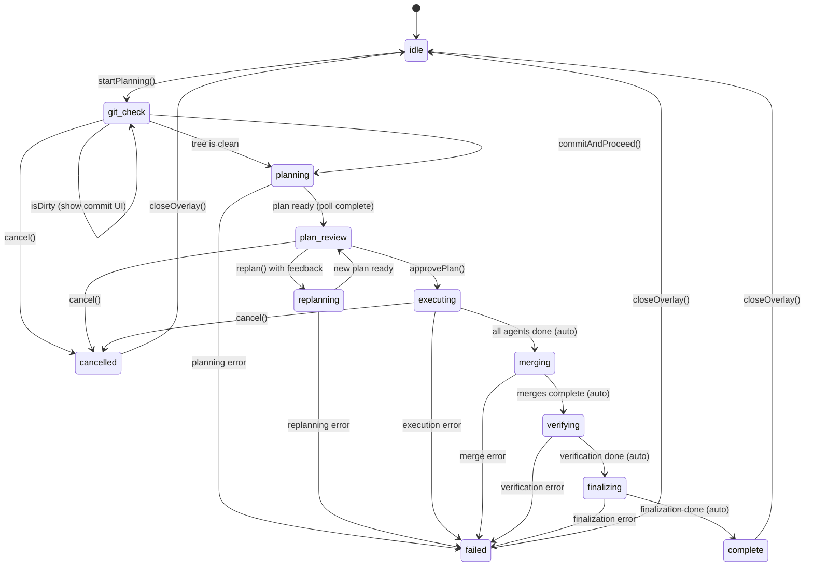
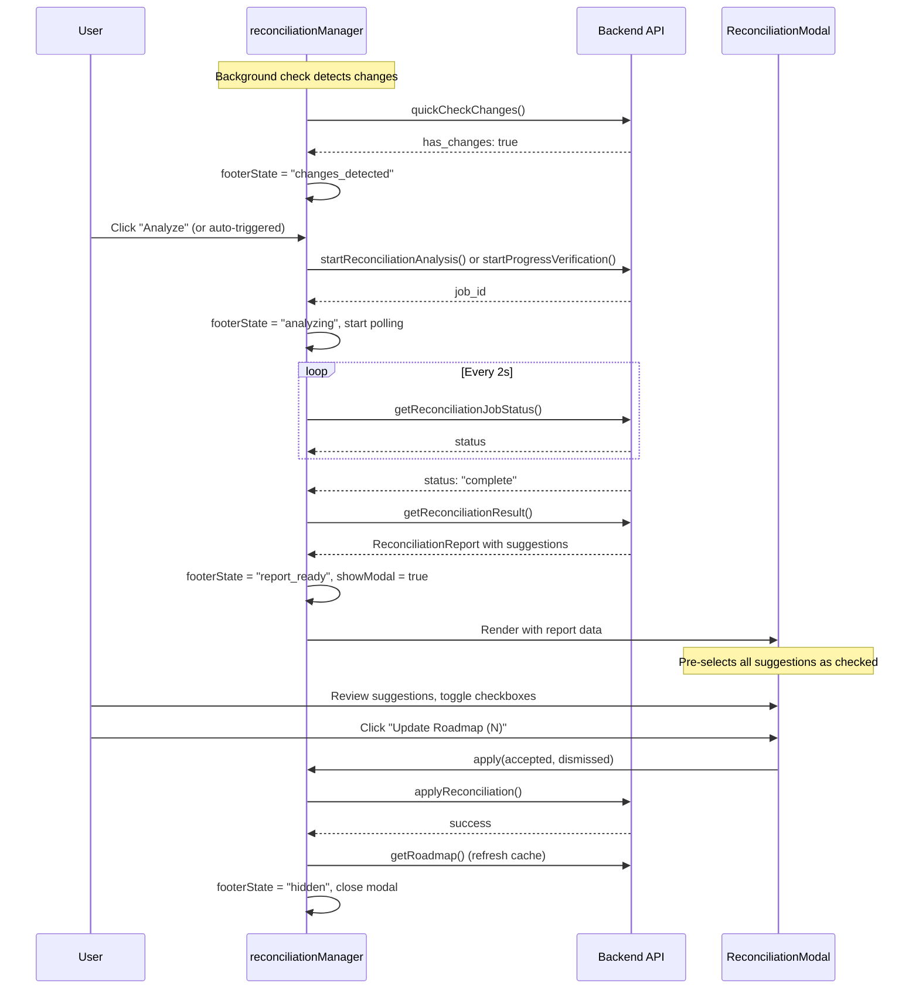
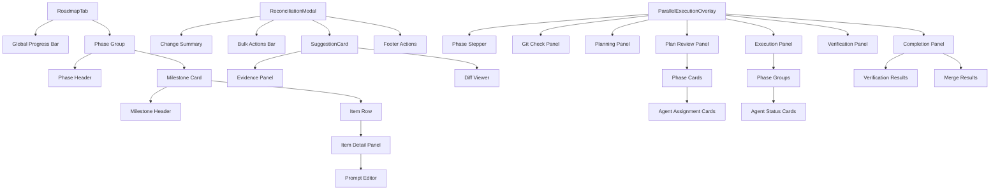
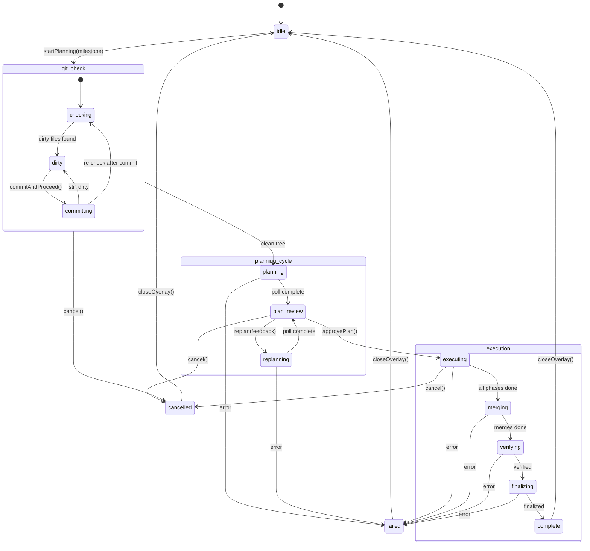
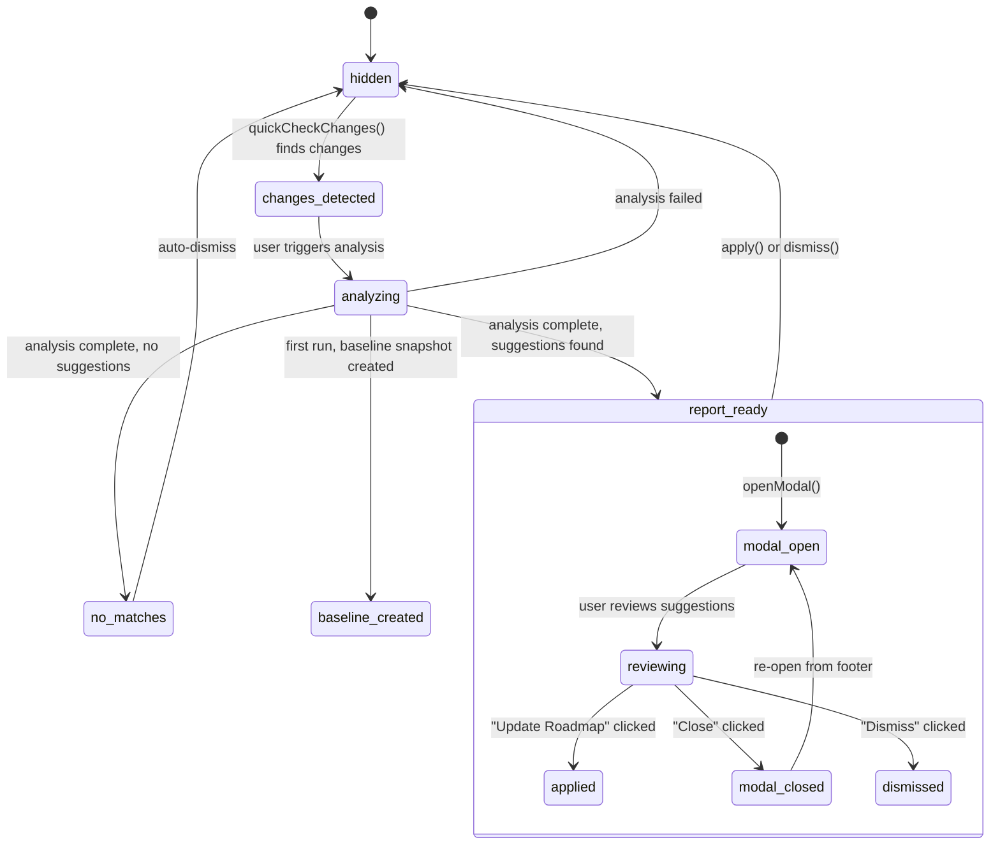
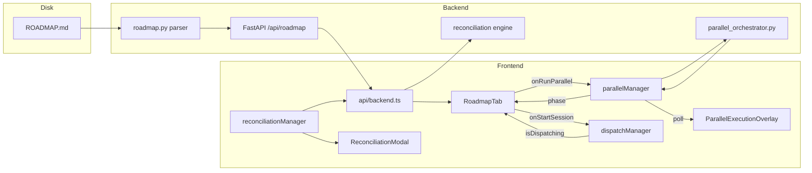

# Roadmap Tab - View Documentation

> Last updated: 2026-02-17

## 1. Purpose and Role in the App

The Roadmap tab is the primary task-tracking and execution interface in Claudetini. It renders the project's `ROADMAP.md` file as an interactive, phase-grouped list of milestones and their checklist items. Users can:

- Visualize overall project progress at a glance.
- Expand milestones to inspect, dispatch, or skip individual tasks.
- Launch single-item Claude Code sessions to implement a task.
- Run all remaining items in a milestone sequentially ("Run All").
- Launch AI-orchestrated parallel execution across multiple agents ("Parallel").
- Review and accept reconciliation suggestions that auto-detect completed work.

The tab acts as the bridge between the static `ROADMAP.md` source-of-truth and the live Claude Code dispatch/parallel execution system.

---

## 2. Component Hierarchy

```
RoadmapTab
  |
  +-- (global progress bar)
  +-- PhaseGroup[] (rendered inline, not a separate component)
  |     +-- Phase header (label, mini progress bar, count)
  |     +-- Milestone card(s)
  |           +-- Milestone header (badge, title, subtitle, dot bar, Run All / Parallel buttons)
  |           +-- Expanded item list (when open)
  |                 +-- Item row (checkbox, text, action buttons, "Next" tag)
  |                 +-- Item detail panel (prompt editor, Skip, Start Session)
  |
  +-- ReconciliationModal (rendered by parent, controlled by reconciliationManager)
  |     +-- Change summary (LOC bar chart)
  |     +-- Bulk actions bar
  |     +-- SuggestionCard[]
  |           +-- Checkbox, metadata, evidence, diff viewer
  |     +-- Footer actions (Close, Dismiss, Update Roadmap)
  |
  +-- ParallelExecutionOverlay (rendered by parent, controlled by parallelManager)
        +-- Header (phase stepper, milestone title, agent count)
        +-- Phase-specific content (git check, planning, plan review, executing, verifying, finalizing, complete)
        +-- Footer actions (Cancel, Re-plan, Approve & Run, Done)
```

---

## 3. Component Details

### 3.1 RoadmapTab

**File:** `app/src/components/roadmap/RoadmapTab.tsx`

**Purpose:** Top-level roadmap view. Fetches milestone data from the backend, renders phase groups, milestone cards, and item rows. Manages expand/collapse state, item toggling, prompt editing, and dispatching.

**Props:**

| Prop | Type | Description |
|------|------|-------------|
| `projectPath` | `string \| null` | Active project path. When null, shows placeholder. |
| `isActive` | `boolean` | Whether this tab is currently visible. Controls lazy loading. |
| `onStartSession` | `(item: MilestoneItem) => void` | Callback to dispatch a single-item Claude Code session. |
| `onStartMilestone` | `(milestone: Milestone) => void` | Callback to dispatch all remaining items sequentially. |
| `onRunParallel` | `(milestone: Milestone) => void` | Callback to launch parallel execution for a milestone. |
| `onToggleDone` | `(item: MilestoneItem) => void` | Callback when a user manually toggles an item's done status. |
| `onEditPrompt` | `(item: MilestoneItem, newPrompt: string) => void` | Callback when a user saves an edited prompt. |
| `onShowConfirm` | `(config: ConfirmConfig \| null) => void` | Callback to show a confirmation dialog. |

**Local State:**

| State | Type | Purpose |
|-------|------|---------|
| `milestones` | `Milestone[]` | Parsed milestone data from API. |
| `expanded` | `Set<number>` | Which milestone IDs are expanded. |
| `expandedItem` | `string \| null` | Which item text is expanded to show its detail panel. |
| `editingItem` | `string \| null` | Which item is in prompt-edit mode. |
| `editText` | `string` | Current text in the prompt editor textarea. |
| `loading` | `boolean` | Whether the initial fetch is in progress. |
| `focusedMilestoneIdx` | `number` | Index for keyboard navigation. |
| `refreshKey` | `number` | Incremented to trigger a re-fetch (post-dispatch, post-parallel). |

**API Calls:**

- `api.getRoadmap(projectPath)` -- Fetches the parsed roadmap (milestones, items, phases) on mount, tab activation, and after dispatch/parallel completion.

**Zustand Store Dependencies:**

- `useDispatchManager` -- Reads `isDispatching` to detect when a dispatch completes and trigger a refresh.
- `useParallelManager` -- Reads `phase` to detect when parallel execution reaches a terminal state and trigger a refresh.

**User Interactions:**

| Interaction | Behavior |
|-------------|----------|
| Click milestone header | Toggle expand/collapse for that milestone. |
| Click item checkbox | If marking complete: shows confirmation dialog. If unchecking: toggles immediately. |
| Click item text (undone) | Expands/collapses the item's detail panel. |
| Click "Start" / "Run" button | Fires `onStartSession` for that item. |
| Click "Run All (N)" button | Fires `onStartMilestone` for the milestone's remaining items. |
| Click "Parallel (N)" button | Fires `onRunParallel` to start AI-orchestrated parallel execution. |
| Click "Edit" in detail panel | Enters prompt-edit mode with textarea. |
| Click "Save" in edit mode | Saves the edited prompt via `onEditPrompt`. |
| Click "Skip" in detail panel | Shows confirmation, then marks item complete without running. |
| Arrow keys on milestone list | Keyboard navigation (Up/Down to move, Enter/Space to toggle, Left/Right to collapse/expand). |

---

### 3.2 SuggestionCard

**File:** `app/src/components/roadmap/SuggestionCard.tsx`

**Purpose:** Renders a single reconciliation suggestion inside the `ReconciliationModal`. Displays the item text, confidence level, evidence summary, reasoning details, and an optional commit diff viewer.

**Props:**

| Prop | Type | Description |
|------|------|-------------|
| `suggestion` | `RoadmapSuggestion` | The suggestion data (item text, confidence, reasoning, matched files/commits). |
| `checked` | `boolean` | Whether this suggestion is selected for acceptance. |
| `onToggle` | `() => void` | Callback to toggle the checked state. |
| `projectId` | `string` | Project path, used for fetching commit diffs. |

**Local State:**

| State | Type | Purpose |
|-------|------|---------|
| `expanded` | `boolean` | Whether the evidence/reasoning details section is visible. |
| `showDiff` | `boolean` | Whether the commit diff panel is visible. |
| `diffContent` | `string \| null` | Cached diff text for the first matched commit. |
| `loadingDiff` | `boolean` | Whether the diff is being fetched. |

**API Calls:**

- `api.getCommitDiff(projectId, commitSha)` -- Fetches the diff for the first matched commit when the user clicks "View diff".

**User Interactions:**

| Interaction | Behavior |
|-------------|----------|
| Click checkbox | Toggles selection for this suggestion. |
| Click "View details" | Expands reasoning list and matched files. |
| Click "View diff" | Fetches and shows the commit diff (cached after first load). |

**Confidence Display:**

| Confidence Range | Label | Color |
|-----------------|-------|-------|
| >= 0.8 | HIGH | `text-mc-green` |
| >= 0.5 | MEDIUM | `text-mc-amber` |
| < 0.5 | LOW | `text-mc-text-3` |

---

### 3.3 ReconciliationModal

**File:** `app/src/components/roadmap/ReconciliationModal.tsx`

**Purpose:** Full-screen modal that presents a reconciliation report. Shows file change statistics, LOC (lines of code) visualization, and a scrollable list of `SuggestionCard` components. The user reviews, selects, and applies suggestions to mark roadmap items as complete.

**Props:**

| Prop | Type | Description |
|------|------|-------------|
| `projectPath` | `string` | Active project path for API calls. |

**Zustand Store Dependencies (reconciliationManager):**

| Selector | Type | Purpose |
|----------|------|---------|
| `report` | `ReconciliationReport \| null` | The full reconciliation analysis report. |
| `showModal` | `boolean` | Controls modal visibility. |
| `checkedItems` | `Set<string>` | Set of item_text strings currently selected for acceptance. |
| `apply` | function | Applies accepted/dismissed items to ROADMAP.md. |
| `dismiss` | function | Dismisses the report entirely. |
| `closeModal` | function | Closes modal without dismissing (keeps notification). |
| `toggleCheckedItem` | function | Toggles a single item's selection. |
| `toggleAllHighConfidence` | function | Bulk-toggles all suggestions with confidence >= 0.9. |

**Keyboard Shortcuts:**

| Key | Action |
|-----|--------|
| `Escape` | Close modal (keep notification). |
| `Cmd/Ctrl + Enter` | Apply selected suggestions. |
| `A` | Toggle all high-confidence suggestions. |

**User Interactions:**

| Interaction | Behavior |
|-------------|----------|
| Click "Update Roadmap (N)" | Calls `apply()` with accepted items (checked) and dismissed items (unchecked). Shows toast. |
| Click "Close (Keep Notification)" | Closes modal but keeps the reconciliation footer notification visible. |
| Click "Dismiss Completely" | Clears the report, hides footer, stops polling. |
| Click "Toggle all high-confidence" | Selects or deselects all suggestions with confidence >= 0.9. |
| Click backdrop | Same as Close. |

---

### 3.4 ParallelExecutionOverlay

**File:** `app/src/components/roadmap/ParallelExecutionOverlay.tsx`

**Purpose:** Full-screen overlay that manages and visualizes the entire parallel execution lifecycle. Spans from git cleanliness check through planning, review, multi-phase execution, verification, finalization, and completion.

**Props:**

| Prop | Type | Description |
|------|------|-------------|
| `projectPath` | `string` | Active project path for all parallel API calls. |

**Zustand Store Dependencies (parallelManager):**

The overlay reads nearly the entire `parallelManager` state. Key selectors:

| Selector | Type | Purpose |
|----------|------|---------|
| `showOverlay` | `boolean` | Controls visibility. |
| `phase` | `ParallelPhase` | Current lifecycle phase. |
| `milestoneTitle` | `string \| null` | Title shown in header. |
| `tasks` | `MilestoneItem[]` | The remaining tasks being executed. |
| `error` | `string \| null` | Error message, if any. |
| `plan` | `ExecutionPlan \| null` | The AI-generated execution plan. |
| `planOutputTail` | `string \| null` | Live planning agent output. |
| `agents` | `AgentSlotStatus[]` | Per-task agent status during execution. |
| `mergeResults` | `MergeResultStatus[]` | Branch merge results. |
| `totalCost` | `number` | Accumulated API cost. |
| `currentPhaseId` | `number` | Active execution phase index. |
| `currentPhaseName` | `string` | Active execution phase name. |
| `verification` | `VerificationResult \| null` | Post-execution verification results. |
| `verificationOutputTail` | `string \| null` | Live verification agent output. |
| `finalizeMessage` | `string \| null` | Finalization status message. |
| `userFeedback` | `string` | User feedback text for re-planning. |
| `isDirty` | `boolean` | Whether git working tree has uncommitted changes. |
| `dirtyFiles` | `string[]` | List of dirty file paths. |
| `commitMessage` | `string` | User-entered or AI-generated commit message. |
| `isGeneratingMessage` | `boolean` | Whether AI commit message generation is in progress. |
| `isCommitting` | `boolean` | Whether the commit operation is in progress. |
| `commitError` | `string \| null` | Error from commit attempt. |

**Actions used:**

| Action | Description |
|--------|-------------|
| `approvePlan(projectPath)` | Approves the plan and starts execution. |
| `replan(projectPath)` | Sends user feedback and regenerates the plan. |
| `cancel()` | Cancels the current operation (planning, execution, etc.). |
| `closeOverlay(projectPath)` | Closes the overlay, releases HMR lock, resets state. |
| `setUserFeedback(feedback)` | Updates the re-plan feedback text. |
| `setCommitMessage(msg)` | Updates the commit message text. |
| `generateCommitMessage(projectPath)` | Generates a commit message via AI. |
| `commitAndProceed(projectPath)` | Commits dirty files and auto-proceeds to planning. |

**Local State:**

| State | Type | Purpose |
|-------|------|---------|
| `showAllCriteria` | `boolean` | Toggle for success criteria list in plan review. |
| `showAllWarnings` | `boolean` | Toggle for warnings list in plan review. |
| `collapsedPhases` | `Set<number>` | Tracks which execution phases are manually collapsed/expanded. |

---

## 4. Roadmap Parsing and Rendering

### Data Flow: ROADMAP.md to UI

```
ROADMAP.md (on disk)
       |
       v
Python backend: src/core/roadmap.py
  - Parses markdown headings as milestones
  - Parses checkbox items (- [x] / - [ ]) as MilestoneItems
  - Detects phase groupings from heading hierarchy
  - Extracts prompt/context from em-dash-separated text
       |
       v
FastAPI endpoint: GET /api/roadmap/{projectId}
  - Returns JSON: { milestones: [...] }
       |
       v
api.getRoadmap(projectPath)
       |
       v
RoadmapTab.useEffect (fetch on mount / tab activation / refresh)
  - Maps response to Milestone[] with typed items
  - Auto-expands the first milestone with incomplete items
       |
       v
Render: phases -> PhaseGroup[] -> Milestone cards -> Item rows
```

### Phase Grouping

Milestones are grouped into phases based on the `phase` field returned by the backend. The `phases` memo iterates milestones in order, grouping consecutive milestones that share the same phase label. Each phase group gets:

- A header with the phase label.
- A mini progress bar showing the phase's aggregate completion.
- A count badge (done/total).

### Item Display

Each item's display text is extracted using `displayTitle()`, which splits on the em-dash separator (" --- ") and shows only the portion before the dash. This keeps the UI concise while the full text (including context after the dash) is available in the expanded detail panel.

### Active Milestone Detection

The "active" milestone is the first milestone that has at least one incomplete item (`activeId`). This milestone gets:

- An accent-colored gradient badge instead of a numbered badge.
- A subtitle showing how many items remain and a preview of the next task.
- An accent-colored underline bar when collapsed.
- The first undone item within it is tagged with a "Next" badge and highlighted with an accent background.

---

## 5. Item Actions

### Toggle Done (Checkbox)

- **Marking complete (unchecked to checked):** If `onShowConfirm` is provided, shows a confirmation dialog ("Mark as Complete") before toggling. This prevents accidental completion without running a session.
- **Unmarking (checked to unchecked):** Toggles immediately without confirmation.
- Both paths update local state optimistically and fire the `onToggleDone` callback.

### Dispatch (Start Session)

Clicking "Start" or "Run" on an individual item fires `onStartSession(item)`. The parent component wires this to the dispatch manager, which:

1. Builds a prompt from the item's text/prompt.
2. Dispatches via Claude Code CLI.
3. On success, auto-marks the item as done in ROADMAP.md via `api.toggleRoadmapItem()`.

### Batch Toggle (Run All)

The "Run All (N)" button on a milestone header fires `onStartMilestone(milestone)`. The parent wires this to the dispatch manager's milestone plan mode:

1. Generates a combined prompt for all remaining items.
2. Runs a planning dispatch to create an implementation plan.
3. Presents the plan for review.
4. Executes all items in a single Claude Code session.
5. On completion, marks all items as done via batch toggle.

### Parallel Launch

The "Parallel (N)" button fires `onRunParallel(milestone)`, which is wired to `parallelManager.startPlanning()`. This initiates the full parallel execution state machine (see Section 6).

### Skip

The "Skip" button in the expanded item detail panel marks an item as complete without running a session. If `onShowConfirm` is provided, a confirmation dialog is shown first.

### Edit Prompt

The "Edit" button in the expanded detail panel enters prompt-edit mode. The user can modify the prompt text in a textarea and save it. The edited prompt is stored locally and passed to the dispatch when the item is executed.

---

## 6. ParallelExecutionOverlay - Full Phase State Machine

### Phase Diagram



### Phase Details

#### `idle`
Initial/reset state. Overlay is hidden. No operations in progress.

#### `git_check`
**Gate phase.** Before any parallel work begins, the system checks whether the git working tree is clean. If dirty files exist, the overlay shows a commit UI with:

- List of dirty files.
- Textarea for commit message.
- "AI Message" button to generate a commit message via the light model.
- "Commit & Continue" button that stages all, commits, re-checks, and auto-proceeds to planning.

If the tree is already clean, this phase is a brief flash (spinner with "Checking git status...") before auto-transitioning to `planning`.

#### `planning` / `replanning`
An AI planning agent analyzes the tasks and generates an `ExecutionPlan`. The overlay shows:

- A spinner with "Analyzing N tasks..."
- Live planning agent output (tail of the CLI output, streamed via polling every 2 seconds).

Polling happens via `api.parallelPlanStatus(planJobId)` at 2-second intervals. When status is `"complete"`, the plan is stored and the phase transitions to `plan_review`.

#### `plan_review`
The user reviews the AI-generated plan. The overlay shows:

- **Plan summary** (markdown-rendered).
- **Phase cards** (color-coded) showing each execution phase, whether it is parallel or sequential, and the agent assignments within it. Each agent card lists its theme and assigned task indices.
- **Success criteria** (collapsible list).
- **Warnings** (collapsible list, amber-colored).
- **Refine Plan** textarea for user feedback.
- **Footer actions:** Cancel, Re-plan (only when feedback text is present), Approve & Run.

#### `executing` / `merging`
The core execution phase. After plan approval:

1. `api.parallelExecute()` starts the batch and returns a `batch_id`.
2. The batch ID is persisted to `localStorage` for HMR resilience.
3. Polling begins via `api.parallelExecuteStatus(batchId)` at 2-second intervals.

The overlay shows a **phase-grouped execution view**:

- Each execution phase is a collapsible card (color-coded by phase index).
- **Active phase:** Expanded by default, showing agent cards with per-task status icons.
- **Done phases:** Collapsed by default with a summary count.
- **Pending phases:** Dimmed (40% opacity), collapsed, showing "pending" label.
- Each phase has its own progress bar.
- Per-phase agent cards show task status with animated spinner (running), green check (succeeded), red X (failed), or dash (cancelled).
- Live terminal output from the currently running agent is shown at the bottom.
- Total cost is displayed when non-zero.

**Fallback flat view:** If the plan is null (edge case), a simpler flat agent list is rendered without phase grouping.

#### `verifying`
A verification agent runs tests, linting, and file integrity checks against the plan's success criteria. The overlay shows:

- A spinner with "Running verification agent".
- Count of success criteria being checked.
- Live verification CLI output (streamed via polling).

#### `finalizing`
The system marks completed tasks in ROADMAP.md, stages and commits changes, and cleans up git worktrees. The overlay shows a checklist of finalization steps with animated spinners.

#### `complete`
Terminal success state. The overlay shows:

- Green check with "All N tasks executed".
- **Verification Results:** Each success criterion shown as passed (green check) or failed (red X) with evidence.
- **Merge Results:** Per-branch merge status showing success/failure, branch name, and message.
- **Finalize result:** Commit message.
- **Total cost**.
- Footer: "Done" button to close.

#### `failed`
Terminal error state. An error banner is shown. The overlay remains open for the user to read the error and close.

#### `cancelled`
Terminal state after user cancellation. Footer shows "Cancelled".

### Agent Status Icons

| Status | Icon |
|--------|------|
| `running` | Animated spinner (accent-colored border, transparent top) |
| `succeeded` | Green checkmark |
| `failed` | Red X |
| `cancelled` | Gray em-dash |
| (default/pending) | Small gray circle |

### Phase Stepper

A 5-step horizontal stepper is shown in the header (hidden during `git_check`):

1. **Plan** (planning, replanning)
2. **Review** (plan_review)
3. **Execute** (executing, merging)
4. **Verify** (verifying)
5. **Finalize** (finalizing, complete)

Each step's bar is colored:
- Green: completed step.
- Accent: currently active step.
- Gray: pending step.

### HMR Resilience

The `parallelManager` persists the `batchId`, `phase`, and `milestoneTitle` to `localStorage` under the key `cantina:parallel-execution`. On module load (which re-fires during Vite HMR), `_tryResumeExecution()` checks for persisted state:

1. If a non-terminal phase is found, it restores minimal state (`batchId`, `phase`, `milestoneTitle`, `showOverlay: true`).
2. Resumes execution polling via `_startExecutionPolling()`.
3. The first poll response fills in the full state (agents, mergeResults, verification, etc.).
4. When execution reaches a terminal state, the persisted state is cleared.

When the overlay is closed via `closeOverlay()`, the persisted state is cleared and `api.parallelReleaseHmrLock(projectPath)` is called to release the HMR lock so Vite resumes normal hot-reload operation.

---

## 7. ReconciliationModal - Suggestion Review

### Flow



### Accept/Dismiss Flow

When the user clicks "Update Roadmap":

1. **Accepted items:** All suggestions whose `item_text` is in the `checkedItems` set are passed as `acceptedItems`. The backend marks these items as `[x]` in ROADMAP.md.
2. **Dismissed items:** All suggestions NOT in `checkedItems` are passed as `dismissedItems`. The backend records the dismissal so they are not suggested again.
3. A success toast confirms the count of marked items.
4. A separate info toast confirms dismissed items.
5. The modal closes and the footer notification hides.

### Bulk Actions

The "Toggle all high-confidence" button selects or deselects all suggestions with confidence >= 0.9. If all high-confidence items are already checked, it unchecks them; otherwise it checks them all.

### Change Summary

The modal header shows a computed summary of the reconciliation report:

- File counts (created, modified, deleted).
- Commit count.
- LOC bar chart showing lines added (green) and lines removed (red) with a net change.

---

## 8. State Dependencies (Zustand Stores)

### parallelManager (`useParallelManager`)

**Store file:** `app/src/managers/parallelManager.ts`

Used by: `ParallelExecutionOverlay`, `RoadmapTab` (for refresh trigger).

Key state slices:

| Slice | Description |
|-------|-------------|
| `phase` | Current parallel execution phase (see state machine). |
| `showOverlay` | Whether the overlay is visible. |
| `plan` | The AI-generated execution plan. |
| `agents` | Per-task status during execution. |
| `mergeResults` | Branch merge outcomes. |
| `verification` | Post-execution verification results. |
| `isDirty` / `dirtyFiles` | Git cleanliness state. |
| `commitMessage` / `isCommitting` | Git commit state. |
| `totalCost` | Accumulated API cost across all agents. |

### reconciliationManager (`useReconciliationManager`)

**Store file:** `app/src/managers/reconciliationManager.ts`

Used by: `ReconciliationModal`.

Key state slices:

| Slice | Description |
|-------|-------------|
| `footerState` | Controls the reconciliation footer banner visibility and state. |
| `report` | The full reconciliation analysis report. |
| `showModal` | Whether the modal is visible. |
| `checkedItems` | Set of item texts selected for acceptance. |

### dispatchManager (`useDispatchManager`)

**Store file:** `app/src/managers/dispatchManager.ts`

Used by: `RoadmapTab` (reads `isDispatching` for refresh trigger).

Key interaction: When `isDispatching` transitions from `true` to `false`, the RoadmapTab waits 800ms (to let the backend persist changes to ROADMAP.md) and then increments `refreshKey` to trigger a re-fetch.

### settingsStore (`useSettingsStore`)

Used by: `parallelManager` internally (not directly by components).

Reads `maxParallelAgents` (for execution) and `lightModel` (for planning/replanning/commit message generation).

---

## 9. Edge Cases

### No Roadmap

When `projectPath` is null or `api.getRoadmap()` returns an empty milestones array:

- **No project selected:** Renders "Select a project to view roadmap data."
- **No roadmap data:** Renders "No roadmap data found for this project."
- The progress bar, phase groups, and all interactive elements are hidden.

### Empty Milestones

If a milestone has zero items (edge case from malformed ROADMAP.md), the milestone card renders normally but:

- The dot bar is empty (no dots).
- The "Run All" and "Parallel" buttons are hidden (they require `remaining.length > 0` and `>= 2` respectively).
- The expanded items section is an empty list.
- The count shows "0/0".

### All Items Complete

When every item in every milestone is done:

- The global progress bar shows 100%.
- The `activeId` resolves to -1 (no active milestone), so no milestone gets the accent treatment.
- All milestone badges show green checkmarks instead of numbers.
- Milestone subtitles read "All N items complete" when collapsed.
- "Run All" and "Parallel" buttons are hidden (no remaining items).
- Checkboxes still allow unchecking (toggling back to incomplete) without a confirmation dialog.

### Refresh After Dispatch/Parallel

- After a dispatch completes (`isDispatching` goes false), a 800ms delay precedes the re-fetch to allow backend persistence.
- After parallel execution reaches a terminal phase (`complete` or `failed`), a 500ms delay precedes the re-fetch.
- On refresh (not initial load), no loading spinner is shown -- the data updates silently to avoid UI flicker.
- The user's expand/collapse state is preserved on refresh (only auto-expand happens on initial load).

### Backend Disconnected

If `isBackendConnected()` returns false during fetch, the component sets `milestones` to an empty array and shows the "No roadmap data" placeholder. No error is thrown.

### Parallel Execution Git Dirty

If the git working tree has uncommitted changes when parallel execution is started, the overlay blocks at the `git_check` phase until the user commits. If the tree is still dirty after a commit (e.g., untracked files), the error is shown with the remaining dirty file list.

---

## 10. Mermaid Diagrams

### Component Tree



### Parallel Execution Phase State Machine



### Reconciliation Flow



### Data Flow


